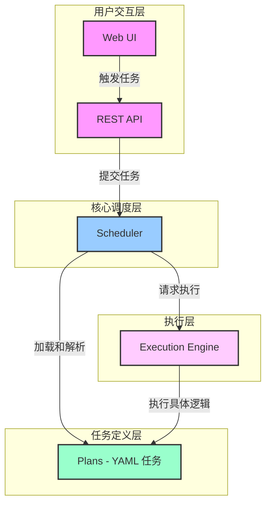

# 1. 欢迎来到 Aura

Aura 是一个为复杂、多步骤任务设计的事件驱动、插件化的开源自动化框架。它通过声明式的 YAML 文件来定义任务，结合强大的插件生态系统，让开发者能够轻松构建、管理和扩展各种自动化流程。

## 核心价值

*   **事件驱动**：Aura 的核心是一个事件总线，所有组件通过事件进行松耦合通信，这使得系统高度灵活和可扩展。
*   **插件化架构**：框架的一切皆为插件。无论是核心功能还是第三方集成，都可以作为插件动态加载，让你能按需组合功能。
*   **声明式任务**：使用简单直观的 YAML 文件来定义自动化任务（我们称之为 "Plan"），将复杂的业务逻辑转化为清晰的步骤。

## 主要特性

*   **基于 YAML 的任务定义**：无需编写复杂的代码，即可通过 YAML 定义任务的元数据、输入参数和执行步骤。
*   **动态热重载**：在不停止服务的情况下，动态加载和更新任务和插件，极大地提升了开发和调试效率。
*   **Web UI 和 REST API**：内置一个现代化的 Web 用户界面，用于任务的触发、监控和日志查看。同时提供完整的 REST API，方便与外部系统集成。
*   **强大的逻辑控制**：支持上下文变量、条件执行、循环和错误处理，让你的自动化任务能够应对复杂的场景。
*   **可扩展的服务和行为**：通过自定义 Action 和 Service，你可以轻松地将任何功能集成为 Aura 的一部分。

## 应用场景

Aura 适用于任何需要将手动、重复性任务自动化的场景，例如：

*   **持续集成/持续部署 (CI/CD)**：自动化代码的构建、测试和部署流程。
*   **IT 运维和基础设施管理**：自动化的服务器配置、监控、备份和故障恢复。
*   **数据处理和 ETL**：定时从多个数据源拉取数据，进行转换和加载。
*   **业务流程自动化**：将企业内部的审批、报告生成等业务流程自动化。
*   **智能家居和物联网**：响应来自传感器和设备的事件，触发相应的自动化动作。

## 生态系统概览

下图展示了 Aura 框架中几个核心组件之间的关系：

