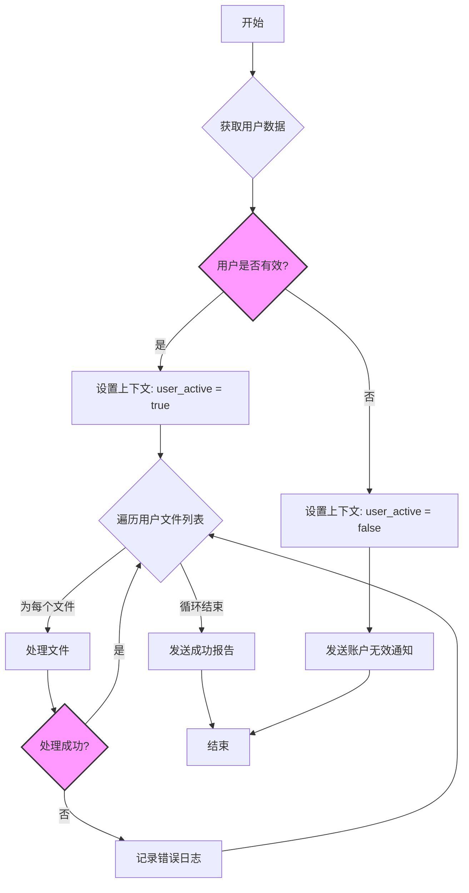

# 5. 编写复杂逻辑

当你的自动化需求变得更加复杂时，Aura 提供了多种强大的功能来帮助你实现精细的逻辑控制，包括上下文变量、条件执行、循环和错误处理。

---

## 1. 上下文变量：在步骤间传递数据

有时候，你需要将一个步骤的输出结果用在后续的步骤中。`上下文 (Context)` 就是用来实现这一点的。你可以把它看作是一个任务执行期间的临时存储空间。

*   **`core.set_context`**: 这是一个内置的 Action，用于将一个或多个值存入上下文中。
*   **`{{ ctx.variable_name }}`**: 这是引用上下文变量的语法。

**示例：获取并使用数据**

假设我们有一个 Action `api.get_user_data` 用于获取用户信息，然后我们想在另一个步骤中使用用户的名字。

```yaml
steps:
  - name: "fetch_user_data"
    action: "api.get_user_data"
    params:
      user_id: 123

  - name: "store_user_name_in_context"
    action: "core.set_context"
    params:
      user_name: "{{ steps.fetch_user_data.output.name }}" # 假设上一步返回了 { "name": "Alice" }

  - name: "greet_the_user"
    action: "core.log"
    params:
      message: "Hello, {{ ctx.user_name }}!" # 从上下文中读取 user_name
```
*Note: The syntax `steps.step_name.output` is used to get the entire output of a previous step.*

---

## 2. 条件执行：`when`

你可以使用 `when` 关键字来为一个步骤设置执行条件。只有当 `when` 表达式的计算结果为 `true` 时，该步骤才会被执行。表达式内部同样支持变量引用。

**示例：根据用户状态发送通知**

```yaml
steps:
  - name: "check_user_status"
    action: "api.get_user_status" # 假设返回 { "status": "active" }
    params:
      user_id: "{{ inputs.user_id }}"

  - name: "store_status"
    action: "core.set_context"
    params:
      status: "{{ steps.check_user_status.output.status }}"

  - name: "send_welcome_email"
    action: "email.send"
    # 只有当上下文中 status 的值是 "active" 时，才执行此步骤
    when: "{{ ctx.status == 'active' }}"
    params:
      recipient: "{{ inputs.user_email }}"
      subject: "Welcome!"
```

---

## 3. 循环执行：`loop`

`loop` 关键字允许你遍历一个列表（来自 `inputs` 或上下文），并对列表中的每一项执行同一个步骤。在循环的步骤中，你可以使用 `{{ item }}` 来引用当前正在遍历的列表项。

**示例：处理多个文件**

```yaml
inputs:
  - name: "files_to_process"
    type: "list"
    default: ["file1.txt", "file2.txt", "file3.txt"]

steps:
  - name: "process_each_file"
    action: "file.process"
    # 遍历 inputs 中的 files_to_process 列表
    loop: "{{ inputs.files_to_process }}"
    params:
      # {{ item }} 在每次循环中会依次变为 "file1.txt", "file2.txt", ...
      filename: "{{ item }}"
```

---

## 4. 错误处理：`on_error`

默认情况下，如果一个步骤执行失败，整个任务会立即停止。你可以使用 `on_error` 块来覆盖这个行为，定义一个或多个在失败时执行的补偿步骤。

**示例：在 API 调用失败时发送警报**

```yaml
steps:
  - name: "call_critical_api"
    action: "api.do_something"
    params:
      some_param: "value"
    # 如果 call_critical_api 步骤失败...
    on_error:
      # ...则执行以下步骤
      - name: "send_failure_alert"
        action: "slack.send_message"
        params:
          channel: "#alerts"
          message: "CRITICAL FAILURE: The 'call_critical_api' step failed!"
```

---

## 5. 复杂任务流程图

下面的 Mermaid 图展示了一个综合运用了条件、循环和错误处理的复杂任务流程。


