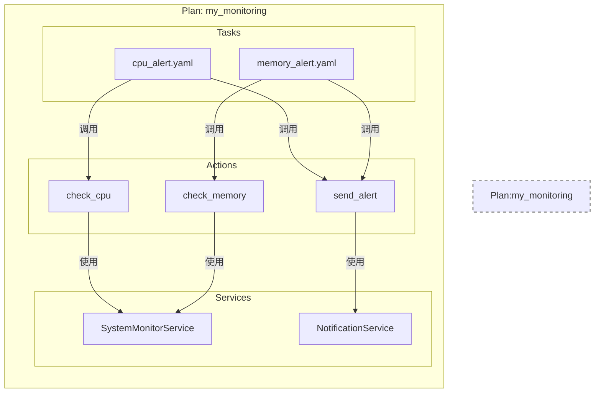

# 1. 插件架构

Aura 的核心设计理念之一就是“一切皆插件”。这种高度模块化的架构使得框架极易扩展。理解 Plan、Action 和 Service 这三个核心概念及其关系，是进行插件开发的第一步。

## 1. 核心概念

*   **Plan (计划)**
    *   **是什么？** Plan 是一个功能的集合，代表了一个完整的、自洽的业务场景或工具集。例如，一个名为 `git` 的 Plan 可能会提供所有与 Git 版本控制相关的操作。
    *   **包含什么？** 一个 Plan 通常包含一组相关的 Tasks、Actions 和 Services。它是一个独立的、可分发的单元。
    *   **物理结构**：在文件系统上，一个 Plan 就是 `plans/` 目录下的一个子目录。

*   **Action (动作)**
    *   **是什么？** Action 是一个可执行的原子操作，是任务 (`Task`) 中最基本的执行单元。每个 Action 都应该只做一件具体的事情，并把它做好。
    *   **如何实现？** 在 Python 代码中，一个 Action 就是一个被 `@action` 装饰器标记的函数。这个函数可以接收参数，执行逻辑，并返回结果。
    *   **示例**：`core.log` 是一个 Action，它的功能是在日志中打印一条消息。`git.clone` 是另一个 Action，用于克隆一个 Git 仓库。

*   **Service (服务)**
    *   **是什么？** Service 是一个可复用的后台服务或组件，通常用于管理状态、处理复杂逻辑或封装与外部系统的交互。
    *   **与 Action 的区别**：Action 是无状态的、一次性的操作，而 Service 通常是有状态的、长生命周期的对象。例如，一个管理数据库连接池的 `DatabaseService` 就是一个典型的 Service。
    *   **如何使用？** Service 通过依赖注入的方式提供给 Action 使用，这使得 Action 本身可以保持无状态，专注于业务逻辑。

## 2. 它们之间的关系

Plan、Action 和 Service 之间的关系可以用下图来清晰地展示：

*   一个 **Plan** 是一个容器，它封装了一系列功能。
*   这个 Plan 提供了多个 **Actions**，这些是用户可以在任务 (`Task`) 中直接调用的具体操作。
*   为了实现这些 Actions 的功能，Plan 内部可能还实现了一个或多个 **Services**，用于处理更底层的、可复用的逻辑。
*   **Actions** 通过依赖注入来使用这些 **Services**。

## 3. 插件组件图

下面的 Mermaid 图展示了一个名为 `my_monitoring` 的自定义 Plan 的内部结构：

在这个例子中：

*   `my_monitoring` 是一个 Plan。
*   它提供了 `check_cpu`、`check_memory` 和 `send_alert` 三个 Action。
*   它内部有两个 Service：`SystemMonitorService` 用于获取系统指标，`NotificationService` 用于发送通知。
*   `check_cpu` 和 `check_memory` Action 都依赖 `SystemMonitorService` 来完成工作。
*   `send_alert` Action 依赖 `NotificationService`。
*   用户可以通过编写 `cpu_alert.yaml` 这样的 Task，来编排这些 Action，实现一个完整的监控告警流程。
