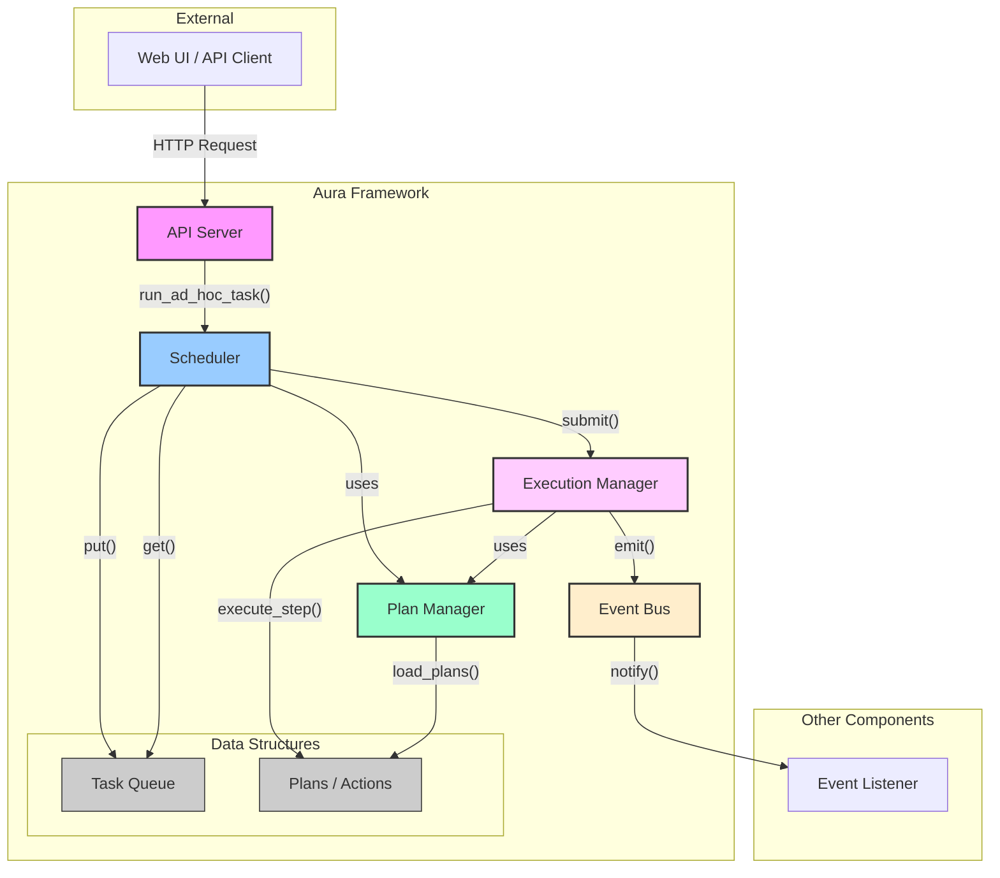

# 1. 框架宏观架构

本章旨在为希望深入理解 Aura 核心代码的开发者提供一个宏观的架构概览。理解这些核心组件的职责以及它们之间的交互模式，是修改或扩展框架功能的基础。

## 1. 核心组件及其职责

Aura 的后端系统主要由以下几个核心组件构成：

*   **API Server (`api_server.py`)**:
    *   **职责**: 作为框架的入口，负责接收所有来自外部的 HTTP 请求，包括 Web UI 的操作和外部系统的 API 调用。
    *   **交互**: 它将接收到的任务执行请求（例如，运行一个 ad-hoc 任务）转发给 `Scheduler`。它本身不处理任何业务逻辑。

*   **Scheduler (`scheduler.py`)**:
    *   **职责**: 框架的“大脑”和调度中心。它负责管理任务的生命周期，维护一个任务队列，并确保任务按照预定的并发数执行。
    *   **交互**: 从 `API Server` 接收新任务，将其封装成 `Tasklet` 对象后放入任务队列。它还负责启动和管理消费者协程，从队列中取出任务并提交给 `ExecutionManager` 执行。

*   **Plan Manager (`plan_manager.py`)**:
    *   **职责**: 负责发现、加载、解析和管理所有的 Plan。它会扫描 `plans/` 目录，加载 YAML 任务文件，并注册所有的 Actions 和 Services。
    *   **交互**: 在框架启动时被调用，为 `Scheduler` 和 `ExecutionManager` 提供关于可用 Plans 和 Actions 的信息。它还支持热重载，可以在运行时动态更新 Plans。

*   **Execution Manager (`execution_manager.py`)**:
    *   **职责**: 任务的“执行者”。它负责具体执行一个 `Tasklet` 中定义的各个步骤。
    *   **交互**: 从 `Scheduler` 接收 `Tasklet` 对象。它会遍历 `Tasklet` 中的步骤，解析每个步骤的 `action` 和 `params`，调用对应的 Action 函数，并处理上下文变量、条件、循环和错误处理等逻辑。

*   **Event Bus (`event_bus.py`)**:
    *   **职责**: 一个全局的事件总线，用于在框架的各个组件之间进行解耦的异步通信。
    *   **交互**: 例如，当一个任务完成时，`ExecutionManager` 可能会发出一个 `TASK_COMPLETED` 事件，其他关心此事件的组件（如日志记录器或通知服务）可以订阅并响应该事件。

## 2. 数据流和组件交互

下图详细展示了这些主要 Python 类之间的关系和数据流：

### 流程解析：
1.  **请求入口**: 用户通过 **Web UI** 或 API 客户端发起一个任务执行请求。
2.  **API 接收**: **API Server** 接收到 HTTP 请求，并调用 **Scheduler** 的 `run_ad_hoc_task` 方法。
3.  **任务入队**: **Scheduler** 创建一个 `Tasklet` 对象来代表这个任务，并将其放入内部的 **Task Queue**。
4.  **任务出队与提交**: **Scheduler** 的后台消费者协程从 **Task Queue** 中取出 `Tasklet`，然后调用 **Execution Manager** 的 `submit` 方法来执行它。
5.  **步骤执行**: **Execution Manager** 遍历 `Tasklet` 中的步骤。对于每个步骤，它会向 **Plan Manager** 查询对应的 Action 函数，并执行它。
6.  **Plan 加载**: 在整个流程的背后，**Plan Manager** 在程序启动时就已经扫描并加载了所有的 Plans 和 Actions，为执行阶段提供支持。
7.  **事件通知**: 在任务执行的各个阶段（如开始、失败、完成），**Execution Manager** 或 **Scheduler** 可能会通过 **Event Bus** 发出事件，供其他组件消费。
