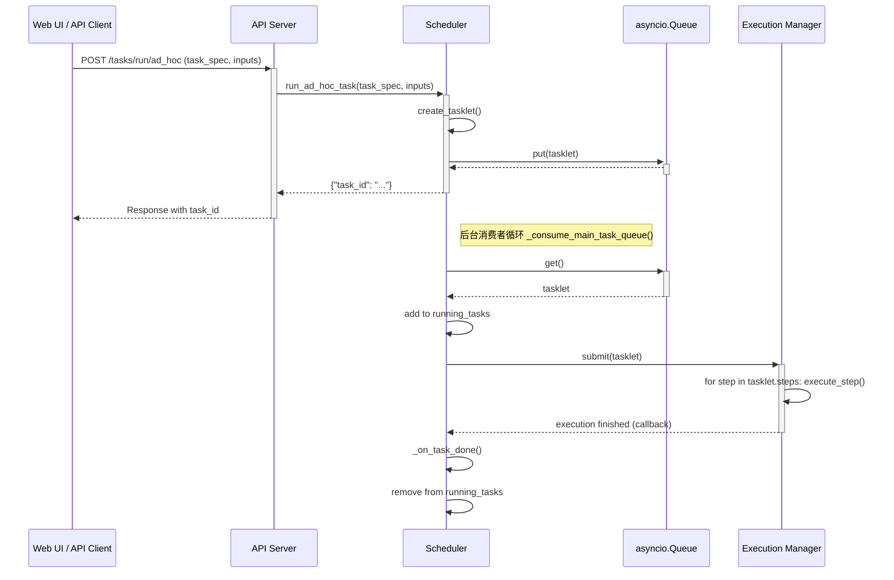

# 2. 一个任务的生命周期

理解一个任务从被接收到执行完成的全过程，是理解 Aura 工作流程的关键。本章将通过追踪一个 ad-hoc (即席) 任务的旅程，来详细拆解框架内部的交互步骤。

## 1. 核心流程步骤

1.  **API 接收请求**:
    *   **触发点**: 用户在 Web UI 点击“执行”按钮，或通过外部工具调用了 Aura 的 REST API `/tasks/run/ad_hoc`。
    *   **处理者**: `api_server.py` 中的对应路由处理函数。
    *   **动作**: API 服务器从请求体中解析出任务的定义（`task_spec`）和输入参数（`inputs`），然后调用 `Scheduler` 的 `run_ad_hoc_task()` 方法，并将这些信息传递过去。

2.  **创建 Tasklet 并入队**:
    *   **处理者**: `scheduler.py` 中的 `run_ad_hoc_task()` 方法。
    *   **动作**:
        *   为这个新任务生成一个唯一的 `task_id`。
        *   创建一个 `Tasklet` 对象。`Tasklet` 是任务在框架内部流转的“护照”，它封装了任务的定义、ID、输入、状态等所有信息。
        *   将这个 `Tasklet` 对象放入内部的 `task_queue` (`asyncio.Queue`) 中，等待被消费。

3.  **消费者协程处理**:
    *   **处理者**: `scheduler.py` 中的 `_consume_main_task_queue()` 方法。这是一个在后台持续运行的异步消费者循环。
    *   **动作**:
        *   `_consume_main_task_queue` 从 `task_queue` 中 `get()` 一个 `Tasklet`。
        *   将 `Tasklet` 的状态更新为 `RUNNING`，并将其添加到 `running_tasks` 字典中。`running_tasks` 用于跟踪所有正在执行的任务，也是实现并发控制的关键。

4.  **提交给执行器**:
    *   **处理者**: `scheduler.py` 中的 `_consume_main_task_queue()` 方法。
    *   **动作**: Scheduler 调用 `execution_manager.submit()`，将 `Tasklet` 对象交给 `ExecutionManager` 来处理具体的执行逻辑。

5.  **任务执行**:
    *   **处理者**: `execution_manager.py` 中的 `submit()` 方法。
    *   **动作**:
        *   `ExecutionManager` 接收到 `Tasklet` 后，会遍历其 `steps` 列表。
        *   对于每一个步骤，它会查找对应的 Action 函数，渲染模板化的 `params`，然后执行 Action。
        *   它会处理上下文、条件 (`when`)、循环 (`loop`) 和错误处理 (`on_error`) 等所有复杂逻辑。
        *   执行过程中，日志会被实时捕获并关联到该 `Tasklet`。

6.  **执行完成与清理**:
    *   **处理者**: `scheduler.py` 中的 `_on_task_done()` 回调方法。
    *   **动作**:
        *   当 `execution_manager.submit()` 执行完毕（无论成功或失败），`Scheduler` 的 `_on_task_done()` 方法会被调用。
        *   在这个回调中，`Scheduler` 会将 `Tasklet` 从 `running_tasks` 字典中移除。
        *   `Tasklet` 的最终状态（`COMPLETED` 或 `FAILED`）被记录下来。
        *   释放并发槽位，允许下一个等待的任务开始执行。

## 2. 任务生命周期序列图

下面的 Mermaid 序列图清晰地展示了上述步骤中各个组件的调用顺序和交互：

