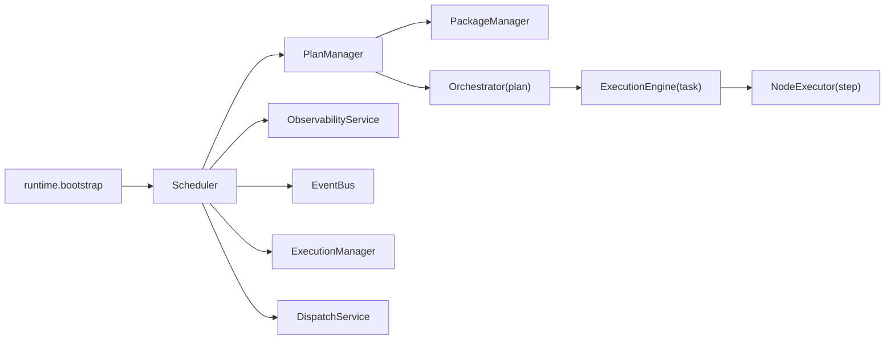

# 架构总览

Aura 的核心运行链路是：

`runtime bootstrap -> Scheduler -> PlanManager / PackageManager -> Orchestrator -> ExecutionEngine -> NodeExecutor`

## 1. 核心职责图

## 2. 启动与生命周期

- `runtime.bootstrap`
  负责创建 runtime 单例、应用 runtime profile、启动和停止 `Scheduler`
- `Scheduler`
  是运行时外观层，构造时装配 config、event bus、state store、plan manager、execution manager、observability 等核心服务
- `LifecycleManager`
  负责调度线程的 start/stop、启动超时和资源清理
- `RuntimeLifecycleService`
  在 control loop 中启动 queue consumer、event worker、schedule loop、interrupt loop、observability cleanup 和文件监控

## 3. 执行链路

### Plan / Package 装载

- `PlanManager`
  使用 `PackageManager` 加载 packages 和 plans，并为每个 plan 创建一个 `Orchestrator`
- `PackageManager`
  发现 `manifest.yaml`，校验依赖，计算加载顺序，注册 services 和 actions

### Task 执行

- `Orchestrator`
  负责 plan 内任务的 YAML 读取、输入校验、task 事件发布、`ExecutionEngine` 创建和最终结果封装
- `ExecutionEngine`
  负责一个 task 的 DAG 构建和调度
- `GraphBuilder`
  解析 `depends_on` 并检测循环依赖
- `NodeExecutor`
  执行单个 step，处理 action 调用、循环、重试、超时、`when` 和输出映射

## 4. 线程与事件循环模型

Aura 的运行时不是单纯同步调用模型，而是：

- 一个独立的 scheduler 线程
- 该线程内部运行一个 asyncio event loop
- loop 中有：
  - main task queue consumer
  - interrupt queue consumer
  - event worker loop
  - schedule loop
  - interrupt loop
  - subscription monitor

这意味着：

- API 线程通常通过 `run_on_control_loop()` 把工作转交到 control loop
- task 执行与 API 请求解耦
- scheduler 未运行时，部分 ad-hoc task 可以先进入 pre-start buffer，待启动后再 flush

## 5. Runtime Profile

当前内置两个 profile：

### `api_full`

- 启用 schedule loop
- 启用 interrupt loop
- 启用 event triggers

适合 API 服务模式。

### `tui_manual`

- 禁用 schedule loop
- 禁用 interrupt loop
- 禁用 event triggers

适合手动执行任务的 TUI 模式。

## 6. 核心队列与总线

- `EventBus`
  系统内部事件总线，用于 `task.*`、`node.*`、`queue.*` 等事件流
- `task_queue`
  主任务队列
- `event_task_queue`
  事件触发后的任务队列
- `interrupt_queue`
  中断处理队列
- `ui_event_queue`
  提供给 UI/TUI 或外部消费者的事件流镜像
- `api_log_queue`
  跨线程日志输出队列

## 7. 读代码建议

建议按以下顺序阅读：

1. `packages/aura_core/runtime/bootstrap.py`
2. `packages/aura_core/scheduler/core.py`
3. `packages/aura_core/scheduler/runtime_lifecycle.py`
4. `packages/aura_core/packaging/core/plan_manager.py`
5. `packages/aura_core/scheduler/orchestrator.py`
6. `packages/aura_core/engine/execution_engine.py`
7. `packages/aura_core/engine/node_executor.py`

## 8. 下一步

- 任务编写：见 [任务 YAML 指南](./03-task-yaml-guide.md)
- 任务执行语义：见 [运行时行为](./04-runtime-behavior.md)
- package 开发：见 [Manifest 参考](../package-development/manifest-reference.md)
