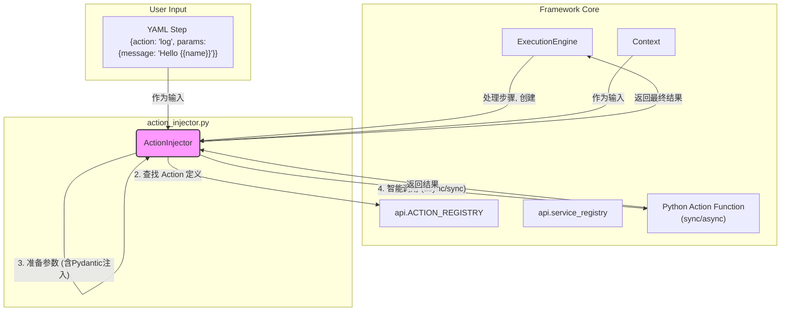
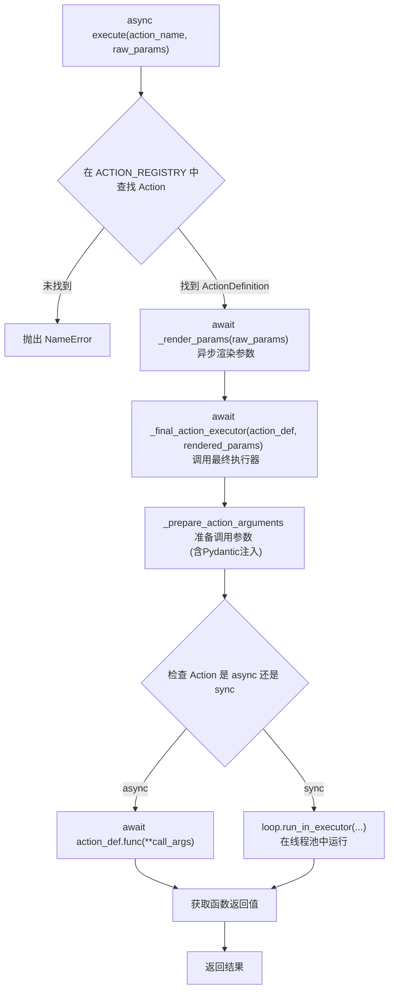

---

# **核心模块: `action_injector.py` (重构版)**

## **1. 概述 (Overview)**

`action_injector.py` 模块定义了 `ActionInjector` 类，它是 Aura 框架的**异步行为调用核心**。您可以将其想象成一个高度专业化的“翻译器”和“执行官”，负责将 YAML 中声明式的步骤（如 `action: log`）转化为一次具体、完整且类型安全的 Python 函数调用。

它的核心职责是弥合用户编写的简单 YAML 和开发者编写的、支持异步操作和 Pydantic 数据模型的复杂 Python Action 函数之间的鸿沟。此版本全面拥抱 `asyncio`，并引入了 Pydantic 进行参数验证，极大地提升了框架的健壮性和性能。

## **2. 在框架中的角色 (Role in the Framework)**

`ActionInjector` 在整个任务执行流程中扮演着承上启下的关键角色。它被 `ExecutionEngine` 在处理每个具体步骤时所创建和使用。与旧版本不同，新版本简化了执行路径，移除了中间件层，使得调用链路更加直接和高效。

下面是 `ActionInjector` 在架构中的交互图：



如图所示，`ActionInjector` 的交互流程更为线性：它利用 `Context` 和异步 `Jinja2` 环境来准备数据，查询 `ACTION_REGISTRY` 来确定目标，通过强大的参数准备逻辑（包括 Pydantic 模型注入）来构建调用参数，并最终以非阻塞的方式智能地调用同步或异步的 Action 函数。

## **3. Class: `ActionInjector`**

### **3.1. 目的与职责 (Purpose & Responsibilities)**

`ActionInjector` 类的设计目标是**封装所有与单个 Action 异步调用相关的复杂性**。其主要职责细分为：

1.  **异步参数渲染**: 使用支持 `async` 的 Jinja2 模板引擎，将 YAML 中包含 `{{...}}` 语法的参数，利用当前 `Context` 中的数据，异步渲染成最终的 Python 值。
2.  **类型安全的依赖注入**: 自动识别 Action 函数签名中声明的依赖。**此版本引入了对 Pydantic 模型的原生支持**，能够将整个参数字典注入并验证到一个 Pydantic 模型中，同时也支持对框架服务和核心对象的注入。
3.  **异步执行管理**: 智能地处理同步和异步的 Action 函数。对于异步函数，直接 `await`；对于同步函数，则在线程池中执行 (`run_in_executor`)，避免阻塞事件循环。
4.  **最终调用与结果返回**: 精确地调用目标 Action 函数，传递所有准备好的参数，并将 Action 函数的返回值返回给调用者（`ExecutionEngine`）。

### **3.2. 初始化 (`__init__`)**

创建一个 `ActionInjector` 实例需要提供：

*   **`context: Context`**: 当前任务的上下文实例。
*   **`engine: ExecutionEngine`**: 执行引擎的实例。

在初始化过程中，它会创建一个启用了异步支持 (`enable_async=True`) 的 `Jinja2` 环境，并注册全局可用的**异步**模板函数，如 `config()`，允许用户在 YAML 中通过 `{{ config('some_key') }}` 来异步获取配置。

### **3.3. 核心方法: `async execute()`**

这是 `ActionInjector` 对外暴露的唯一主方法，现在是一个异步函数。

*   **输入**:
    *   `action_name: str`: 要执行的 Action 的名称。
    *   `raw_params: Dict[str, Any]`: 从 YAML 中读取的原始参数字典。
*   **输出**: `Any` - Action 函数执行后的返回值。

#### **执行流程图 (Execution Flow)**

`execute` 方法的内部逻辑遵循一个清晰的异步流程：



### **3.4. 关键内部方法 (Key Internal Methods)**

#### **`_render_params()` 和 `_render_value()`**

这两个方法组成了模块的**异步模板渲染引擎**。

*   **功能**: 异步且递归地遍历 `raw_params`，找到所有字符串类型的值，并使用 `Jinja2` 和当前 `Context` 的数据进行渲染。
*   **核心特性**:
    *   **完全异步**: 整个渲染过程是异步的，不会阻塞事件循环。
    *   **移除 `literal_eval`**: 为了安全性和可预测性，新版本不再使用 `ast.literal_eval` 进行类型推断。模板渲染的结果就是其字面值（通常是字符串）。例如，`"{{ 1 + 1 }}"` 将被渲染为字符串 `"2"`，而不是整数 `2`。类型转换的责任现在交给了 Pydantic 模型或 Action 函数本身。
    *   **健壮性**: 当模板中引用的变量在上下文中不存在时 (`UndefinedError`)，它会返回 `None`，保证流程的健壮性。

#### **`_prepare_action_arguments()`**

这是模块的**依赖注入引擎**，经过了彻底重构，引入了 Pydantic 支持，使其更加强大和安全。

*   **功能**: 检查目标 Action 函数的签名，并按照一个全新的、更加明确的优先级顺序来为每个参数寻找对应的值。

*   **参数解析优先级**:

    **情况一：Action 函数的参数包含 Pydantic 模型**

    如果 Action 函数有一个参数被类型提示为 Pydantic 的 `BaseModel`，`ActionInjector` 会采取一种特殊的、高效的注入策略：

    1.  **Pydantic 模型注入**: `ActionInjector` 会将**所有**经过渲染的参数 (`rendered_params`) 作为关键字参数，尝试去实例化这个 Pydantic 模型。
    2.  **验证**: Pydantic 会自动对传入的数据进行验证、类型转换和默认值填充。如果验证失败，会抛出一个清晰的 `ValueError`。
    3.  **参数消费**: 一旦 Pydantic 模型创建成功，`rendered_params` 就被视为已完全消费，后续的优先级将不再从中取值。

    ***示例:***
    *   **YAML 定义:**
        ```yaml
        - action: send_email
          params:
            recipient: "test@example.com"
            subject: "Hello from Aura!"
            # 'body' 将使用模型的默认值
        ```
    *   **Python Action 定义:**
        ```python
        from pydantic import BaseModel

        class EmailParams(BaseModel):
            recipient: str
            subject: str
            body: str = "This is the default body."

        # Action 函数直接请求 EmailParams 模型
        def send_email(params: EmailParams, context: Context):
            print(f"Sending to {params.recipient} with subject '{params.subject}'")
            # params.body 会是 "This is the default body."
        ```

    **情况二：Action 函数不使用 Pydantic 模型**

    如果函数签名中没有 Pydantic 模型，`ActionInjector` 会为函数的**每一个参数**按以下顺序查找它的值：

    1.  **服务注入**: 检查参数名是否在 Action 的 `@requires_services` 声明中。如果是，则从 `service_registry` 获取服务实例并注入。
    2.  **框架对象注入**: 检查参数名是否是框架的保留字，如 `context`, `engine`, `persistent_context`。如果是，则注入对应的核心对象。
    3.  **显式参数**: 在经过渲染的 `params` 字典中查找同名参数。
    4.  **隐式上下文注入**: 如果在 `params` 中没找到，则尝试直接从 `Context` 中获取同名变量。
    5.  **函数默认值**: 如果以上都未找到，检查 Action 函数本身是否为该参数定义了默认值。
    6.  **失败**: 如果以上所有尝试都失败，说明这是一个必需但未被提供的参数，此时会抛出 `ValueError`。

#### **`_final_action_executor()`**

*   **功能**: **异步执行的调度器**。它接收 `ActionDefinition` 和渲染后的参数，其核心职责是：
    1.  调用 `_prepare_action_arguments()` 来准备最终的调用参数 `call_args`。
    2.  检查 `action_def.is_async` 标志。
    3.  如果 Action 是异步的，则直接 `await action_def.func(**call_args)`。
    4.  如果 Action 是同步的，则通过 `loop.run_in_executor()` 将其提交到线程池执行，从而避免阻塞主事件循环，然后 `await` 其完成。

## **4. 总结 (Summary)**

 `ActionInjector` 是一个更现代化、更健壮的核心组件。通过全面转向异步操作，它确保了框架在高 I/O 场景下的性能和响应能力。**引入 Pydantic 模型作为一等公民的参数注入和验证机制**，极大地提升了 Action 开发的体验和运行时的可靠性，减少了在 Action 函数内部编写大量样板代码的需要。

同时，简化的执行路径和智能的同步/异步函数调度，使得整个行为调用过程更加清晰、高效和可维护。理解新版 `ActionInjector` 的工作原理，是掌握 Aura 框架异步核心和类型安全编程范式的关键。

