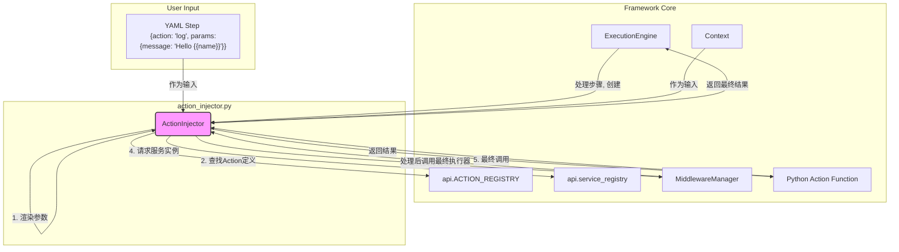
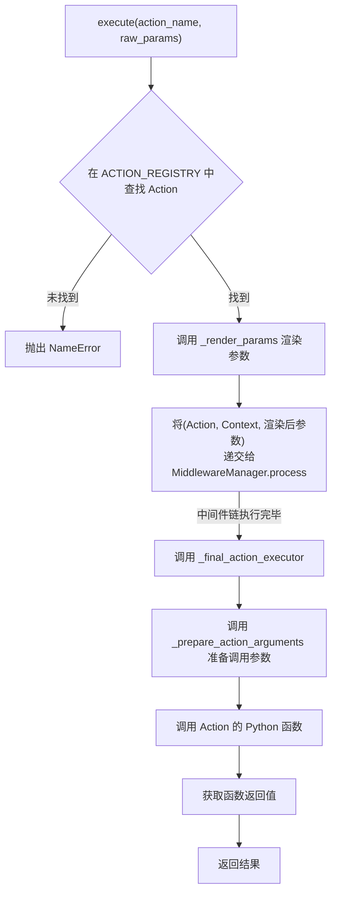

# **Core Module: `action_injector.py`**

## **1. 概述 (Overview)**

`action_injector.py` 模块定义了 `ActionInjector` 类，它是 Aura 框架的**行为调用核心**。您可以将其想象成一个高度专业化的“翻译器”和“执行官”，负责将 YAML 中声明式的步骤（如 `action: log`）转化为一次具体、完整的 Python 函数调用。

它的核心职责是弥合用户编写的简单 YAML 和开发者编写的复杂 Python Action 函数之间的鸿沟。

## **2. 在框架中的角色 (Role in the Framework)**

`ActionInjector` 在整个任务执行流程中扮演着承上启下的关键角色。它被 `ExecutionEngine` 在处理每个具体步骤时所创建和使用。

下面是 `ActionInjector` 在系统中的交互图：

如图所示，`ActionInjector` 是一个中心协调者，它利用 `Context` 和 `Jinja2` 来准备数据，查询 `ACTION_REGISTRY` 来确定目标，通过 `MiddlewareManager` 来增强过程，并从 `service_registry` 获取依赖，最终完成对 Action 函数的调用。

## **3. Class: `ActionInjector`**

### **3.1. 目的与职责 (Purpose & Responsibilities)**

`ActionInjector` 类的设计目标是**封装所有与单个 Action 调用相关的复杂性**。其主要职责细分为：

1.  **参数渲染**: 使用 Jinja2 模板引擎，将 YAML 中包含 `{{...}}` 语法的参数字符串，利用当前 `Context` 中的数据，渲染成最终的 Python 值。
2.  **依赖注入**: 自动识别 Action 函数签名中声明的依赖（如 `context`, `engine` 或特定服务），并从框架中获取相应的实例进行注入。
3.  **执行编排**: 将 Action 的执行请求包裹后，首先递交给 `MiddlewareManager`。这允许外部插件通过中间件来监视、修改甚至拦截 Action 的执行（例如，用于日志记录、性能分析、权限校验等）。
4.  **最终调用**: 作为中间件链的最终环节，精确地调用目标 Action 函数，并传递所有准备好的参数。
5.  **结果返回**: 将 Action 函数的返回值返回给调用者（通常是 `ExecutionEngine`）。

### **3.2. 初始化 (`__init__`)**

创建一个 `ActionInjector` 实例需要提供：

*   **`context: Context`**: 当前任务的上下文实例。这是参数渲染和依赖注入所需数据的来源。
*   **`engine: ExecutionEngine`**: 执行引擎的实例。某些特殊的 Action（如 `run_task`）可能需要与引擎直接交互，因此需要将其注入。

在初始化过程中，它会创建一个独立的、线程安全的 `Jinja2` 环境，并调用 `_initialize_jinja_globals()` 来注册全局可用的模板函数，最典型的就是 `config()` 函数，允许用户在 YAML 中直接通过 `{{ config('some_key') }}` 来获取配置。

### **3.3. 核心方法: `execute()`**

这是 `ActionInjector` 对外暴露的唯一主方法，是所有功能的入口。

*   **输入**:
    *   `action_name: str`: 要执行的 Action 的名称，来自 YAML 的 `action` 字段。
    *   `raw_params: Dict[str, Any]`: 从 YAML 中读取的、未经处理的原始参数字典。
*   **输出**: `Any` - Action 函数执行后的返回值。

#### **执行流程图 (Execution Flow)**

`execute` 方法的内部逻辑遵循一个清晰的流程：

### **3.4. 关键内部方法 (Key Internal Methods)**

#### **`_render_params()` 和 `_render_value()`**

这两个方法组成了模块的**模板渲染引擎**。

*   **功能**: 递归地遍历 `raw_params` 字典/列表，找到所有字符串类型的值，并使用 `Jinja2` 和当前 `Context` 的数据进行渲染。
*   **核心特性**:
    *   **智能类型转换**: 对于纯表达式（如 `value: "{{ 1 + 1 }}"`），它会使用 `ast.literal_eval` 尝试将渲染后的字符串（如 `"2"`）转换为对应的 Python 类型（`int(2)`）。它还能正确处理 `"True"` -> `True`，`"None"` -> `None`。
    *   **健壮性**: 当模板中引用的变量在上下文中不存在时 (`UndefinedError`)，它不会抛出异常导致任务中断，而是会返回 `None`。这使得 `when: "{{ optional_var }}"` 这样的条件判断能够安全地工作。

#### **`_prepare_action_arguments()`**

这是模块的**依赖注入引擎**，是 Aura 框架实现“约定优于配置”的关键。

*   **功能**: 它会检查目标 Action 函数的签名（即它需要哪些参数），然后按照一个严格的优先级顺序来为每个参数寻找对应的值。

*   **参数解析优先级**: 对于 Action 函数的每一个参数（比如叫 `my_param`），`ActionInjector` 会按以下顺序查找它的值：

    1.  **服务注入**: 检查 `my_param` 是否在 Action 的 `@requires_services` 声明中。如果是，则从 `service_registry` 获取服务实例并注入。
    2.  **框架对象注入**: 检查 `my_param` 是否是框架的保留字，如 `context`, `engine`, `persistent_context`。如果是，则注入对应的核心对象。
    3.  **显式参数**: 在经过渲染的 `params` 字典中查找 `my_param`。这是最常见的传参方式。
    4.  **隐式上下文注入**: 如果在 `params` 中没找到，则尝试直接从 `Context` 中获取名为 `my_param` 的变量。这允许用户不显式传递已存在于上下文中的变量。
    5.  **函数默认值**: 如果以上都未找到，检查 Action 函数本身是否为 `my_param` 定义了默认值。
    6.  **失败**: 如果以上所有尝试都失败，说明这是一个必需但未被提供的参数，此时会抛出 `ValueError`。

#### **`_final_action_executor()`**

*   **功能**: 它是 `middleware_manager.process()` 的 `final_handler`。在所有中间件都执行完毕后，这个函数会被调用，它负责衔接参数准备和最终的函数调用。它的存在是 Aura 中间件模式的标准实现。

## **4. 总结 (Summary)**

`ActionInjector` 是 Aura 框架中一个设计精巧、职责单一的核心组件。它优雅地解决了从用户友好的 YAML 声明到功能强大的 Python 代码执行之间的转换问题。通过其内置的模板渲染和依赖注入机制，它极大地简化了 Action 的编写和使用，是 Aura 框架动态、灵活和可扩展特性的基石。理解 `ActionInjector` 的工作原理，是深入理解 Aura 任务执行细节的关键一步。

