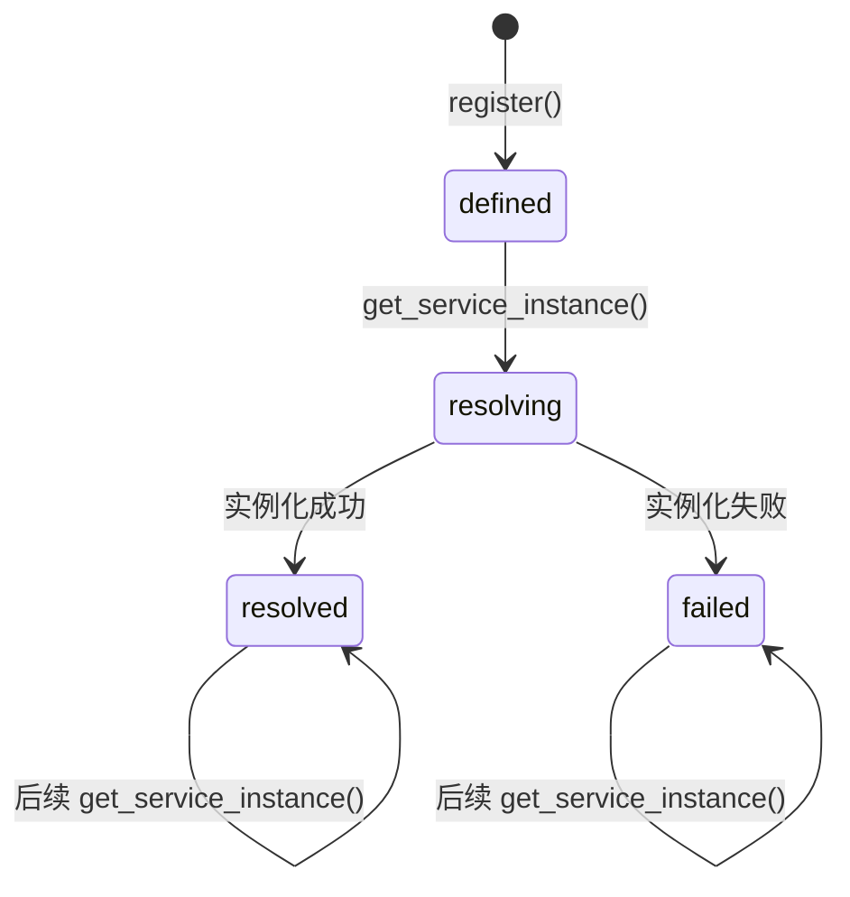

# **Core Module: `api.py`**

## **1. 概述 (Overview)**

`api.py` 是 Aura 3.0 框架的**公共应用程序接口 (Public API) 入口**。它定义了所有插件开发者与 Aura 核心交互的“契约”。任何希望为 Aura 扩展新功能（如自定义 Action、Service 或响应框架事件）的开发者，都应该从这个模块导入所需的装饰器和全局注册中心。

此模块的设计遵循**注册中心模式 (Registry Pattern)**，为框架的三个核心可扩展点提供了统一的接口：

1.  **Action API**: 用于定义新的可执行行为。
2.  **Service API**: 用于定义可复用的、有状态的后端服务。
3.  **Hook API**: 用于在框架生命周期的特定节点执行自定义逻辑。

## **2. 在框架中的角色 (Role in the Framework)**

`api.py` 是框架的“中央枢纽”和“公告板”。在框架启动阶段，`PluginLoader` (或其他引导程序) 会扫描所有插件，并使用此模块中的注册函数（如 `@register_action`, `@register_service`）将插件提供的功能“公告”到全局的注册中心单例（`ACTION_REGISTRY`, `service_registry`, `hook_manager`）。

在任务执行阶段，框架的核心组件（如 `ExecutionEngine` 和 `ActionInjector`）则会从这些注册中心查询和获取所需的功能来执行任务。

## **3. Action API**

Action API 允许开发者将普通的 Python 函数封装成可被 `ExecutionEngine` 调用的原子操作。

### **3.1. 核心组件 (Core Components)**

*   **`@register_action(name, ...)`**: 装饰器。将一个函数标记为 Action，并附加元数据。
    *   **输入**: `name` (插件内唯一的行为名), `read_only`, `public` (可见性标志)。
*   **`@requires_services(...)`**: 装饰器。用于为 Action 声明其所需的服务依赖，支持通过关键字参数（`db='mydb'`）或位置参数（`'vision'`）进行声明。
*   **`ActionDefinition`**: 数据类。一个内部数据结构，用于封装 Action 函数及其所有元数据（包括其来源插件 `plugin`，依赖 `service_deps` 等）。它的 `fqid` 属性（Fully Qualified ID，格式为 `plugin_id/action_name`）提供了全局唯一的标识。
*   **`ACTION_REGISTRY`**: 全局单例。`ActionRegistry` 类的实例，负责存储所有已注册的 `ActionDefinition`。
    *   **交互**: `PluginLoader` 在启动时调用其 `register` 方法。`ActionInjector` 在执行时调用其 `get` 方法来查找 Action。
    *   **冲突处理**: `register` 方法在遇到同名 Action 时会发出警告，并以后加载的为准。

## **4. Service API**

Service API 是 Aura 框架最强大和最复杂的部分，它提供了一个完善的**依赖注入 (Dependency Injection)** 和**服务生命周期管理**系统。

### **4.1. 核心组件 (Core Components)**

*   **`@register_service(alias, ...)`**: 装饰器。将一个 Python 类标记为 Service。
    *   **输入**: `alias` (服务的短别名，在整个框架中应具备高辨识度), `public` (可见性标志)。
*   **`ServiceDefinition`**: 数据类。封装了 Service 类及其元数据。关键属性包括：
    *   `fqid`: 全局唯一ID，格式为 `plugin_id/alias`。
    *   `status`: 服务的生命周期状态 (`defined`, `resolving`, `resolved`, `failed`)。
    *   `is_extension`, `parent_fqid`: 用于支持服务继承。
*   **`service_registry`**: 全局单例。`ServiceRegistry` 类的实例，是整个服务系统的核心。

### **4.2. `ServiceRegistry` 的功能与机制**

`ServiceRegistry` 负责服务的完整生命周期，从定义到销毁。

#### **注册 (`register`)**

*   **功能**: 将一个 `ServiceDefinition` 添加到注册中心。
*   **输入**: `ServiceDefinition` 对象。
*   **核心逻辑**:
    1.  **冲突检测**: 检查 FQID 是否已存在。
    2.  **别名处理**: 检查服务的 `alias` 是否已被占用。
    3.  **继承与覆盖 (Inheritance & Overriding)**: 这是最复杂的逻辑。它会检查定义服务的插件的 `plugin.yaml` 中是否声明了 `extends` 或 `overrides` 字段。
        *   如果 `extends`，则将新服务标记为对现有服务的**扩展**，并记录父服务的 FQID。
        *   如果 `overrides`，则允许新服务**覆盖**（替换）现有服务的别名映射。
        *   如果既不扩展也不覆盖，但别名冲突，则会抛出异常，强制开发者明确其意图。

#### **实例化 (`get_service_instance` & `_instantiate_service`)**

*   **功能**: 按需创建并返回服务的单例实例。
*   **输入**: `service_id` (可以是短别名 `alias` 或 FQID)。
*   **核心机制**:
    1.  **懒加载 (Lazy Loading)**: 服务只有在第一次被请求时才会被实例化。
    2.  **单例模式 (Singleton)**: 一旦实例化，该实例将被缓存，后续所有对该服务的请求都将返回同一个实例。
    3.  **循环依赖检测**: 通过 `resolution_chain` 列表跟踪实例化链，如果发现循环依赖（如 A 依赖 B，B 依赖 A），则抛出 `RecursionError`。
    4.  **自动依赖注入 (`_resolve_constructor_dependencies`)**: 这是框架的“魔法”所在。当实例化一个服务时，它会自动解析其构造函数 (`__init__`) 的参数，并注入所需的其他服务实例。解析顺序为：
        *   **优先按类型注解**: 如果参数有类型提示，且该类型对应一个已注册的服务，则注入该服务。
        *   **回退到参数名**: 如果类型注解无法解析，则将参数名本身作为服务别名去查找并注入。
    5.  **服务继承实现**: 当实例化一个扩展服务 (`is_extension=True`) 时，它会先实例化父服务，然后将父服务实例通过 `InheritanceProxy` 与子服务实例组合起来，实现方法的继承和覆盖。

#### **服务生命周期状态图**

## **5. Hook API**

Hook API 提供了一个简单的发布-订阅系统，允许插件在框架运行的关键时刻（如“任务开始前”、“任务结束后”）注入自己的逻辑。

### **5.1. 核心组件 (Core Components)**

*   **`@register_hook(name)`**: 装饰器。将一个函数注册为特定事件钩子的监听器。
    *   **输入**: `name` (钩子的名称，如 `before_task_run`)。
*   **`HookManager`**: 一个简单的事件分发器。
    *   `register(hook_name, func)`: 将函数 `func` 添加到 `hook_name` 事件的监听者列表中。
    *   `trigger(hook_name, ...)`: 遍历 `hook_name` 事件的所有监听函数并依次执行。
*   **`hook_manager`**: 全局单例。`HookManager` 类的实例。

## **6. 总结 (Summary)**

`api.py` 是 Aura 框架可扩展性的基石。它通过提供一组清晰、一致的装饰器和全局注册中心，为插件开发者定义了一个稳定的开发接口。其内部实现，特别是 `ServiceRegistry` 中复杂的依赖注入、生命周期管理和继承/覆盖逻辑，是 Aura 框架强大功能和灵活性的核心体现。任何对 Aura 进行深度定制或插件开发的工程师，都必须首先理解并掌握此模块提供的公共 API。

