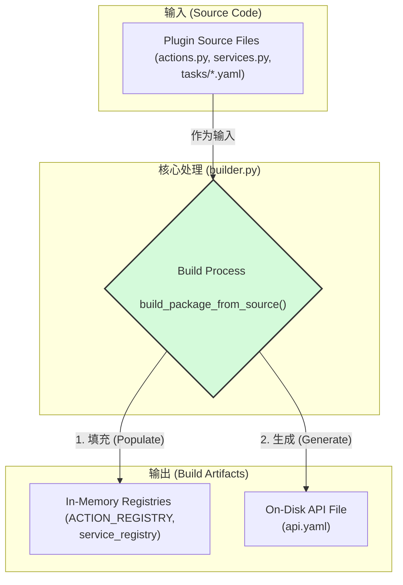
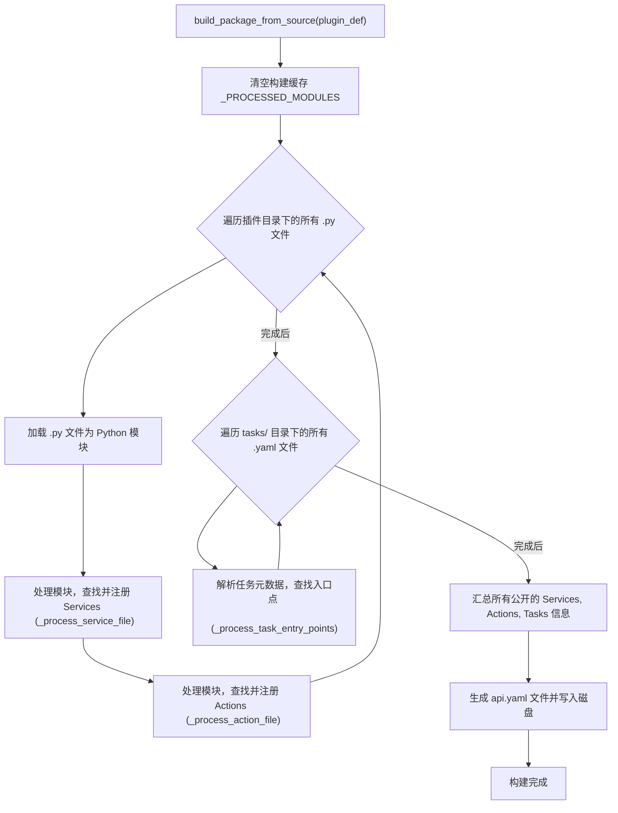

    

# **Core Module: `builder.py`**

## **1. 概述 (Overview)**

`builder.py` 是 Aura 框架的**插件构建引擎**。它的核心职责是将开发者编写的、人类可读的插件源代码（`.py` 和 `.yaml` 文件）转换成 Aura 运行时能够理解和使用的内部结构。

可以将其看作是一个**轻量级的“编译器”或“扫描器”**。它在框架启动或插件加载时运行，负责动态地发现、解析和注册插件提供的所有功能。这个模块是 Aura 强大插件化架构的基石。

## **2. 在框架中的角色 (Role in the Framework)**

`builder.py` 是一个典型的**构建时 (Build-Time)** 工具，它在任务的实际执行之前工作，负责准备好所有的“原材料”。它的工作流程与 `ExecutionEngine` 等**运行时 (Run-Time)** 组件是分离的。

下面的图表演示了 `builder` 在整个系统中的位置和数据流：

如图所示，`builder` 消耗插件的源代码，并产生两种关键的“构建产物”：
1.  **内存中的注册表**: 它直接调用 `api.py` 中的 `ACTION_REGISTRY.register()` 和 `service_registry.register()`，将发现的 Action 和 Service 实时注册到内存中，供运行时立即使用。
2.  **磁盘上的 API 文件**: 它会为每个插件生成一个 `api.yaml` 文件，作为该插件对外暴露能力的静态清单。这个文件对于 UI 工具、静态分析或未来的包管理系统非常有用。

## **3. 核心功能: `build_package_from_source()`**

这是 `builder.py` 对外暴露的唯一主函数，它编排了整个插件的构建过程。

*   **输入**:
    *   `plugin_def: PluginDefinition`: 一个数据对象，包含了插件的元数据，最重要的是插件的根目录路径 (`plugin_def.path`)。
*   **输出**: 无直接返回值，其效果体现在对全局注册中心的修改和 `api.yaml` 文件的生成上。

#### **执行流程图 (Orchestration Flow)**

`build_package_from_source` 的内部工作流程如下：

## **4. 关键机制 (Key Mechanisms)**

`builder.py` 的强大功能依赖于几个核心的 Python 编程技术。

### **4.1. 动态模块加载 (`_load_module_from_path`)**

*   **功能**: 这是 `builder` 能够处理任意位置插件的魔法所在。它不依赖于传统的 `sys.path`，而是使用 `importlib.util` 库根据文件的绝对路径直接将其加载为一个 Python 模块。
*   **交互**:
    *   它会检查 `sys.modules`，避免重复加载已经存在的模块。
    *   加载成功后，会将新模块添加到 `sys.modules`，以便后续的 `import` 语句可以找到它。
    *   使用 `_PROCESSED_MODULES` 集合作为本地缓存，防止在单次构建流程中重复处理同一个文件。

### **4.2. 反射与内省 (`_process_service_file` & `_process_action_file`)**

*   **功能**: `builder` 不会去“理解”Action 或 Service 的代码逻辑。相反，它使用 Python 的 `inspect` 模块来**反射**地检查模块内容。
*   **交互**:
    1.  它遍历模块中所有的类和函数。
    2.  它检查每个对象是否有一个特殊的元数据属性（`_aura_service_meta` 或 `_aura_action_meta`）。这个属性是在代码中由 `@register_service` 和 `@register_action` 装饰器附加的。
    3.  如果找到了这个元数据，它就知道这是一个需要注册的 Aura 组件。
    4.  然后，它会从元数据中提取信息（如 `name`, `alias`, `public`），并结合从 `plugin_def` 中获取的插件信息，创建 `ActionDefinition` 或 `ServiceDefinition` 对象。
    5.  最后，调用 `ACTION_REGISTRY.register()` 或 `service_registry.register()` 完成注册。

### **4.3. 任务元数据解析 (`_process_task_entry_points`)**

*   **功能**: 负责从插件的 `tasks` 目录中识别出哪些任务是希望暴露给用户（例如，在 UI 界面上显示）的“入口点”。
*   **交互**:
    *   它会递归地扫描 `tasks` 目录下的所有 `.yaml` 文件。
    *   对于每个文件，它会使用 `yaml.safe_load()` 进行解析。
    *   **支持多格式**: 这是一个关键特性。它能智能地判断 YAML 文件的格式：
        *   **旧格式 (单任务)**: 如果文件顶层包含 `steps` 键，则认为整个文件是一个任务。
        *   **新格式 (多任务)**: 否则，它会遍历文件顶层的所有键，将每个键都视为一个独立的任务定义。
    *   它会查找每个任务定义中的 `meta.entry_point: true` 标志。只有带有此标志的任务才会被视为公共入口点，并被记录到 `api.yaml` 中。

## **5. 总结 (Summary)**

`builder.py` 是 Aura 插件化架构的“引导程序”和“翻译官”。它通过动态加载、反射和元数据解析等高级技术，将分散在各个插件中的源代码，系统性地整合进框架的统一管理体系中。它将复杂的发现和注册过程与核心的执行逻辑完全解耦，使得框架的扩展变得简单而清晰。任何希望理解 Aura 如何加载和管理插件的开发者，都必须首先理解 `builder.py` 的工作流程和核心机制。

