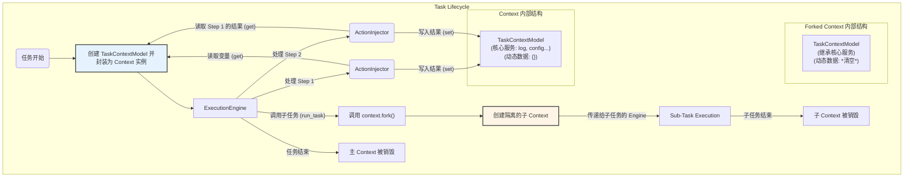

---

# **核心模块: `context.py`**

## **1. 概述 (Overview)**

`context.py` 定义了 `Context` 类，它是 Aura 框架中**结构化数据流的载体**。与旧版本不同，新版 `Context` 是一个围绕 Pydantic 数据模型 (`TaskContextModel`) 构建的智能接口。它不再是一个简单的键值存储，而是一个类型安全、自文档化的数据容器，负责在任务的各个步骤之间传递信息、状态和核心服务。

它将框架的核心数据（如配置、日志服务）与任务执行期间产生的动态数据（如步骤输出）进行了明确的分离，极大地提升了系统的健robustness和可维护性。

## **2. 核心架构：模型与接口分离**

新版 `Context` 的设计采用了**模型-接口分离**的模式，由两个核心类组成：

1.  **`TaskContextModel` (数据模型)**:
    *   这是一个 Pydantic `BaseModel`，它严格定义了上下文中**必须存在的核心数据和服务的结构**。
    *   它为 `plan_name`, `log`, `persistent_context`, `config` 等核心对象提供了明确的、类型化的字段。
    *   它包含一个名为 `dynamic_data` 的字典字段，这是**唯一**用于存储用户自定义变量、步骤输出和循环变量的地方。
    *   **目的**: 提供类型安全、数据验证和自动补全，确保框架所需的核心服务始终可用。

2.  **`Context` (智能接口)**:
    *   这是一个封装 `TaskContextModel` 实例的**公共 API**。
    *   开发者和框架的其他部分通过 `Context` 类的方法 (`get`, `set`, `fork`) 与上下文数据进行交互。
    *   **目的**: 提供一个受控的、方便的接口来访问和修改上下文数据，同时保护核心数据不被意外覆盖。

## **3. 在框架中的角色 (Role in the Framework)**

`Context` 对象在任务的生命周期中扮演着核心角色。一个 `Context` 实例在任务开始时被创建，并被传递给 `ExecutionEngine`。随后，在任务的每一步执行中，它都会被 `ActionInjector` 使用。



## **4. Class: `Context`**

### **4.1. 核心方法 (Core Methods)**

#### **`get(key, default)`**

*   **功能**: 从上下文中获取一个值。
*   **核心机制**: 它实现了一个明确的查找优先级：
    1.  **首先，在 `dynamic_data` (动态数据) 中查找**。这是用户通过 `set` 方法或 `output_to` 存入数据的地方。
    2.  **然后，在 `TaskContextModel` 的核心字段中查找**。这允许访问 `log`, `config`, `plan_name` 等核心服务和元数据。
    3.  如果都找不到，则返回 `default` 值。

***示例:***
```python
# 假设 context 中:
# - model.plan_name = "my_plan"
# - model.dynamic_data = {"my_variable": 123}

context.get("my_variable")  # -> 返回 123 (来自 dynamic_data)
context.get("plan_name")    # -> 返回 "my_plan" (来自核心模型)
context.get("non_existent") # -> 返回 None (默认值)
```

#### **`set(key, value)`**

*   **功能**: 向上下文中设置一个值。
*   **核心机制**:
    *   此方法**只能**向 `dynamic_data` 字典中写入数据。
    *   它有一个**保护机制**：如果尝试设置的 `key` 与 `TaskContextModel` 的一个核心字段同名，操作将被阻止并记录一条警告。这可以防止用户意外地覆盖核心服务（如 `log` 或 `config`）。

#### **`fork()`**

这是实现子任务数据隔离的关键方法，其行为在新架构下更加精确。

*   **功能**: 创建并返回一个新的、变量隔离的子 `Context` 实例。
*   **核心机制**:
    1.  它使用 Pydantic 的 `copy(deep=True)` 方法深度复制底层的 `TaskContextModel`。这意味着所有核心服务和元数据（如 `log`, `config`, `persistent_context`）都会被**继承**到子上下文中。
    2.  复制完成后，它会**显式地将子上下文的 `dynamic_data` 重置为一个空字典 `{}`**。
    3.  同时，它会将新 `Context` 的 `is_sub_context` 标志设置为 `True`。

这种 **“继承核心，清空动态”** 的设计模式是新版 `Context` 的核心优势。它确保了子任务可以访问所有必要的框架服务，但又从一个干净的、无污染的变量环境开始执行，使其行为高度可预测、易于测试和复用。

#### **`is_sub_context()` 和 `get_triggering_event()`**

这些是只读的访问器方法，允许框架的其他部分安全地查询上下文的状态，它们直接从底层的 Pydantic 模型中读取相应的值。

## **5. 总结 (Summary)**

重构后的 `Context` 类是 Aura 框架在健壮性和可维护性方面迈出的一大步。通过引入 Pydantic 模型，它从一个灵活但易出错的字典，转变为一个结构清晰、类型安全的“数据契约”。

其核心设计思想——**分离核心服务与动态数据**——并通过 `get`, `set`, `fork` 方法实施严格的访问和隔离策略，有效地防止了数据污染，使得复杂的任务流更加可靠和易于调试。理解这个新的、基于模型的上下文是掌握现代 Aura 任务执行流程的关键。

