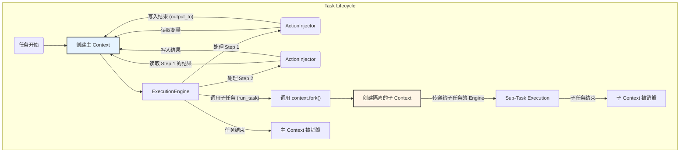

# **Core Module: `context.py`**

## **1. 概述 (Overview)**

`context.py` 定义了 `Context` 类，它是 Aura 框架中**数据流动的载体**。如果说 `ExecutionEngine` 是框架的大脑，那么 `Context` 就是流淌在其中的血液，负责在任务的各个步骤之间传递信息、状态和变量。

它的本质是一个智能的、大小写不敏感的键值存储（字典），封装了任务执行期间的所有动态数据。

## **2. 在框架中的角色 (Role in the Framework)**

`Context` 对象在任务的生命周期中扮演着核心角色。一个 `Context` 实例在任务开始时被创建，并被传递给 `ExecutionEngine`。随后，在任务的每一步执行中，它都会被 `ActionInjector` 用来：

1.  **提供数据**: 为 Jinja2 模板渲染提供变量。
2.  **存储结果**: 接收 Action 执行后的返回值 (通过 `output_to`)。
3.  **状态传递**: 将一个步骤的结果传递给后续步骤。

此外，当任务调用子任务时，`Context` 通过其 `fork()` 方法来确保数据隔离，这是实现模块化和可复用任务的关键。

## **3. Class: `Context`**

### **3.1. 目的与职责 (Purpose & Responsibilities)**

`Context` 类的设计目标是提供一个简单、可靠且隔离的变量存储区。其核心职责包括：

1.  **数据存储**: 提供基本的 `set`, `get`, `delete` 方法来操作键值对。
2.  **大小写不敏感**: 所有的键（key）在内部都会被转换为小写，这极大地提升了用户在 YAML 中编写变量名的容错性（例如，`{{ myVar }}` 和 `{{ myvar }}` 是等效的）。
3.  **隔离性**: 通过 `fork()` 方法为子任务创建全新的、空白的上下文，防止父子任务之间发生意外的数据污染。
4.  **状态标识**: 内部维护标志位（`_is_sub_context`, `_triggering_event`）来记录自身的来源和类型，供框架内部逻辑判断使用。

### **3.2. 初始化 (`__init__`)**

*   **输入**:
    *   `initial_data: Dict[str, Any]` (可选): 一个普通的字典，用于在上下文创建时预置一些初始数据。例如，`Orchestrator` 会用它来传入任务的启动参数。
    *   `is_sub_context: bool` (内部使用): 一个布尔标志，用于明确地标记这个上下文是否是为子任务创建的。默认为 `False`。
    *   `triggering_event: Optional[Event]` (内部使用): 记录触发此上下文创建的事件对象（如果适用）。这对于追溯任务启动的源头（例如，是哪个定时器或哪个 Webhook 触发的）非常有用。

### **3.3. 核心方法 (Core Methods)**

#### **`set(key, value)` / `get(key, default)` / `delete(key)`**

这些是标准的字典操作方法，但都内置了将 `key` 转换为小写的逻辑，这是其“智能”的体现。

#### **`fork()`**

这是实现子任务数据隔离的关键方法。

*   **功能**: 创建并返回一个新的 `Context` 实例。
*   **核心机制**:
    1.  它**不会**复制父上下文的任何数据 (`_data`)。新创建的 `Context` 是完全空白的。
    2.  它会将新 `Context` 的 `is_sub_context` 标志**硬编码为 `True`**。
    3.  它会将父上下文的 `_triggering_event` 传递给子上下文，确保整个调用链的触发源头信息得以保留。

这种“完全隔离，显式传递”的设计模式（父任务需要通过 `run_task` 的 `pass_params` 显式传递数据给子任务）是一种健壮的设计，它使得子任务的行为更加可预测，易于独立测试和复用。

#### **`is_sub_context()` 和 `get_triggering_event()`**

这些是只读的访问器方法，允许框架的其他部分安全地查询上下文的状态，而无需直接访问内部的私有变量（如 `_is_sub_context`）。

## **4. 与其他模块的交互 (Interaction with Other Modules)**

*   **`Orchestrator`**: 在任务启动时，负责创建**主上下文 (Main Context)**，并可能传入初始参数。
*   **`ExecutionEngine`**: 持有 `Context` 的引用，并在执行 `run_task` 时调用 `context.fork()` 来创建子上下文。
*   **`ActionInjector`**: **重度使用者**。它从 `Context` 中读取数据用于渲染模板，并将 `output_to` 的结果写回 `Context`。它还会将 `Context` 实例本身注入到需要它的 Action 函数中。
*   **`ContextManager`**: 在任务开始前，负责将**持久化上下文** (`persistent_context.json`) 的数据加载到主上下文中。
*   **`EventBus`**: 当通过事件触发任务时，`Event` 对象会被传递给 `Context` 的构造函数，从而在整个任务执行期间保留事件信息。

## **5. 总结 (Summary)**

`Context` 类虽然代码简单，但其在 Aura 框架中的概念地位至关重要。它是连接任务所有步骤的“胶水”，是实现动态和数据驱动自动化的基础。其大小写不敏感的设计提升了用户体验，而其 `fork()` 方法所实现的严格隔离机制则是保证复杂任务流健壮性和可维护性的核心设计决策。任何对 Aura 任务数据流的分析，都离不开对 `Context` 对象的理解。

