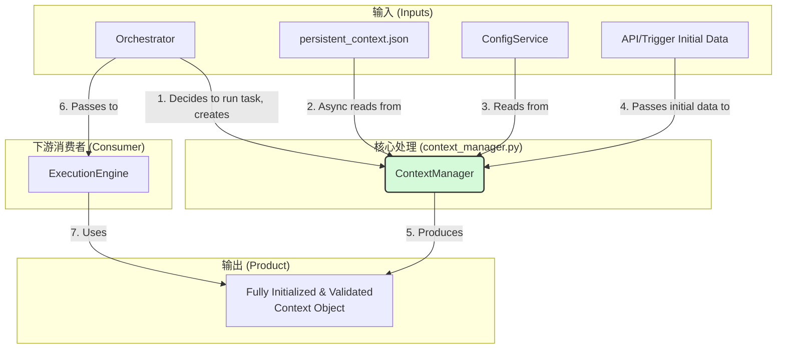
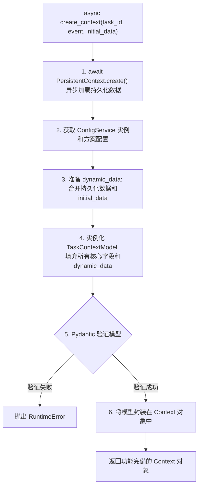

---

# **核心模块: `context_manager.py`**

## **1. 概述 (Overview)**

`context_manager.py` 定义了 `ContextManager` 类，它是 Aura 框架的**异步上下文引导程序 (Async Context Bootstrapper)**。它的核心职责是在每次任务执行前，**异步地**准备一个功能完备、结构化且经过验证的 `Context` 对象。

它确保了 `ExecutionEngine` 在开始工作时，能拿到一个基于 Pydantic 模型 (`TaskContextModel`) 的、预置了所有必要数据的“满状态”上下文，而无需关心其复杂的、可能涉及 I/O 的准备过程。

## **2. 在框架中的角色 (Role in the Framework)**

`ContextManager` 是**任务编排**与**任务执行**之间的关键桥梁。它通常被 `Orchestrator` 在决定运行一个任务时实例化和使用。`Orchestrator` 负责“决定做什么”，而 `ContextManager` 负责为这个“决定”准备好所需的数据环境。

其在系统中的数据流转清晰明了：

如图所示，`ContextManager` 异步地整合了来自多个源头的信息，将它们统一填充到 `TaskContextModel` 中，然后封装成一个 `Context` 对象交付给 `ExecutionEngine` 使用。

## **3. Class: `ContextManager`**

### **3.1. 目的与职责 (Purpose & Responsibilities)**

`ContextManager` 的设计目标是**将上下文的创建和初始化逻辑与执行逻辑解耦**。其核心职责包括：

1.  **实例化数据模型**: 创建并填充结构化的 `TaskContextModel`。
2.  **异步处理持久化**: 异步加载 `persistent_context.json` 文件中的数据。
3.  **注入配置与服务**: 与 `ConfigService` 交互，获取配置，并将 `logger` 等核心服务注入到模型中。
4.  **合并初始数据**: 能够接收并合并来自任务触发源（如 API 调用）的初始动态数据。
5.  **验证与封装**: 使用 Pydantic 验证模型的有效性，然后将其封装在 `Context` 接口对象中返回。

### **3.2. 初始化 (`__init__`)**

*   **输入**:
    *   `plan_name: str`: 当前执行的方案（插件）的名称。
    *   `plan_path: Path`: 当前方案的根目录路径。
*   **作用**: `ContextManager` 是**与特定方案绑定的**。它的初始化参数决定了它将要加载哪个 `persistent_context.json` 和哪个方案的配置。

### **3.3. 核心方法: `async create_context()`**

这是 `ContextManager` 最核心的方法，现在是一个异步函数，负责执行完整的上下文构建流程。

*   **输入**:
    *   `task_id: str`: 将要执行的任务的ID。
    *   `triggering_event: Optional[Event]`: （可选）触发本次任务执行的事件对象。
    *   `initial_data: Optional[Dict[str, Any]]`: （可选）一个字典，用于传入任务的初始动态数据。这对于 API 触发的任务尤其有用。
*   **输出**: 一个经过完全初始化的 `Context` 对象。

#### **上下文构建流程图 (Context Building Flow)**

#### **结构化数据填充机制**

新版 `ContextManager` 不再使用旧的“双重注入”机制，而是采用了一种更清晰、更结构化的方式来处理数据：

1.  **核心数据作为字段**: 所有框架级的、有明确结构的数据（如 `log`, `config`, `persistent_context` 对象本身）都作为 `TaskContextModel` 的**独立字段**被填充。
2.  **动态数据集中管理**: 所有来自持久化文件 (`persistent_context.json`) 和外部输入 (`initial_data`) 的、不固定的用户变量，都被合并后统一放入 `TaskContextModel` 的 `dynamic_data` 字段中。

这种设计使得数据的来源和类型一目了然，并通过 Pydantic 的验证确保了每次任务启动时上下文的完整性和正确性。

### **3.4. 辅助方法**

*   **`async get_persistent_context_data()`** 和 **`async save_persistent_context_data()`**: 这两个方法提供了对方案持久化数据的异步读写能力。它们现在使用 `PersistentContext.create()` 工厂方法，确保了与主创建流程一致的、健壮的文件访问逻辑。

## **4. 与其他模块的交互 (Interaction with Other Modules)**

*   **`Orchestrator`**: `ContextManager` 的**主要使用者**。`Orchestrator` 在启动任务流时，会创建 `ContextManager` 实例并 `await` 其 `create_context()` 方法。
*   **`Context` & `TaskContextModel`**: `ContextManager` 的**主要产品**。它负责创建、填充和验证 `TaskContextModel`，然后将其封装在 `Context` 对象中。
*   **`PersistentContext`**: `ContextManager` 使用它作为**底层实现**来异步处理 `persistent_context.json` 的文件读写。
*   **`api.service_registry`**: `ContextManager` 通过它来获取 `ConfigService` 的实例。

## **5. 总结 (Summary)**

重构后的 `ContextManager` 是一个现代化的、支持异步的“准备区”组件。它将所有繁琐但必要的上下文初始化工作集中处理，并通过 Pydantic `TaskContextModel` 确保了输出的 `Context` 对象的结构化和有效性。通过提供一个标准化的、可预期的异步上下文创建流程，它确保了每个任务都在一个一致、完备的数据环境中启动，是框架健壮性、可维护性和异步性能的重要保障。

