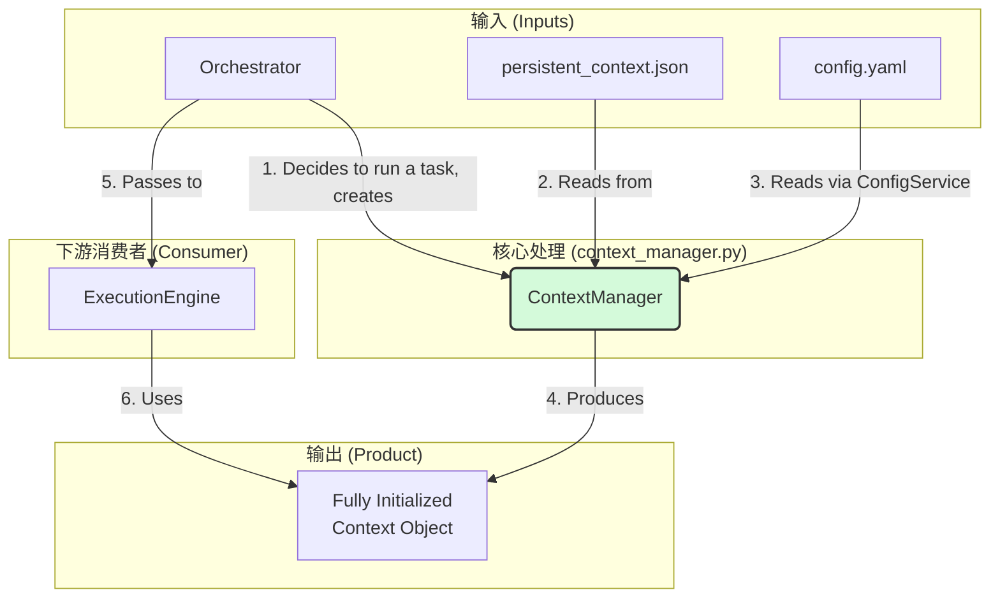
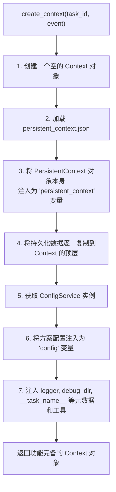

# **Core Module: `context_manager.py`**

## **1. 概述 (Overview)**

`context_manager.py` 定义了 `ContextManager` 类，它是 Aura 框架的**上下文引导程序 (Context Bootstrapper)**。它的核心职责是在每次任务执行前，准备一个功能完备、预置了所有必要信息的 `Context` 对象。

如果说 `Context` 是数据流动的血液，那么 `ContextManager` 就是在输血前，将所有必需的营养物质（如持久化数据、配置、元数据）注入血液的“护士站”。它确保了 `ExecutionEngine` 在开始工作时，能拿到一个“满状态”的上下文，而无需关心其复杂的准备过程。

## **2. 在框架中的角色 (Role in the Framework)**

`ContextManager` 是**任务编排**与**任务执行**之间的关键桥梁。它通常被 `Orchestrator` 在决定运行一个任务时实例化和使用。`Orchestrator` 负责“决定做什么”，而 `ContextManager` 负责为这个“决定”准备好所需的数据环境。

其在系统中的数据流转清晰明了：

如图所示，`ContextManager` 整合了来自多个源头（磁盘文件、配置服务）的信息，将它们统一注入到一个 `Context` 对象中，然后交付给 `ExecutionEngine` 使用。

## **3. Class: `ContextManager`**

### **3.1. 目的与职责 (Purpose & Responsibilities)**

`ContextManager` 的设计目标是**将上下文的创建和初始化逻辑与执行逻辑解耦**。其核心职责包括：

1.  **创建基础上下文**: 实例化一个 `Context` 对象。
2.  **处理持久化**: 加载 `persistent_context.json` 文件中的数据，并将其注入到新创建的上下文中。
3.  **注入配置**: 与 `ConfigService` 交互，获取当前方案的配置信息并注入上下文。
4.  **注入元数据**: 将任务执行相关的元数据（如任务ID、方案名称、调试目录路径等）注入上下文。
5.  **注入核心工具**: 将框架提供的常用工具（如 `logger`）注入上下文，方便用户在任务中直接使用。

### **3.2. 初始化 (`__init__`)**

*   **输入**:
    *   `plan_name: str`: 当前执行的方案（插件）的名称。
    *   `plan_path: Path`: 当前方案的根目录路径。
*   **作用**: `ContextManager` 是**与特定方案绑定的**。它的初始化参数决定了它将要加载哪个 `persistent_context.json` 和哪个方案的配置。

### **3.3. 核心方法: `create_context()`**

这是 `ContextManager` 最核心的方法，负责执行完整的上下文构建流程。

*   **输入**:
    *   `task_id: str`: 将要执行的任务的ID。
    *   `triggering_event: Optional[Event]`: （可选）触发本次任务执行的事件对象。
*   **输出**: 一个经过完全初始化的 `Context` 对象。

#### **上下文构建流程图 (Context Building Flow)**

#### **持久化上下文的双重注入机制**

`create_context` 在处理持久化上下文时采用了一种巧妙的**双重注入**机制：

1.  **对象注入**: 它将 `PersistentContext` 对象本身作为一个整体，注入到主上下文中，键为 `persistent_context`。这允许高级用户在 YAML 中直接调用其方法，例如 `{{ persistent_context.save() }}` 来强制保存。
2.  **数据注入**: 它遍历持久化上下文中的所有键值对，并将它们一一复制到主上下文的顶层。这提供了极大的便利，用户可以直接通过 `{{ my_persistent_variable }}` 来访问，而无需写成 `{{ persistent_context.my_persistent_variable }}`。

这种设计兼顾了易用性（直接访问）和高级功能（对象方法调用）。

### **3.4. 辅助方法**

*   **`get_persistent_context_data()`** 和 **`save_persistent_context_data()`**: 这两个方法提供了对方案持久化数据的直接读写能力，而无需创建一个完整的任务执行上下文。它们主要供外部工具（如配置UI、管理脚本）使用，方便用户在不运行任务的情况下查看或修改持久化状态。

## **4. 与其他模块的交互 (Interaction with Other Modules)**

*   **`Orchestrator`**: `ContextManager` 的**主要使用者**。`Orchestrator` 在启动任务流时，会创建 `ContextManager` 实例并调用 `create_context()`。
*   **`Context`**: `ContextManager` 的**主要产品**。它负责创建并“装配”`Context` 对象。
*   **`PersistentContext`**: `ContextManager` 使用它作为**底层实现**来处理 `persistent_context.json` 的文件读写。`ContextManager` 是高层策略，`PersistentContext` 是底层工具。
*   **`api.service_registry`**: `ContextManager` 通过它来获取 `ConfigService` 的实例，以实现配置的注入。

## **5. 总结 (Summary)**

`ContextManager` 是 Aura 框架中一个优雅的“准备区”组件。它将所有繁琐但必要的上下文初始化工作集中处理，从而极大地简化了 `Orchestrator` 和 `ExecutionEngine` 的职责。通过提供一个标准化的、可预期的上下文创建流程，它确保了每个任务都在一个一致、完备的数据环境中启动，是框架健壮性和可维护性的重要保障。

