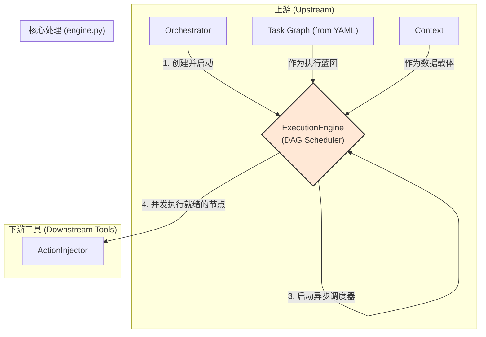
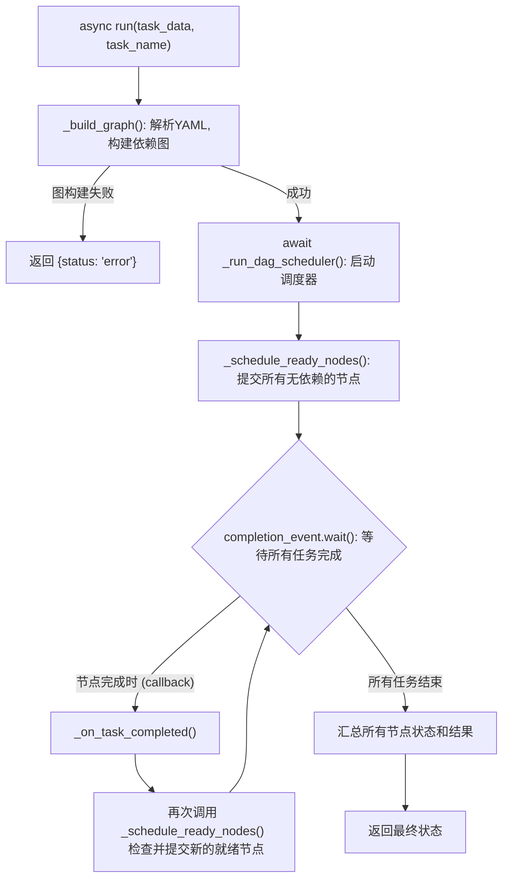

 好的，这是一个非常重大的重构。`ExecutionEngine` 已经从一个线性的、基于索引的解释器，演变成了一个先进的、基于依赖图 (DAG) 的异步调度器。这从根本上改变了任务的执行模型。

以下是根据您提供的新代码完全重写的文档，它将详细解释这个新的、功能强大的执行引擎。

---

# **核心模块: `engine.py` (DAG 调度器版)**

## **1. 概述 (Overview)**

`engine.py` 定义了新一代的 `ExecutionEngine` 类，它是 Aura 框架的**异步、基于依赖图 (DAG) 的运行时核心**。如果说 YAML 任务文件是一份复杂的“项目计划”，其中包含了各项任务（节点）及其前置条件，那么 `ExecutionEngine` 就是那位智能的“项目经理”，它能够理解这些复杂的依赖关系，并以最高效的方式并发调度和执行这些任务。

它的核心职责是接收一个定义了节点和依赖关系的图，然后**根据依赖满足情况，而非固定的线性顺序**，异步地执行每一个节点，并处理所有复杂的流程控制、并发和错误。

## **2. 在框架中的角色 (Role in the Framework)**

`ExecutionEngine` 是任务执行阶段的绝对中心。它被 `Orchestrator` 创建并启动，然后全权负责一个任务图的完整生命周期。它是一个有状态的对象，维护着图中所有节点的当前状态 (`PENDING`, `RUNNING`, `SUCCESS`, `FAILED`, `SKIPPED`)。



如图所示，`ExecutionEngine` 的执行模型已变为：构建图 -> 启动调度器 -> 并发执行。

## **3. Class: `ExecutionEngine`**

### **3.1. 目的与职责 (Purpose & Responsibilities)**

新版 `ExecutionEngine` 的设计目标是成为一个健壮、高效、支持复杂流程的**异步任务调度器**。其核心职责包括：

1.  **图构建与验证**: 在执行前，将 YAML 中的 `steps` 字典解析成一个内部的依赖图，并验证依赖关系的有效性（如检查未知依赖、循环依赖）。
2.  **异步调度**: 维护一个事件驱动的调度循环，持续检查哪些节点的所有依赖已满足，并将它们提交到 `asyncio` 事件循环中并发执行。
3.  **高级依赖评估**: 解析并评估复杂的布尔依赖逻辑（`and`, `or`, `not`），而不仅仅是简单的“A完成后做B”。
4.  **高级流程控制**: 原生支持 `try/catch/finally`, `for_each` (并行循环), `while` 和 `switch` 等强大的、作为图节点的流程控制结构。
5.  **状态管理**: 精确跟踪图中每个节点的状态，并根据节点状态（`SUCCESS`, `FAILED`, `SKIPPED`）来决定下游节点的行为。
6.  **子图编排**: 通过递归创建新的 `ExecutionEngine` 实例来执行 `for_each`, `while`, `try` 等结构中的子图，实现了完美的逻辑隔离。

### **3.2. 核心方法: `async run()`**

这是引擎的**主入口和调度器启动点**。

*   **输入**:
    *   `task_data: Dict[str, Any]`: 一个任务的完整定义，其 `steps` 字段现在是一个**字典**，键是节点ID。
    *   `task_name: str`: 当前任务的名称。
*   **输出**: 一个包含最终执行状态和所有节点结果的字典。

#### **执行流程图 (Execution Flow)**



## **4. 关键机制与设计决策 (Key Mechanisms & Design Decisions)**

### **4.1. DAG模型与异步调度器**

这是最核心的架构变革。任务不再是一个步骤列表，而是一个**节点字典**，每个节点可以声明其 `depends_on`。

*   **调度器 (`_run_dag_scheduler`)**: 一个基于 `asyncio.Event` 的事件驱动模型。它启动第一批就绪的节点，然后就 `await` 一个完成信号。
*   **回调驱动 (`_on_task_completed`)**: 每个节点的执行任务 (`asyncio.Task`) 完成后，都会触发此回调。这个回调函数负责再次调用 `_schedule_ready_nodes`，检查是否有新的节点因为刚刚完成的这个节点而变得“就绪”，从而驱动整个图的执行向前推进。
*   **并发性**: 这种模型天然支持最大程度的并发。只要多个节点互不依赖，它们就会被同时调度执行。

### **4.2. 高级布尔依赖 (`_are_dependencies_met`)**

`depends_on` 字段不再是一个简单的ID列表，它现在是一个可以递归解析的布尔表达式结构。

***示例:***
```yaml
steps:
  step_d:
    action: log
    depends_on:
      or:
        - step_a
        - and: [step_b, {not: step_c}]
```
`step_d` 会在“`step_a` 成功” **或** “`step_b` 成功 **且** `step_c` **没有**成功（已失败或跳过）”时执行。引擎的 `_evaluate_dep_struct` 方法负责递归地计算这个表达式的值。

### **4.3. 作为节点的流程控制**

旧引擎中的 `if`, `for` 是在执行流中解释的指令。在新引擎中，它们是**图中的一等公民节点**，拥有自己独特的行为。

*   **`for_each` (并行循环)**:
    *   它会为迭代的每一项创建一个独立的子上下文和**全新的 `ExecutionEngine` 实例**。
    *   然后使用 `asyncio.gather` **并行地**执行所有子任务。
    *   只有当所有子任务都成功时，`for_each` 节点本身才算成功。这实现了强大的 "fan-out/fan-in" 模式。

*   **`try/catch/finally`**:
    *   这是一个超级节点，它内部编排了 `try`, `catch`, `finally` 三个子图的执行。
    *   它能捕获 `try` 子图中的失败，并将错误信息注入到 `catch` 子图的上下文中。
    *   它能保证无论 `try` 或 `catch` 是否成功，`finally` 子图**总是**会被执行。

*   **`switch` (路由节点)**:
    *   它根据条件判断，决定执行哪一个下游分支。
    *   一个关键行为是：它会**主动地**将所有未被选中的分支路径上的第一个节点状态设置为 `SKIPPED`，从而有效地“剪枝”了图的执行路径。

### **4.4. 向后兼容性 (`_convert_linear_list_to_dag`)**

为了平滑过渡，引擎在 `run` 方法的开始会检查 `steps` 是否为旧的列表格式。如果是，它会自动将其包装成一个只包含单个节点 (`__legacy_linear_task`) 的图，该节点内部使用 `do` 关键字来顺序执行旧的步骤列表。

## **5. 总结 (Summary)**

新一代的 `ExecutionEngine` 是 Aura 框架在能力和现代化方面的一次巨大飞跃。它从一个简单的线性任务解释器，演变成了一个功能完备、为复杂自动化流程设计的**异步 DAG 调度器**。通过引入依赖图、布尔依赖评估、并行执行循环和强大的 `try/catch` 机制，它使得任务的编写可以更加声明式、模块化，并能充分利用现代多核 CPU 和异步 I/O 的性能优势。理解这个新的、基于图的执行模型，是掌握现代 Aura 任务编排与执行的关键。

