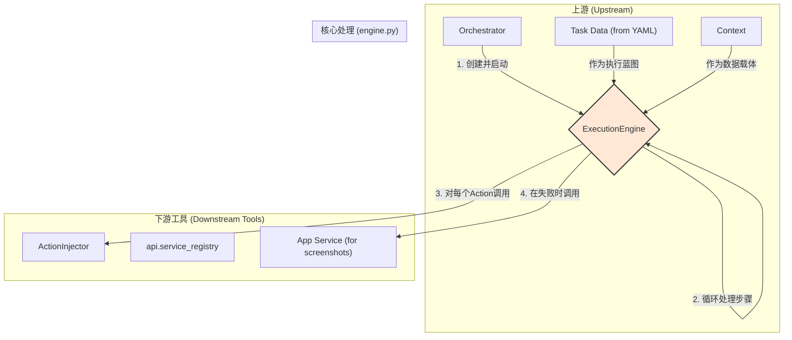
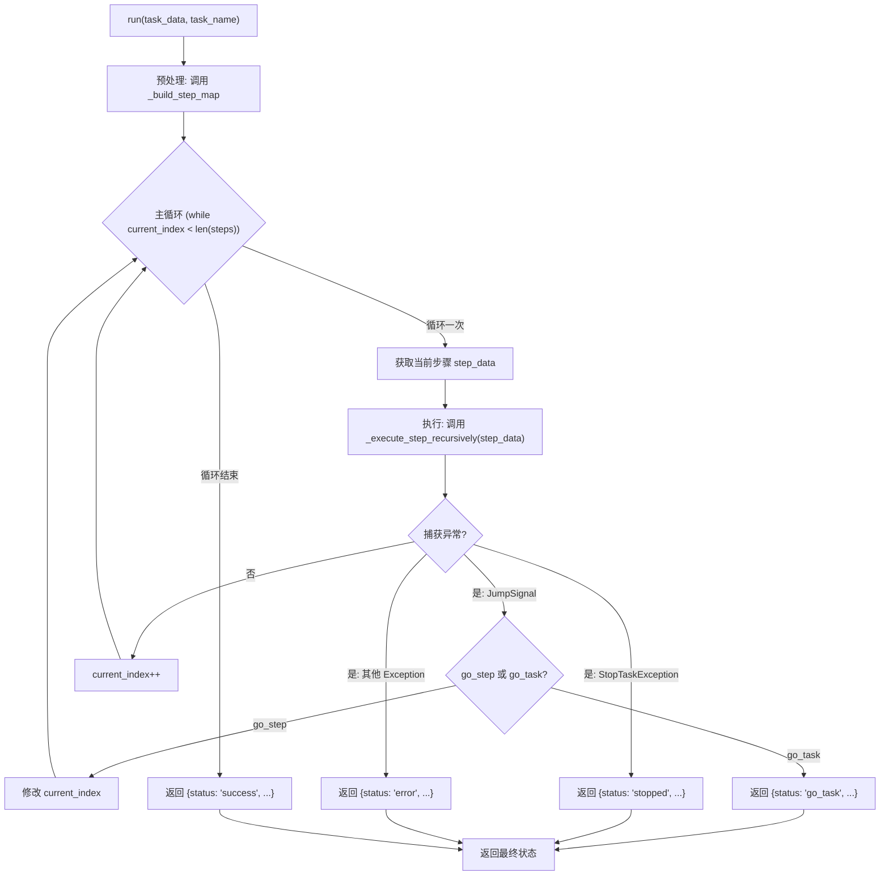

# **Core Module: `engine.py`**

## **1. 概述 (Overview)**

`engine.py` 定义了 `ExecutionEngine` 类，它是 Aura 框架的**运行时核心和任务解释器**。如果说 YAML 任务文件是一份详细的“食谱”，那么 `ExecutionEngine` 就是那位严格按照食谱步骤、使用各种厨房工具（如 `ActionInjector`）来烹饪菜肴的“大厨”。

它的核心职责是接收一个解析后的任务数据和一个上下文，然后精确地、有序地执行其中的每一个步骤，并处理所有复杂的流程控制、错误和状态转移。

## **2. 在框架中的角色 (Role in the Framework)**

`ExecutionEngine` 是任务执行阶段的绝对中心。它被 `Orchestrator` 创建并启动，然后全权负责一个任务（或子任务）的完整生命周期。它是一个有状态的对象，维护着当前执行的“程序计数器”（即步骤索引）。

如图所示，`ExecutionEngine` 是一个独立的执行单元，它消费任务数据和上下文，并利用框架提供的其他工具来完成具体工作。

## **3. Class: `ExecutionEngine`**

### **3.1. 目的与职责 (Purpose & Responsibilities)**

`ExecutionEngine` 的设计目标是成为一个健壮、可预测的**任务状态机**。其核心职责包括：

1.  **顺序执行**: 维护一个内部指针，按顺序迭代和执行任务中的步骤。
2.  **流程控制解释**: 将 YAML 中的高级流程控制结构（`if/then/else`, `for`, `while`）翻译成实际的执行逻辑。
3.  **跳转处理**: 实现 `go_step` 和 `go_task` 等跳转指令，改变正常的执行流程。
4.  **错误与重试管理**: 处理步骤失败、执行重试逻辑 (`retry`)，并根据 `continue_on_failure` 决定是否中断任务。
5.  **子任务编排**: 调用 `_run_sub_task` 来创建新的 `ExecutionEngine` 实例以执行子任务，并处理其返回值。
6.  **状态管理**: 与 `Context` 紧密交互，读取条件判断所需的数据，并将步骤结果写回。

### **3.2. 核心方法: `run()`**

这是引擎的**主入口和主循环**。

*   **输入**:
    *   `task_data: Dict[str, Any]`: 一个任务的完整定义，通常来自解析后的 YAML 文件。
    *   `task_name: str`: 当前任务的名称，用于日志记录。
*   **输出**: 一个包含执行状态的字典，如 `{'status': 'success', 'next_task': 'some_other_task'}`。这个返回值指导 `Orchestrator` 下一步该做什么。

#### **主执行循环流程图 (Main Execution Loop)**

## **4. 关键机制与设计决策 (Key Mechanisms & Design Decisions)**

### **4.1. 递归分发 (`_execute_step_recursively`)**

引擎不直接执行 Action，而是通过这个**递归分发器**来处理每个步骤。此方法首先检查 `when` 条件，然后像一个 `switch` 语句一样，判断步骤的类型（`if`, `for`, `while`, 或普通 Action），并调用相应的私有方法 (`_execute_if_block`, `_execute_for_block`, etc.)。这种分层设计使得逻辑清晰，易于扩展新的流程控制块。

### **4.2. 使用异常进行流程跳转 (`JumpSignal`)**

这是一个关键的设计决策。`go_step` 和 `go_task` 不是通过复杂的返回值来传递跳转意图，而是直接 `raise` 一个 `JumpSignal` 异常。

*   **优点**: 这种方式可以**立即中断当前的执行栈**。无论 `go_step` 指令深埋在多少层 `if/for/while` 循环内部，`raise` 语句都能直接将控制权交还给主 `run` 方法中的 `try...except` 块。这比层层 `return` 特殊信号值要干净和高效得多。

### **4.3. 步骤ID预映射 (`_build_step_map`)**

在 `run` 方法开始时，引擎会先调用 `_build_step_map` 遍历**整个任务的步骤树**。

*   **功能**: 它会创建一个字典 `self.step_map`，将所有步骤的 `id` 映射到其在**顶层 `steps` 列表中的索引**。
*   **目的**: 这是一个重要的**性能优化**。当执行 `go_step: 'my_target'` 时，引擎无需再次递归搜索整个步骤树来寻找 `id` 为 `my_target` 的步骤。它可以直接通过 `self.step_map['my_target']` 以 O(1) 的时间复杂度找到目标顶层步骤的索引，然后将主循环的 `current_index` 设置为该值。

### **4.4. 健壮的 Action 执行 (`_execute_single_action_step`)**

这个方法封装了单个 Action 的完整生命周期，体现了框架的健壮性设计。

1.  **前置等待**: 处理 `wait_before`。
2.  **重试循环**: `for attempt in range(max_attempts)` 实现了 `retry` 逻辑。
3.  **异常捕获**: 在循环内部捕获异常，以便进行下一次重试。
4.  **结果判断**: 能够智能地判断 Action 结果的成功与否（处理布尔值 `False` 和 `find_*` 系列返回对象中的 `.found` 属性）。
5.  **失败后处理**: 在所有重试都失败后，它会执行收尾工作：
    *   **【关键修复】**: 如果步骤定义了 `output_to`，则自动将 `False` 写入上下文对应的变量。这使得后续步骤可以安全地判断该可选操作是否成功。
    *   **调试截图**: 调用 `_capture_debug_screenshot`。

### **4.5. 子任务隔离与执行 (`_run_sub_task`)**

此方法完美地展示了 Aura 的模块化任务设计。

1.  **隔离**: 调用 `self.context.fork()` 创建一个全新的、隔离的子上下文。
2.  **参数传递**: 将 `pass_params` 中的数据显式地设置到子上下文中。
3.  **递归创建**: **创建一个全新的 `ExecutionEngine` 实例** 来执行子任务。这确保了父子任务的执行环境（如 `step_map`）完全独立。
4.  **结果处理**: 子任务结束后，它会处理子任务的 `outputs`，将其渲染并作为 `run_task` 这个 Action 的返回值。同时，它也会将子任务的 `go_task` 信号向上传播。

## **5. 总结 (Summary)**

`ExecutionEngine` 是 Aura 框架中逻辑最密集、最重要的组件。它不仅仅是一个简单的步骤迭代器，而是一个功能完备的、为自动化场景量身定制的编程语言解释器。通过巧妙地使用异常进行流程控制、预先构建跳转映射表、以及分层递归的执行策略，它在保证强大功能的同时，也维持了代码的清晰和可维护性。理解 `ExecutionEngine` 的工作原理，就等于掌握了 Aura 任务执行的脉搏。

