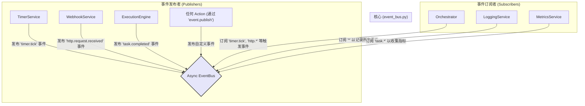

---

# **核心模块: `event_bus.py` (异步版)**

## **1. 概述 (Overview)**

`event_bus.py` 实现了 Aura 框架的**异步事件驱动核心**。它提供了一个全局的、异步安全的**发布-订阅 (Publish-Subscribe)** 系统，允许框架的不同部分在互不了解的情况下进行高效通信。

可以将其想象成一个现代化的内部消息队列。任何组件都可以向特定频道发布一个事件（`Event`），而所有订阅了该事件的组件都会被**并发地**、**非阻塞地**通知到。这种模式极大地降低了组件之间的耦合度，并充分利用了 `asyncio` 的性能优势。

## **2. 在框架中的角色 (Role in the Framework)**

`EventBus` 是将 Aura 从一个简单的任务执行器转变为一个**高性能、响应式的自动化平台**的关键。它使得 Aura 能够对内部或外部的变化做出快速反应（例如，对定时器滴答、文件变动或收到的 Webhook 请求做出反应）。

`Orchestrator` 是 `EventBus` 的主要消费者，它订阅各种触发事件，并据此启动相应的任务。

## **3. Class: `Event`**

`Event` 数据类是事件总线中流动的**标准化消息结构**。

*   **目的**: 它将零散的信息（事件名称、来源、数据）封装成一个结构化的对象，方便传递和处理。
*   **核心属性**:
    *   `name`: 事件的名称，支持通配符匹配 (e.g., `task.started`)。
    *   `channel`: 事件发布的频道，用于隔离不同领域的事件。默认为 `global`。
    *   `payload`: 一个字典，携带事件相关的任意数据。
    *   `id` & `timestamp`: 每个事件实例的唯一标识和创建时间。
    *   `causation_chain` & `depth`: 框架的**防循环熔断机制**。当一个事件的处理程序又发布了新的事件时，新事件会继承父事件的 `causation_chain` 并增加自己的 `id`，同时 `depth` 加一。
*   **新增方法**:
    *   `to_dict()`: 一个方便的辅助方法，可将 `Event` 实例转换为字典，便于序列化（例如，发送到 WebSocket 或写入日志）。

## **4. Class: `EventBus`**

### **4.1. 目的与职责 (Purpose & Responsibilities)**

新版 `EventBus` 的设计目标是提供一个高性能、异步安全且灵活的事件分发中心。其核心职责包括：

1.  **订阅管理**: 提供 `async subscribe` 和 `async unsubscribe` 方法来动态管理事件监听器。
2.  **事件分发**: `async publish` 方法负责接收事件，并将其**并发地**分发给所有匹配的订阅者。
3.  **异步安全**: 使用 `asyncio.Lock` 确保在高并发的异步环境中订阅和发布操作的数据一致性。
4.  **智能执行**: 能够无缝处理同步和异步的回调函数，确保同步代码不会阻塞事件循环。
5.  **健壮性保障**: 内置事件链深度检查，防止无限循环的事件风暴。

### **4.2. 核心机制与设计决策 (Key Mechanisms & Design Decisions)**

#### **频道与通配符订阅**

*   **频道 (`channel`)**: 内部订阅者列表按频道组织，这是一种命名空间机制，可以有效隔离不同领域的事件，避免命名冲突。
*   **通配符 (`fnmatch`)**: `subscribe` 的 `event_pattern` 和 `publish` 的 `event.name` 之间使用 `fnmatch` 进行匹配，提供了强大的灵活性（如 `task.*` 或 `*`）。

#### **高性能异步执行模型**

这是与旧版最根本的区别。

*   **`asyncio.Lock`**: 替代了 `threading.RLock`。在所有修改 `_subscribers` 字典的操作周围都使用了异步锁。这可以防止多个协程同时修改订阅列表，确保了在 `asyncio` 环境下的数据安全。
*   **`asyncio.gather`**: `publish` 方法在找到所有匹配的回调后，并**不会**逐一 `await` 它们。相反，它会将每个回调的执行包装成一个任务，然后使用 `asyncio.gather` **并发地、并行地**启动所有任务。
    *   **优点**: 这种设计确保了 `publish` 方法可以**极快地完成**，发布者无需等待任何订阅者处理完毕。所有订阅者的处理过程同时进行，极大地提升了事件处理的吞吐量和系统的响应性。

#### **智能回调执行 (`_execute_callback`)**

*   **功能**: 这个内部方法是 `EventBus` 能够同时支持同步和异步回调的关键。
    *   **对于异步回调 (`async def`)**: 它会直接 `await callback(event)`。
    *   **对于同步回调 (`def`)**: 它会使用 `loop.run_in_executor(None, callback, event)` 将同步函数提交到默认的线程池中执行。
*   **设计目的**: 这可以防止一个耗时的同步回调（例如，进行 CPU 密集型计算或阻塞式 I/O）**阻塞整个 `asyncio` 事件循环**，从而保证了整个应用程序的响应能力。

#### **事件因果链与熔断器 (`causation_chain` & `max_depth`)**

这个至关重要的**自我保护机制**被完整保留并适用于异步环境。

*   **工作原理**: 当 `publish` 收到一个事件时，它会首先检查 `event.depth`。如果深度超过了 `self.max_depth`，`EventBus` 会拒绝发布该事件，并记录一条严重错误日志。
*   这就像一个**电路熔断器**，在检测到可能导致系统崩溃的事件风暴时，会主动切断电路，保护系统的稳定性。

#### **精确的订阅生命周期管理**

*   **订阅句柄 (Subscription Handle)**: `subscribe` 方法返回一个 `(channel, event_pattern, callback)` 元组，作为该次订阅的唯一“身份证”。
*   **精确取消订阅 (`unsubscribe`)**: `unsubscribe` 方法接收这个句柄作为参数，能够精确地找到并移除特定的回调函数，这对于防止内存泄漏和“僵尸”回调至关重要。

## **5. 总结 (Summary)**

异步重构后的 `EventBus` 是 Aura 框架实现高性能、响应式自动化的基石。它通过提供一个解耦的、并发的、异步安全的消息传递机制，将框架从一个被动执行脚本的工具，提升为一个能够主动感知并快速响应内外部变化的动态系统。其内置的智能回调执行、因果链追踪和熔断器等高级特性，共同构成了一个功能强大、性能卓越且高度健壮的事件处理核心。

