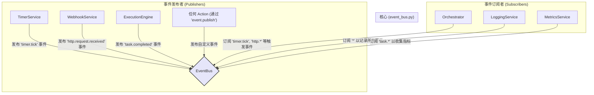

# **Core Module: `event_bus.py`**

## **1. 概述 (Overview)**

`event_bus.py` 实现了 Aura 框架的**事件驱动核心**。它提供了一个全局的、线程安全的**发布-订阅 (Publish-Subscribe)** 系统，允许框架的不同部分在互不了解的情况下进行通信。

可以将其想象成一个企业级的内部广播系统或邮局。任何组件都可以向特定频道（如“财务部”）发布一则带有特定主题（如“季度报告已完成”）的通知（`Event`），而所有订阅了该频道和主题的组件都会异步地收到这则通知并采取行动。这种模式极大地降低了组件之间的耦合度。

## **2. 在框架中的角色 (Role in the Framework)**

`EventBus` 是将 Aura 从一个简单的线性任务执行器转变为一个**响应式、事件驱动的自动化平台**的关键。它使得 Aura 能够对内部或外部的变化做出反应（例如，对定时器滴答、文件变动或收到的 Webhook 请求做出反应）。

`Orchestrator` 是 `EventBus` 的主要消费者，它订阅各种触发事件，并据此启动相应的任务。

## **3. Class: `Event`**

`Event` 数据类是事件总线中流动的**标准化消息结构**。

*   **目的**: 它将零散的信息（事件名称、来源、数据）封装成一个结构化的对象，方便传递和处理。
*   **核心属性**:
    *   `name`: 事件的名称，支持通配符匹配 (e.g., `task.started`)。
    *   `channel`: 事件发布的频道，用于隔离不同领域的事件。默认为 `global`。
    *   `payload`: 一个字典，携带事件相关的任意数据。
    *   `id` & `timestamp`: 每个事件实例的唯一标识和创建时间，用于追踪和调试。
    *   **`causation_chain` & `depth`**: 这是框架的**防循环熔断机制**。当一个事件的处理程序又发布了新的事件时，新事件会继承父事件的 `causation_chain` 并增加自己的 `id`，同时 `depth` 加一。这可以清晰地追溯事件的因果关系链。

## **4. Class: `EventBus`**

### **4.1. 目的与职责 (Purpose & Responsibilities)**

`EventBus` 的设计目标是提供一个高性能、健壮且灵活的事件分发中心。其核心职责包括：

1.  **订阅管理**: 提供 `subscribe` 和 `unsubscribe` 方法来动态管理事件监听器。
2.  **事件分发**: `publish` 方法负责接收事件，并将其分发给所有匹配的订阅者。
3.  **线程安全**: 使用 `threading.RLock` 确保在高并发场景下订阅和发布操作的原子性和数据一致性。
4.  **异步执行**: 将回调函数的执行放到独立的守护线程中，避免单个缓慢的回调阻塞整个事件发布流程。
5.  **健壮性保障**: 内置事件链深度检查，防止无限循环的事件风暴。

### **4.2. 核心机制与设计决策 (Key Mechanisms & Design Decisions)**

#### **频道与通配符订阅**

*   **频道 (`channel`)**: `EventBus` 内部的订阅者列表是按频道组织的 (`Dict[channel, Dict[pattern, List[callback]]])`。这是一种命名空间机制，可以有效隔离不同插件或领域的事件，避免命名冲突，并提高匹配效率。
*   **通配符 (`fnmatch`)**: `subscribe` 的 `event_pattern` 和 `publish` 的 `event.name` 之间使用 `fnmatch` 进行匹配。这提供了强大的灵活性，允许订阅者监听一类事件，例如：
    *   `task.*`: 匹配所有以 `task.` 开头的事件（`task.started`, `task.completed`, `task.failed`）。
    *   `*`: 匹配任意事件。

#### **异步与线程安全执行**

*   **`threading.RLock`**: 在所有修改 `_subscribers` 字典的操作（`subscribe`, `unsubscribe`, `publish` 中查找回调的部分）周围都加了锁。这可以防止在一个线程正在修改订阅列表时，另一个线程前来读取，从而导致数据不一致。
*   **`threading.Thread`**: `publish` 方法在找到所有匹配的回调后，并**不会**在自己的线程里直接调用它们。相反，它为每个回调函数都创建了一个新的**守护线程 (daemon thread)** 来执行。
    *   **优点**: 这种设计确保了 `publish` 方法可以**极快地返回**，发布者无需等待所有订阅者处理完毕。这使得整个系统响应性更强，并避免了某个订阅者的代码错误或性能问题影响到其他订阅者。

#### **事件因果链与熔断器 (`causation_chain` & `max_depth`)**

这是一个至关重要的**自我保护机制**，用于防止事件的无限递归调用（例如，A发布事件 -> B处理并发布事件 -> A又处理并发布事件...）。

*   **工作原理**: 当 `publish` 收到一个事件时，它会首先检查 `event.depth`。
*   如果深度超过了 `self.max_depth`（默认为10），`EventBus` 会**拒绝发布**该事件，并记录一条严重错误日志，其中包含完整的 `causation_chain`。
*   这就像一个**电路熔断器**，在检测到可能导致系统崩溃的事件风暴时，会主动切断电路，保护系统的稳定性。

#### **精确的订阅生命周期管理**

*   **订阅句柄 (Subscription Handle)**: `subscribe` 方法不再返回 `None`，而是返回一个包含 `(channel, event_pattern, callback)` 的元组。这个元组是该次订阅的唯一“身份证”。
*   **精确取消订阅 (`unsubscribe`)**: 新增的 `unsubscribe` 方法接收这个句柄作为参数。它能够精确地找到并移除**那一个特定**的回调函数，而不会影响到其他同样订阅了该模式的回调。
*   **设计演进**: 这是一个从“粗粒度”到“细粒度”管理的演进。在动态系统中，组件可能会被创建和销毁，这种精确的取消订阅能力对于防止内存泄漏和“僵尸”回调至关重要。

## **5. 总结 (Summary)**

`EventBus` 是 Aura 框架实现高级、响应式自动化的基石。它通过提供一个解耦的、异步的、线程安全的消息传递机制，将框架从一个被动执行脚本的工具，提升为一个能够主动感知并响应内外部变化的动态系统。其内置的通配符匹配、频道隔离、因果链追踪和熔断器等高级特性，共同构成了一个功能强大且高度健超的事件处理核心。

