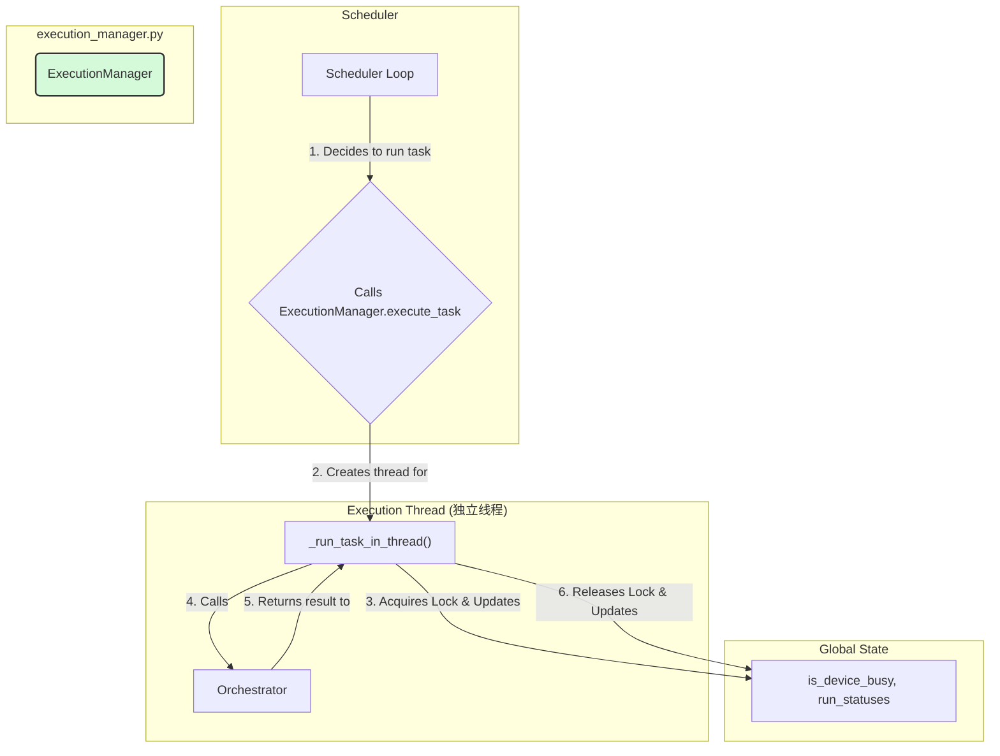
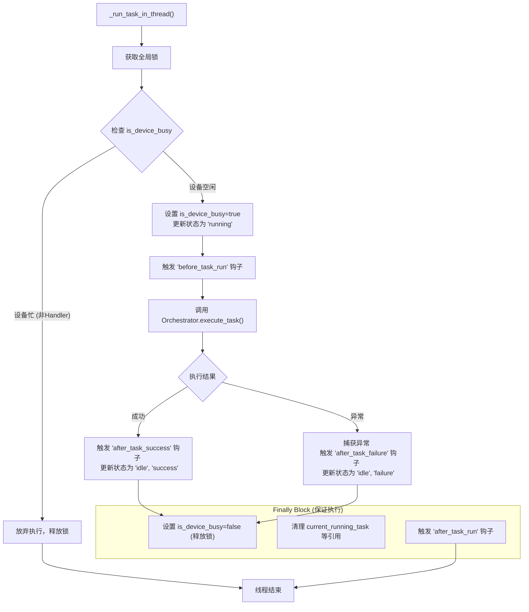

# **Core Module: `execution_manager.py`**

## **1. 概述 (Overview)**

`execution_manager.py` 定义了 `ExecutionManager` 类，它是 Aura 框架的**宏观执行控制器**。如果说 `Scheduler` 是决定“何时”和“做什么”的“项目经理”，那么 `ExecutionManager` 就是负责监督每一次具体施工的“施工队长”。

它的核心职责是接收来自 `Scheduler` 的执行指令，并管理该任务从“准备执行”到“执行完毕”的整个生命周期，包括获取资源锁、创建执行线程、更新全局状态以及确保资源最终被释放。

## **2. 在框架中的角色 (Role in the Framework)**

`ExecutionManager` 是 `Scheduler` 的直接下游和执行代理。它将**任务的执行过程**从 `Scheduler` 的**决策循环**中解耦出来，是实现系统响应性和健壮性的关键。

当 `Scheduler` 决定运行一个任务时，它不会自己去执行，而是将任务项“委托”给 `ExecutionManager`。`ExecutionManager` 随后会启动一个独立的线程来处理这个任务，从而让 `Scheduler` 的主循环可以立即返回，继续监听其他触发器。

## **3. Class: `ExecutionManager`**

### **3.1. 目的与职责 (Purpose & Responsibilities)**

`ExecutionManager` 的设计目标是将复杂的、有状态的、阻塞的执行过程封装起来，使其对上游调用者（`Scheduler`）透明。其核心职责包括：

1.  **线程管理**: 为每个任务执行创建一个独立的线程，确保主调度循环的非阻塞和高响应性。
2.  **资源锁管理**: 负责获取和释放全局的“设备锁” (`is_device_busy`)，确保在任何时候只有一个主任务在与桌面环境交互，防止并发操作导致混乱。
3.  **状态跟踪**: 实时更新 `Scheduler` 中维护的全局任务运行状态字典 (`run_statuses`)，反映任务的 `running`, `idle`, `success`, `failure` 等状态。
4.  **生命周期钩子**: 在任务执行的关键节点（开始前、成功后、失败后、结束后）触发相应的全局钩子，允许其他模块监听和响应任务的生命周期事件。
5.  **异常处理**: 提供一个集中的 `try...except...finally` 结构来捕获任务执行期间的任何异常，确保即使在任务失败时也能正确记录日志和释放资源。

### **3.2. 核心方法: `execute_task()` & `_run_task_in_thread()`**

这两个方法共同构成了 `ExecutionManager` 的核心。

*   **`execute_task()`**: 这是对外的、**非阻塞的**主入口。它只做一件事：创建一个线程来运行 `_run_task_in_thread`，然后立即返回。
*   **`_run_task_in_thread()`**: 这是在**独立线程中运行的**、**阻塞的**实际工作逻辑。

#### **线程内执行流程图 (In-Thread Execution Flow)**

## **4. 关键机制与设计决策 (Key Mechanisms & Design Decisions)**

### **4.1. 全局设备锁 (`is_device_busy`)**

这是 Aura 设计中一个针对桌面自动化的核心概念。由于桌面 UI 不是线程安全的，并且用户的意图通常是线性的（一次只做一件事），因此需要一个全局锁来串行化所有需要与 UI 交互的主任务。

*   **`ExecutionManager` 是这个锁的守护者**。它通过 `with self.lock:` 语句和 `try...finally` 结构，确保了锁的正确获取和释放。
*   **`is_handler` 标志**: 处理器任务 (handler) 通常用于响应中断，它们可能会在主任务运行时执行一些不与 UI 交互的后台逻辑，因此它们在获取锁的逻辑上有所不同，这增加了框架的灵活性。

### **4.2. 职责分离: Scheduler vs. ExecutionManager**

这个模块的出现是框架架构演进的重要一步，体现了**单一职责原则**：

*   **`Scheduler` 的职责**: **决策**。它关心时间、触发器和依赖关系，决定在某个时间点“应该”运行哪个任务。它的逻辑应该是快速的、非阻塞的。
*   **`ExecutionManager` 的职责**: **监督**。它不关心任务为什么被运行，只关心如何安全、健壮地完成一次执行过程，包括处理并发、状态和资源。

这种分离使得两个组件的内部逻辑都更加简单和清晰。

### **4.3. `try...except...finally` 的健壮性**

`_run_task_in_thread` 中的 `finally` 块是系统健壮性的生命线。无论 `Orchestrator` 的执行是成功、失败还是抛出任何意想不到的异常，`finally` 块中的代码都**保证会被执行**。这意味着：
1.  **设备锁最终一定会被释放**。这是最重要的，可以防止系统在任务崩溃后永久地锁死。
2.  **`after_task_run` 钩子总会被触发**，允许外部系统进行可靠的清理工作。
3.  **当前运行任务的引用会被清空**，使系统状态恢复一致。

## **5. 总结 (Summary)**

`ExecutionManager` 是 Aura 框架的“执行监督者”。它通过将任务执行过程封装到独立的、受资源锁保护的线程中，极大地提升了系统的响应性和稳定性。它与 `Scheduler` 的明确职责分离是框架走向成熟和可维护性的重要标志。其对全局锁和 `finally` 块的严格使用，为易于出错的桌面自动化任务提供了一个坚固、可靠的执行保障。

