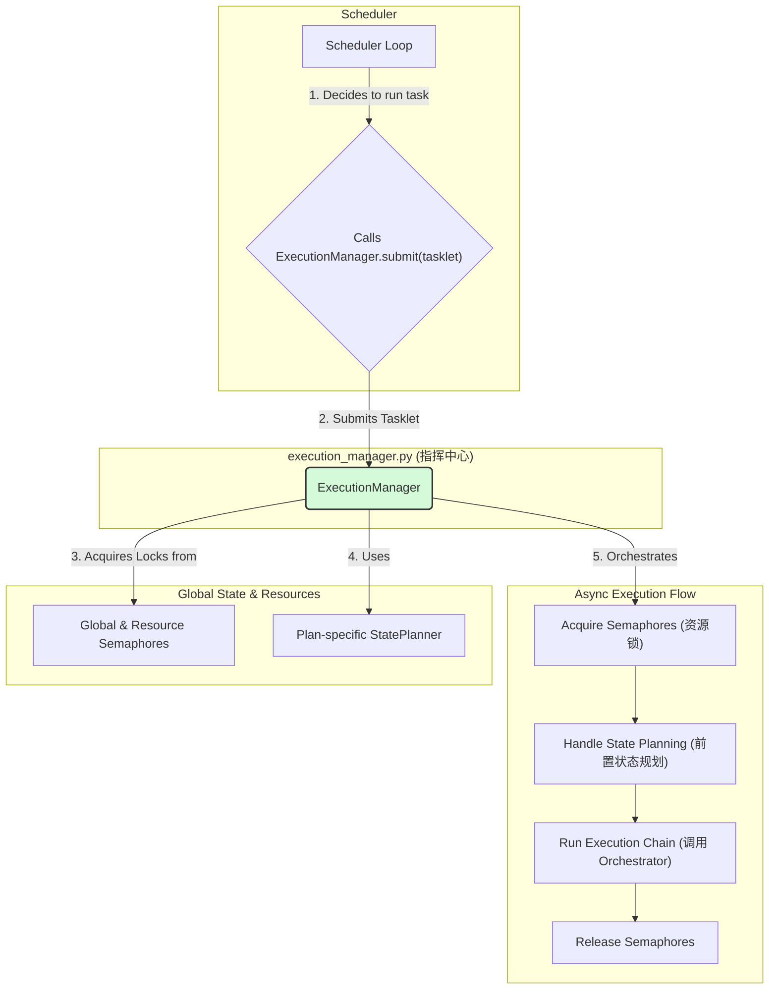
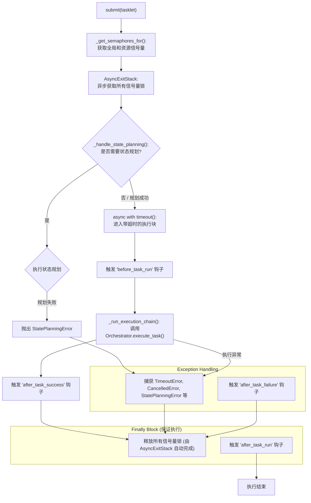

---

# **核心模块: `execution_manager.py` (高级调度器版)**

## **1. 概述 (Overview)**

`execution_manager.py` 定义了新一代的 `ExecutionManager` 类，它是 Aura 框架的**高级任务调度与执行中心**。如果说 `Scheduler` 是决定“何时”触发任务的“闹钟”，那么 `ExecutionManager` 就是一个智能的“资源调度指挥中心”，负责接收任务，并根据系统负载、资源限制和任务要求，高效、安全地管理其完整的执行生命周期。

它的核心职责是**管理并发**、**强制执行资源限制**、**执行前置状态规划**，并为任务提供一个健壮的、有超时和错误处理的执行环境。

## **2. 在框架中的角色 (Role in the Framework)**

`ExecutionManager` 是 `Scheduler` 的直接下游和执行代理。它将**任务的执行过程**从 `Scheduler` 的**决策循环**中解耦出来。当 `Scheduler` 决定运行一个任务时，它会将一个 `Tasklet`（任务的完整描述）“提交”给 `ExecutionManager`。`ExecutionManager` 随后会异步地处理这个 `Tasklet`，让 `Scheduler` 的主循环可以立即返回，继续监听其他事件。

## **3. Class: `ExecutionManager`**

### **3.1. 目的与职责 (Purpose & Responsibilities)**

新版 `ExecutionManager` 的设计目标是成为一个高度并发、资源感知、状态感知的执行引擎。其核心职责包括：

1.  **并发管理 (Concurrency Management)**: 使用 `asyncio.Semaphore` 控制正在运行的任务总数，防止系统过载。
2.  **资源限制 (Resource Limiting)**: 能够根据 `Tasklet` 中定义的 `resource_tags`（如 `"gpu:1"`, `"api_key_A:5"`），为特定的共享资源（如GPU、API密钥池）强制执行并发限制。
3.  **状态规划 (State Planning)**: 在执行主任务前，检查其 `required_initial_state`。如果当前状态不满足，它会自动调用**任务所属方案的 `StatePlanner`** 来计算并执行一系列状态转移任务，以使系统达到所需状态。
4.  **异步执行**: 将所有执行逻辑包装在 `async` 方法中，以非阻塞的方式运行，实现高 I/O 吞吐量。
5.  **生命周期管理**: 在任务执行的关键节点触发全局钩子，并提供全面的错误处理机制，包括超时 (`timeout`)、取消 (`CancelledError`) 和规划失败 (`StatePlanningError`)。

### **3.2. 核心方法: `async submit()`**

这是 `ExecutionManager` 的唯一主入口，负责处理一个 `Tasklet` 的完整生命周期。

#### **执行流程图 (Execution Flow)**

## **4. 关键机制与设计决策 (Key Mechanisms & Design Decisions)**

### **4.1. 基于信号量的资源管理**

这是对旧版 `is_device_busy` 锁的巨大升级，从一个全局布尔锁演变成了一个灵活、细粒度的资源管理系统。

*   **工作原理**: 每个任务可以携带 `resource_tags`，如 `["gpu:1", "database_pool:5"]`。`ExecutionManager` 会为每个唯一的资源标签（`gpu`, `database_pool`）动态创建并维护一个 `asyncio.Semaphore`，其容量由标签中的数字决定。
*   **优点**:
    *   **细粒度控制**: 不再是“要么全锁，要么不锁”，而是可以精确控制对不同资源的并发访问。
    *   **声明式**: 开发者只需在任务定义中声明它需要什么资源，而无需编写任何加锁/解锁的逻辑。
    *   **可扩展性**: 可以轻松添加新的受限资源，而无需修改核心代码。

### **4.2. 声明式状态规划 (`_handle_state_planning`)**

这是一个强大的新功能，极大地提升了任务的健壮性和可复用性。

*   **工作原理**: 任务可以声明一个 `required_initial_state`。`ExecutionManager` 在执行前会：
    1.  找到该任务所属方案 (`Plan`) 的 `StatePlanner`。
    2.  调用状态检查任务，判断当前是否已处于目标状态。
    3.  如果不是，则调用 `planner.find_path()` 寻找从当前状态到目标状态的路径（一系列状态转移任务）。
    4.  顺序执行这些转移任务。
    5.  最后再次检查，确保系统已达到目标状态。
*   **优点**: **将“如何做”与“做什么”分离**。任务本身只需关心其核心逻辑，而将“准备工作环境”这一复杂且易变的过程，委托给了框架和状态规划器。

### **4.3. `AsyncExitStack` 的健壮性**

由于一个任务可能需要获取多个资源锁，如何保证它们都被正确释放是一个挑战。`AsyncExitStack` 完美地解决了这个问题。

*   **功能**: 它可以将多个异步上下文管理器（这里是多个 `Semaphore`）“堆叠”起来。当代码块退出时（无论是正常结束还是因为异常），`AsyncExitStack` 会以相反的顺序**保证**所有上下文管理器的 `__aexit__` 方法都被调用，即所有锁都被释放。
*   **优点**: 提供了原子性的、无懈可击的资源获取与释放保证，极大地简化了代码并防止了死锁和资源泄漏。

## **5. 总结 (Summary)**

新一代的 `ExecutionManager` 是 Aura 框架的“智能调度大脑”。它通过引入基于信号量的细粒度资源管理和声明式的状态规划，将框架的并发处理能力和自动化流程的健壮性提升到了一个新的高度。其完全异步的设计确保了高吞吐量和响应性，而对 `AsyncExitStack` 等现代 Python 语法的运用则保证了其在复杂并发场景下的稳定性和可靠性。

