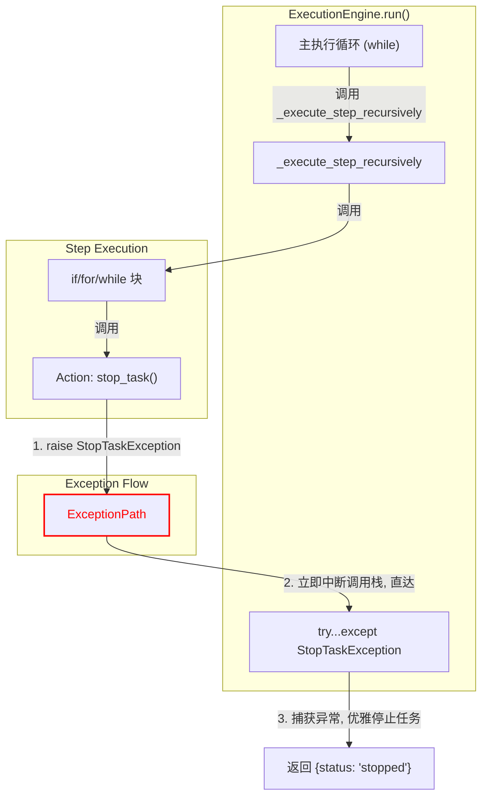

# **Core Module: `exceptions.py`**

## **1. 概述 (Overview)**

`exceptions.py` 模块定义了 Aura 框架中用于**流程控制**的自定义异常类。与传统的、表示程序错误的异常不同，这里的异常被设计为一种**合法的、预期的信号传递机制**，用于在深层调用栈中快速地改变任务的执行流程。

这个模块体现了 Aura 框架的一个核心设计哲学：**使用异常进行非线性流程控制 (Non-Linear Flow Control with Exceptions)**。

## **2. 在框架中的角色 (Role in the Framework)**

这些自定义异常是 `ExecutionEngine` 和 Action 之间的“特殊通信频道”。当一个 Action（无论它被嵌套得多深）需要立即中断整个任务的执行时，它不必通过层层 `return` 一个特殊状态码，而是可以直接 `raise` 一个 `StopTaskException`。

`ExecutionEngine` 的主循环 (`run` 方法) 外层有一个 `try...except` 块，专门用于捕获这些控制流异常，并据此采取相应的行动（如优雅地停止任务）。

如图所示，`StopTaskException` 就像一条“紧急通道”，允许最深层的 Action 直接与最外层的引擎循环对话，绕过了所有中间步骤。

## **3. Class Definitions**

### **3.1. `TaskControlException`**

*   **目的**: 这是一个**基类**，用于将所有用于流程控制的异常归类。
*   **作用**: 它本身通常不被直接实例化。它的存在使得 `ExecutionEngine` 可以通过 `except TaskControlException:` 来捕获所有类型的流程控制信号，如果未来增加了更多控制类异常（例如 `PauseTaskException`），无需修改 `ExecutionEngine` 的 `except` 块。这遵循了面向对象设计中的“里氏替换原则”。

### **3.2. `StopTaskException`**

*   **目的**: 这是最常用的流程控制异常，用于发出“立即停止当前任务”的信号。
*   **输入**:
    *   `message: str`: 停止任务的原因。这条消息会被 `ExecutionEngine` 记录到日志中。
    *   `success: bool`: 标记这次停止是**预期的成功停止**（例如，任务已达到目标）还是**非预期的失败停止**（例如，找到了一个错误状态）。默认值为 `True`。
*   **交互**:
    *   **发布者 (Raiser)**: 通常是核心 Action `stop` (`actions/core_actions.py`)，它会解析用户在 YAML 中提供的 `message` 和 `success` 参数，然后 `raise StopTaskException(message, success)`.
    *   **捕获者 (Catcher)**: `ExecutionEngine.run()` 方法。它捕获这个异常后，会根据 `e.success` 的值来决定日志级别（`info` 或 `warning`），然后中断主循环，并向 `Orchestrator` 返回 `{'status': 'stopped'}`。

## **4. 设计哲学与优势 (Design Philosophy & Advantages)**

在许多编程范式中，使用异常进行流程控制被认为是一种“反模式”(anti-pattern)。然而，在像 Aura 这样的深度嵌套的命令式执行流中，它带来了显著的优势：

1.  **解耦 (Decoupling)**: Action 无需知道它被谁调用，也无需关心调用栈有多深。它只需要发出“停止”信号，而无需关心这个信号如何被处理。
2.  **代码简洁性 (Conciseness)**: 避免了在每一层函数中都添加 `if result == 'STOP': return 'STOP'` 这样的检查代码，使得中间的流程控制块（如 `_execute_if_block`）可以专注于自己的逻辑，而不必充当信号的“中继站”。
3.  **意图清晰 (Clear Intent)**: `raise StopTaskException(...)` 比 `return 'STOP_SUCCESS'` 这样的“魔法字符串”更能清晰地表达“这是一个需要立即终止任务的特殊事件”的意图。

## **5. 总结 (Summary)**

`exceptions.py` 模块虽然代码量小，但它所定义的类是 Aura 框架实现健壮、清晰的非线性流程控制的基石。通过将特定的异常用作信号，框架得以在深层调用和高层循环控制器之间建立一条高效的通信捷径，这对于简化代码、降低耦合度以及提高系统的可维护性至关重要。

