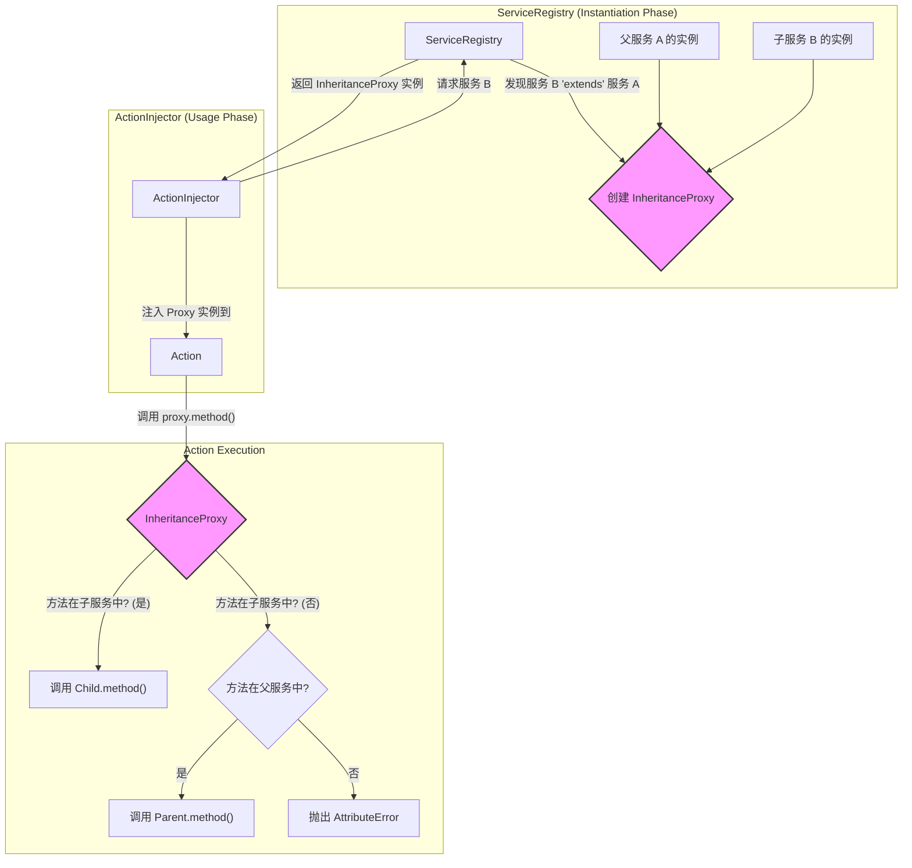

# **Core Module: `inheritance_proxy.py`**

## **1. 概述 (Overview)**

`inheritance_proxy.py` 定义了 `InheritanceProxy` 类，它是 Aura 框架中实现**服务继承 (Service Inheritance)** 的核心魔法。它是一个轻量级的**动态代理 (Dynamic Proxy)**，其作用是在运行时无缝地将一个“父服务”和一个“子服务”的功能组合在一起，形成一个单一的、行为统一的虚拟服务。

当一个插件声明它要 `extend` 另一个插件的服务时，`ServiceRegistry` 就会在幕后使用 `InheritanceProxy` 来创建这个组合服务。

## **2. 在框架中的角色 (Role in the Framework)**

`InheritanceProxy` 是 `ServiceRegistry` 在处理服务继承时的**底层实现工具**。它对框架的其他部分（如 `ActionInjector` 或服务的使用者）是完全透明的。当一个 Action 请求一个被继承的服务时，`ServiceRegistry` 返回给它的是一个 `InheritanceProxy` 实例，但 Action 会像使用一个普通的 Python 对象一样使用它，完全感知不到代理的存在。

## **3. Class: `InheritanceProxy`**

### **3.1. 目的与职责 (Purpose & Responsibilities)**

`InheritanceProxy` 的唯一目的就是实现一种**运行时的方法和属性查找链**，其核心职责是：

1.  **代理访问**: 拦截对组合服务的所有属性和方法的访问请求。
2.  **优先子级**: 优先在子服务中查找请求的属性或方法。如果找到，就返回子服务的结果。这实现了方法的**覆盖 (Overriding)**。
3.  **回退父级**: 如果在子服务中找不到，则在父服务中查找。如果找到，就返回父服务的结果。这实现了方法的**继承 (Inheritance)**。
4.  **失败**: 如果在父子服务中都找不到，则像普通对象一样抛出 `AttributeError`。

### **3.2. 核心魔法: `__getattr__(self, name)`**

`InheritanceProxy` 的所有功能都集中在这个 Python 的“魔术方法”中。

*   **触发时机**: 当代码尝试访问一个对象的属性（如 `proxy.some_attribute` 或 `proxy.some_method()`）但该属性**不是对象的内置属性**时，Python 解释器会自动调用 `__getattr__` 方法。
*   **工作流程**:
    1.  `getattr(self._child_service, name)`: 尝试从子服务实例中获取名为 `name` 的属性。`hasattr` 检查确保了即使属性不存在也不会立即抛出异常。如果成功，则直接返回。
    2.  `getattr(self._parent_service, name)`: 只有在第一步失败时，才会尝试从父服务实例中获取。如果成功，则返回。
    3.  `raise AttributeError`: 如果两步都失败了，说明这个组合服务确实没有这个能力，此时抛出一个标准的错误，行为与普通对象完全一致。

## **4. 设计哲学与优势 (Design Philosophy & Advantages)**

Aura 的服务继承没有使用传统的 Python 类继承（即 `class ChildService(ParentService): ...`），而是选择了代理模式。这背后有几个重要的设计考量：

1.  **解耦与动态性 (Decoupling & Dynamism)**:
    *   **插件无需直接导入**: 子服务插件的开发者**不需要**在他的代码中 `from parent_plugin.services import ParentService`。这避免了插件之间在代码层面的硬依赖，使得插件的加载和卸载更加灵活。依赖关系仅在 `plugin.yaml` 中声明。
    *   **运行时组合**: 继承关系是在运行时由 `ServiceRegistry` 根据 `plugin.yaml` 的声明动态建立的，而不是在代码编写时就固定下来。这为未来实现更复杂的插件依赖管理（如版本控制）奠定了基础。

2.  **依赖注入友好 (Dependency Injection Friendly)**:
    *   父服务和子服务都可以拥有自己独立的构造函数和依赖。`ServiceRegistry` 会分别对它们进行实例化（注入它们各自所需的依赖），然后再将这两个**完全成型的实例**交给 `InheritanceProxy` 进行组合。这比处理复杂的多重继承 `__init__` 调用链要简单和健壮得多。

3.  **明确的意图 (Clear Intent)**:
    *   子服务的开发者可以完全专注于**增加或覆盖**功能，而无需关心父服务的内部实现细节。他只需要知道父服务提供了哪些公共方法即可。

## **5. 总结 (Summary)**

`InheritanceProxy` 是 Aura 服务继承机制背后一个精巧而强大的实现。它通过利用 Python 的动态特性（`__getattr__`），以一种非侵入式、高度解耦的方式实现了服务的扩展和覆盖。这种代理模式是 Aura 插件化架构能够保持灵活性和可维护性的关键设计之一，它使得插件开发者可以在不建立硬代码依赖的情况下，安全地复用和增强其他插件提供的核心功能。

