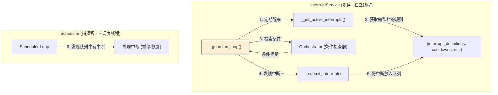

# **Core Module: `interrupt_service.py`**

## **1. 概述 (Overview)**

`interrupt_service.py` 定义了 `InterruptService` 类，它是 Aura 框架的**主动状态监控与中断触发引擎**。您可以将其想象成一个时刻保持警惕的“哨兵”或“守护者”，它的唯一职责是在后台持续不断地检查系统状态，一旦发现满足预设的中断条件，便立即拉响警报。

这个服务的出现，是将 `Scheduler` 的职责进一步细化的结果，使得 `Scheduler` 可以更专注于**被动**的、基于时间的调度，而将**主动**的、基于状态的监控任务完全委托给 `InterruptService`。

## **2. 在框架中的角色 (Role in the Framework)**

`InterruptService` 是一个独立的、常驻后台的守护服务。它与 `Scheduler` 紧密协作，但逻辑上独立运行。

*   **`Scheduler`**: 扮演“指挥官”的角色。它维护着所有中断规则的定义和状态（如冷却时间），并负责在收到中断警报后，决定如何处理（例如，暂停当前任务，执行一个处理器任务）。
*   **`InterruptService`**: 扮演“哨兵”的角色。它不关心如何处理中断，只关心如何**发现**中断。它会定期向 `Scheduler` “索要”当前需要监视的规则列表，然后独立地、高频率地进行检查。

## **3. Class: `InterruptService`**

### **3.1. 目的与职责 (Purpose & Responsibilities)**

`InterruptService` 的设计目标是将高频率、可能消耗资源的状态检查逻辑，从主调度循环中分离出来，以保证主调度循环的稳定性和精确性。其核心职责包括：

1.  **后台运行**: 在一个独立的守护线程中运行，与 `Scheduler` 的主循环并行工作。
2.  **动态规则获取**: 定期从 `Scheduler` 获取当前需要激活的中断规则集合。这个集合是动态的，取决于用户配置和当前正在运行的任务。
3.  **条件检查**: 对于每个激活的规则，在满足其 `check_interval` 和 `cooldown` 的前提下，调用相应 `Orchestrator` 的 `perform_condition_check` 方法来判断条件是否满足。
4.  **中断提交**: 一旦条件满足，就将该中断规则“提交”到 `Scheduler` 的中断队列中，并更新其冷却时间，然后立即寻找下一个可能的中断（或在本轮循环中暂停）。
5.  **生命周期管理**: 提供 `start()` 和 `stop()` 方法来安全地启动和停止其后台监控线程。

### **3.2. 核心方法与逻辑**

#### **`start()` / `stop()`**

标准的后台服务生命周期管理方法。`start` 会创建并启动 `_guardian_loop` 线程，`stop` 会设置一个事件标志并等待线程安全退出。

#### **`_guardian_loop()`**

这是“哨兵”的心跳。一个 `while self.is_running.is_set():` 循环，构成了服务的主体。

*   **循环频率**: `time.sleep(1)` 决定了它的检查频率。这个频率通常比 `Scheduler` 的主循环（可能更长）要快，以保证对状态变化的快速响应。
*   **核心步骤**:
    1.  **获取激活规则**: 调用 `_get_active_interrupts()`。
    2.  **遍历规则**: 对每个激活的规则，调用 `_should_check_interrupt()` 判断是否需要检查。
    3.  **委托检查**: 如果需要，就找到对应的 `Orchestrator` 并调用 `perform_condition_check()`。
    4.  **提交中断**: 如果检查结果为 `True`，就调用 `_submit_interrupt()`。
    5.  **中断风暴避免**: `break` 语句确保在一个检查周期内只提交一个中断，防止因状态快速变化而瞬间产生大量中断请求。

#### **`_get_active_interrupts()`**

这个方法决定了“哨兵”在某一时刻需要监视哪些目标。它组合了两种来源的规则：

1.  **全局中断**: 用户在 `interrupts.yaml` 中定义并启用的，始终需要监控的规则。
2.  **局部中断**: 在特定任务的定义中通过 `activates_interrupts` 字段声明的，只在该任务运行时才需要监控的规则。

#### **`_should_check_interrupt()`**

这个方法为“哨兵”的检查行为增加了“纪律”，避免了不必要的、过于频繁的检查。它确保只有在以下两个条件都满足时，才会进行真正的条件检查：

1.  **冷却已过 (`cooldown`)**: 距离上次该中断被触发，已经过去了足够长的时间。
2.  **间隔已到 (`check_interval`)**: 距离上次**检查**该中断，已经过去了足够长的时间。

#### **`_submit_interrupt()`**

当“哨兵”发现敌情时，它通过这个方法拉响警报。它做两件事：

1.  将触发的规则对象放入 `scheduler.interrupt_queue`。
2.  更新 `scheduler.interrupt_cooldown_until`，确保在冷却时间内，这个规则不会被再次触发。

## **4. 设计哲学与优势 (Design Philosophy & Advantages)**

1.  **职责分离 (Separation of Concerns)**: 这是最重要的优势。
    *   `Scheduler` 关心**时间**和**结果处理**。
    *   `InterruptService` 关心**状态**和**条件发现**。
    这种分离使得两个组件的逻辑都更简单、更专注，易于理解和维护。

2.  **响应性 (Responsiveness)**: 通过将高频检查放到独立线程，`Scheduler` 的主循环不会被耗时的条件检查（例如，可能涉及图像识别或网络请求）所阻塞。同时，`InterruptService` 可以以更高的频率运行，从而更快地响应系统状态的变化。

3.  **健壮性 (Robustness)**: 即使 `InterruptService` 在检查某个条件时发生异常，它也只会影响其自身的循环，而不会导致整个 `Scheduler` 崩溃。`try...except` 块确保了守护线程的存活。

## **5. 总结 (Summary)**

`InterruptService` 是 Aura 框架向更成熟、更健壮的架构演进的产物。它作为一个专职的“守护者”，将主动的状态监控职责从 `Scheduler` 中剥离出来，形成了一个职责清晰、高内聚、低耦合的独立服务。这不仅提升了系统的响应速度和稳定性，也使得整个调度和中断处理系统的架构更加清晰和可扩展。

