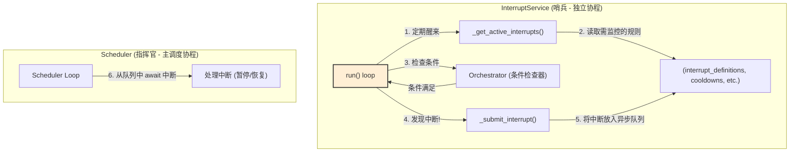

3
---

# **核心模块: `interrupt_service.py` (异步版)**

## **1. 概述 (Overview)**

`interrupt_service.py` 定义了 `InterruptService` 类，它是 Aura 框架的**异步状态监控与中断触发引擎**。您可以将其想象成一个时刻保持警惕的“哨兵”或“守护者”，它的唯一职责是作为一个独立的后台协程，持续不断地检查系统状态，一旦发现满足预设的中断条件，便立即向 `Scheduler` 发出警报。

这个服务的存在，是将 `Scheduler` 的职责进一步细化的结果，使得 `Scheduler` 可以更专注于**被动**的、基于事件和时间的调度，而将**主动**的、基于状态的监控任务完全委托给 `InterruptService`。

## **2. 在框架中的角色 (Role in the Framework)**

`InterruptService` 是一个独立的、常驻后台的异步服务。它与 `Scheduler` 紧密协作，但逻辑上并行运行。

*   **`Scheduler`**: 扮演“指挥官”的角色。它维护着所有中断规则的定义和状态（如冷却时间），并负责在收到中断警报后，决定如何处理（例如，暂停当前任务，执行一个处理器任务）。
*   **`InterruptService`**: 扮演“哨兵”的角色。它不关心如何处理中断，只关心如何**发现**中断。它会定期从 `Scheduler` 的共享状态中“读取”当前需要监视的规则列表，然后独立地、高频率地进行检查。

## **3. Class: `InterruptService`**

### **3.1. 目的与职责 (Purpose & Responsibilities)**

`InterruptService` 的设计目标是将高频率、可能消耗资源的状态检查逻辑，从主调度循环中分离出来，以保证主调度循环的稳定性和精确性。其核心职责包括：

1.  **异步后台运行**: 作为一个独立的 `asyncio` 任务运行，与 `Scheduler` 的主循环并行工作。
2.  **动态规则获取**: 定期从 `Scheduler` 的共享状态中获取当前需要激活的中断规则。
3.  **上下文安全的条件检查**:
    *   对于每个激活的规则，在满足其 `check_interval` 和 `cooldown` 的前提下，调用相应 `Orchestrator` 的 `perform_condition_check` 方法来判断条件是否满足。
    *   **【关键修复】**: 在调用 `Orchestrator` 之前，它会使用 `ContextVar` (`current_plan_name`) 来**设置正确的方案上下文**。这确保了条件检查（特别是那些依赖 `config()` 函数的检查）能够获取到中断规则所属方案的正确配置，而不是 `InterruptService` 自身或其他正在运行任务的配置。
4.  **中断提交**: 一旦条件满足，就将该中断规则异步地 `put` 到 `Scheduler` 的 `interrupt_queue` 中，并更新其冷却时间。

### **3.2. 核心方法与逻辑**

#### **`async run()`**

这是“哨兵”的心跳，一个 `async` 的无限循环，构成了服务的主体。

*   **循环频率**: `await asyncio.sleep(1)` 决定了它的基础检查频率，这是一个非阻塞的等待。
*   **核心步骤**:
    1.  **获取激活规则**: 调用 `_get_active_interrupts()`。
    2.  **遍历规则**: 对每个激活的规则，调用 `_should_check_interrupt()` 判断是否需要检查。
    3.  **设置上下文并委托检查**: 如果需要检查，它会：
        a.  `token = current_plan_name.set(rule['plan_name'])`：设置特定于方案的上下文。
        b.  `await orchestrator.perform_condition_check(...)`：执行检查。
        c.  `current_plan_name.reset(token)`：在 `finally` 块中**保证**重置上下文，避免污染。
    4.  **提交中断**: 如果检查结果为 `True`，就调用 `_submit_interrupt()`。
    5.  **中断风暴避免**: `break` 语句确保在一个检查周期内只提交一个中断。

#### **`_get_active_interrupts()`**

这个方法决定了“哨兵”在某一时刻需要监视哪些目标。它组合了两种来源的规则：

1.  **全局中断**: 用户在 `interrupts.yaml` 中定义并启用的，始终需要监控的规则。
2.  **局部中断**: 在特定任务的定义中通过 `activates_interrupts` 字段声明的，只在该任务运行时才需要监控的规则。

#### **`_should_check_interrupt()`**

这个方法为“哨兵”的检查行为增加了“纪律”，避免了不必要的、过于频繁的检查。它确保只有在以下两个条件都满足时，才会进行真正的条件检查：

1.  **冷却已过 (`cooldown`)**: 距离上次该中断被触发，已经过去了足够长的时间。
2.  **间隔已到 (`check_interval`)**: 距离上次**检查**该中断，已经过去了足够长的时间。

#### **`async _submit_interrupt()`**

当“哨兵”发现敌情时，它通过这个异步方法拉响警报。它做两件事：

1.  `await self.scheduler.interrupt_queue.put(rule)`: 将触发的规则对象**异步地**放入 `Scheduler` 的 `asyncio.Queue`。
2.  更新 `self.interrupt_cooldown_until`，确保在冷却时间内，这个规则不会被再次触发。

## **4. 设计哲学与优势 (Design Philosophy & Advantages)**

1.  **职责分离 (Separation of Concerns)**:
    *   `Scheduler` 关心**时间**和**结果处理**。
    *   `InterruptService` 关心**状态**和**条件发现**。
    这种分离使得两个组件的逻辑都更简单、更专注。

2.  **响应性与性能 (Responsiveness & Performance)**:
    *   通过将高频检查放到独立的异步任务中，`Scheduler` 的主循环不会被耗时的条件检查（例如，可能涉及图像识别或网络请求）所阻塞。
    *   使用 `asyncio` 替代线程，减少了上下文切换的开销，对于 I/O 密集型的检查任务更加高效。

3.  **上下文安全 (Context Safety)**:
    *   修复后的版本通过 `ContextVar` 实现了**检查逻辑的上下文隔离**。这是一个至关重要的改进，确保了中断检查的正确性和可预测性，无论系统当时正在执行什么其他任务。

## **5. 总结 (Summary)**

`InterruptService` 是 Aura 框架向更成熟、更健robust的异步架构演进的产物。它作为一个专职的“守护者”，将主动的状态监控职责从 `Scheduler` 中剥离出来，形成了一个职责清晰、高内聚、低耦合的独立异步服务。这不仅提升了系统的响应速度和稳定性，也通过上下文隔离等机制，极大地增强了整个中断处理系统的可靠性和正确性。

