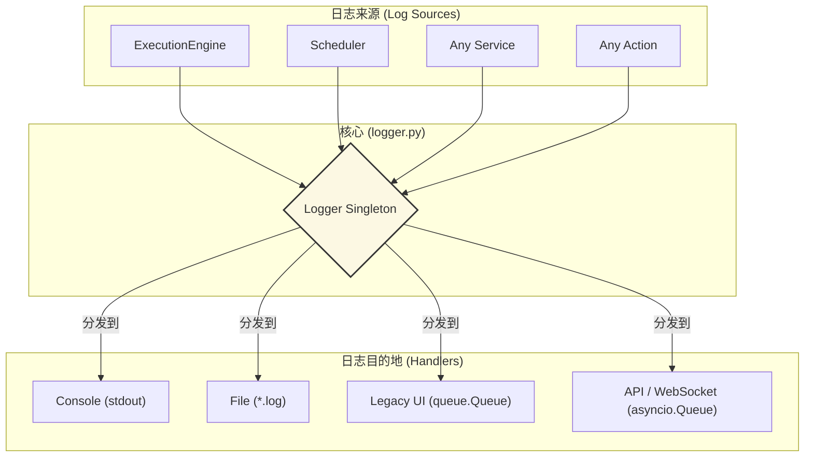

---

# **核心模块: `logger.py`**

## **1. 概述 (Overview)**

`logger.py` 模块提供了 Aura 框架的**中央信息枢纽**。它实现了一个全局的、可配置的单例 `Logger`，负责从框架的各个角落收集日志信息，并根据配置将其分发到不同的目的地，如控制台、文件、UI 界面或 API 客户端。

可以将其想象成应用程序的“中枢神经系统”，负责传递所有重要的状态、调试和错误信息。

## **2. 在框架中的角色 (Role in the Framework)**

`Logger` 是一个基础工具，被框架中几乎所有其他模块所使用。它通过**处理器 (Handler)** 模式，将日志的**生成**与日志的**消费**完全解耦。这意味着，任何组件（如 `ExecutionEngine`）都可以调用 `logger.info()` 来记录一条信息，而无需关心这条信息最终是显示在屏幕上、写入文件，还是通过 WebSocket 发送出去。

## **3. 架构与核心组件**

### **3.1. 单例模式 (Singleton Pattern)**

`Logger` 类使用 `__new__` 方法实现单例模式。这保证了在整个应用程序的生命周期中，无论在何处 `import logger`，获取到的都是同一个日志记录器实例。这对于保持统一的配置和状态至关重要。

### **3.2. 处理器驱动的架构**

`Logger` 自身不直接处理日志输出，而是依赖 Python 标准 `logging` 库的处理器机制。`setup()` 方法的核心工作就是根据传入的参数，动态地添加、移除或配置不同的处理器。

### **3.3. `AsyncioQueueHandler` (异步队列处理器)**

这是连接同步日志世界和异步 API 世界的关键桥梁。

*   **目的**: 当一个普通的同步函数调用 `logger.info()` 时，这个处理器会将日志记录安全地、非阻塞地放入一个 `asyncio.Queue` 中。
*   **核心机制**:
    *   **`loop.call_soon_threadsafe()`**: 这是实现线程安全的关键。`logging` 处理器可能在任何线程中被调用，此方法确保了 `put_nowait` 操作总是在 `asyncio` 事件循环的线程中被调度，避免了多线程冲突。
    *   **【关键修复】完整的日志记录**: 此处理器不再仅仅发送格式化后的消息字符串。相反，它将原始的 `LogRecord` 对象几乎完整地序列化为一个**字典**，并将其放入队列。这至关重要，因为它保留了所有元数据（如 `levelno`, `pathname`, `lineno` 等），允许队列的消费者（如 WebSocket 服务）能够完美地重建日志事件，并根据需要进行格式化或过滤。

### **3.4. 自定义 `TRACE` 级别**

模块在顶层定义并注册了一个新的日志级别 `TRACE` (级别号为 5)，比 `DEBUG` 更低。这为框架提供了更细粒度的调试信息输出能力，用于记录非常详细的内部操作流程。

## **4. 配置与使用**

### **4.1. `setup()` 方法**

这是配置日志记录器的主要入口点。它允许在运行时动态设置日志的输出方式。

*   **`log_dir` & `task_name`**: 用于配置**文件处理器**。如果提供，将创建一个带时间戳的、任务专属的 `RotatingFileHandler`，将日志写入磁盘。
*   **`ui_log_queue`**: 用于连接**遗留的 Tkinter UI**。它接收一个标准的 `queue.Queue`，并将日志放入其中。
*   **`api_log_queue`**: 用于连接**现代的异步 API**（如 WebSocket 服务）。它接收一个 `asyncio.Queue`，并配置 `AsyncioQueueHandler` 将日志放入其中。
*   **`console_level` (新功能)**: 提供了对**控制台处理器**的精细控制。
    *   传入一个级别（如 `logging.DEBUG`），可以**更新**控制台输出的详细程度。
    *   传入 `None`，可以**完全移除**控制台处理器，适用于不希望有任何标准输出的“无头”或服务模式。

### **4.2. `update_api_queue()` (新功能)**

*   **目的**: 允许在应用程序已经运行后，动态地更换或添加 `api_log_queue`。
*   **使用场景**: 当一个新的 WebSocket 客户端连接到服务器时，服务器可以为该客户端创建一个新的 `asyncio.Queue`，然后调用此方法将其“热插拔”到 logger 中，从而开始向该客户端实时流式传输日志，而无需重启或重新配置整个 logger。

### **4.3. 日志记录方法**

`logger` 对象暴露了所有标准的日志记录方法，以及自定义的 `trace` 方法：
*   `logger.trace(message)`
*   `logger.debug(message)`
*   `logger.info(message)`
*   `logger.warning(message)`
*   `logger.error(message, exc_info=True)`
*   `logger.critical(message, exc_info=True)`

## **5. 总结 (Summary)**

`logger.py` 提供了一个健壮、灵活且高度可配置的日志记录系统，是 Aura 框架可观测性和可调试性的基石。通过其模块化的处理器架构和单例设计，它为整个应用提供了一个统一的日志接口。新版本通过增强 `AsyncioQueueHandler`、提供对控制台输出的动态控制以及支持 API 队列的热插拔，进一步提升了其在现代异步和客户端-服务器架构中的集成能力和灵活性。

