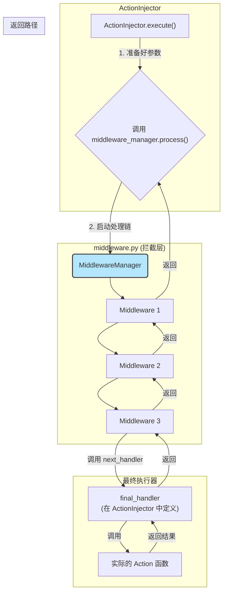

# **Core Module: `middleware.py`**

## **1. 概述 (Overview)**

`middleware.py` 实现了 Aura 框架的**中间件 (Middleware)** 架构。这个模块提供了一种优雅的、可插拔的方式，用于在核心行为（Action）执行的**前后**注入自定义逻辑。

您可以将中间件想象成一个“洋葱”模型或一条“处理流水线”。当一个 Action 的执行请求发出时，它不会直接到达最终的执行函数，而是必须先层层穿过所有注册的中间件。每一层中间件都有机会检查、修改、记录请求，甚至可以决定是否将请求继续传递下去。

这个设计模式极大地增强了框架的可扩展性，允许插件开发者在不修改核心代码的情况下，为所有 Action 的执行添加横切关注点（Cross-Cutting Concerns），如日志记录、性能监控、权限验证、事务管理等。

## **2. 在框架中的角色 (Role in the Framework)**

`MiddlewareManager` 在 `ActionInjector` 和最终的 Action 函数之间扮演着一个**可配置的拦截层**的角色。`ActionInjector` 在准备好所有参数后，并不会直接调用 Action 函数，而是将执行请求“委托”给 `middleware_manager.process()` 方法。

如图所示，请求像穿过一个洋葱一样，从外到内依次经过 M1, M2, M3，到达核心 `final_handler`，然后结果再从内到外依次返回。

## **3. Class: `Middleware` (基类)**

*   **目的**: 定义所有中间件必须遵循的**契约 (Contract)**。
*   **核心方法**: `handle(self, action_def, context, params, next_handler)`
    *   **参数**:
        *   `action_def: ActionDefinition`: 正在被处理的 Action 的完整定义，包含其名称、来源插件等元数据。
        *   `context: Context`: 当前的执行上下文。
        *   `params: Dict`: 已经渲染好的、将要传递给 Action 的参数。
        *   `next_handler: Callable`: **这是关键**。它是一个函数句柄，调用它 (`next_handler(...)`) 就会将控制权传递给流水线中的**下一个**中间件（或者是最终的执行器）。
    *   **职责**:
        1.  **执行前逻辑**: 在调用 `next_handler` 之前编写的代码。
        2.  **传递控制权**: 调用 `next_handler`。**如果一个中间件不调用 `next_handler`，那么整个执行链将在此处被中断**，后续的中间件和最终的 Action 都不会被执行。
        3.  **执行后逻辑**: 在 `next_handler` 返回之后编写的代码。
        4.  **返回结果**: 必须返回 `next_handler` 的结果（或者一个被修改过的结果）。

## **4. Class: `MiddlewareManager`**

*   **目的**: 管理所有注册的中间件，并负责构建和启动中间件调用链。
*   **核心属性**: `_middlewares: List[Middleware]`，一个列表，按添加顺序存储所有中间件实例。
*   **核心方法**:

    #### **`add(middleware)`**
    一个简单的列表追加操作，用于在框架初始化时注册中间件。

    #### **`process(action_def, context, params, final_handler)`**
    这是中间件架构的**核心驱动器**。

    *   **输入**:
        *   `action_def`, `context`, `params`: 来自 `ActionInjector` 的执行请求。
        *   `final_handler`: 一个函数，代表了流水线的**终点**。在 Aura 中，这通常是 `ActionInjector._final_action_executor`，它负责调用真正的 Action 函数。
    *   **核心机制 (洋葱模型的构建)**:
        1.  它从 `final_handler` 开始，将其作为调用链的“最内层”。
        2.  然后，它**反向遍历 (`reversed`)** 中间件列表 `[m1, m2, m3]`。
        3.  **第一次迭代 (m3)**: 它创建一个新的 `handler`，这个 `handler` 本质上是 `partial(m3.handle, next_handler=final_handler)`。
        4.  **第二次迭代 (m2)**: 它又创建一个新的 `handler`，这次是 `partial(m2.handle, next_handler=上一步创建的handler)`。
        5.  **第三次迭代 (m1)**: 最终的 `handler` 变成了 `partial(m1.handle, next_handler=上一步创建的handler)`。
        6.  经过这个循环，`handler` 变量最终指向了**调用链的第一个环节** (`m1.handle`)，并且整个调用链 `m1 -> m2 -> m3 -> final_handler` 已经通过 `functools.partial` 被巧妙地连接起来了。
        7.  最后，它调用这个构建好的、位于最外层的 `handler`，从而启动整个流水线。

## **5. 设计哲学与优势 (Design Philosophy & Advantages)**

1.  **开闭原则 (Open/Closed Principle)**: `MiddlewareManager` 对扩展是开放的（可以随时 `add` 新的中间件），但对修改是关闭的（其核心 `process` 逻辑无需改动）。这使得添加新功能变得非常安全。

2.  **装饰器模式的泛化 (Generalized Decorator Pattern)**: 中间件可以看作是应用在所有 Action 上的动态装饰器。与 Python 的 `@decorator` 语法相比，中间件模式更加灵活，因为它可以在运行时动态地添加、移除或重排。

3.  **高度解耦 (High Decoupling)**:
    *   Action 的实现者无需关心日志、监控等问题，只需专注于其核心业务逻辑。
    *   中间件的实现者也无需关心具体的 Action 是什么，它只需要处理通用的 `ActionDefinition` 对象。
    *   `ActionInjector` 也被解耦了，它只负责准备数据和发起处理请求，而不关心中间有多少处理环节。

## **6. 总结 (Summary)**

`middleware.py` 为 Aura 框架引入了一个强大而优雅的 AOP（面向切面编程）能力。通过其“洋葱式”的调用链模型，它允许开发者以一种非侵入性、可组合的方式来增强框架的核心功能。`MiddlewareManager` 通过巧妙地运用 `functools.partial` 和反向迭代，实现了这个复杂调用链的动态构建。理解中间件模式是深入理解 Aura 框架如何实现高级功能（如可观测性、安全性）的关键。

