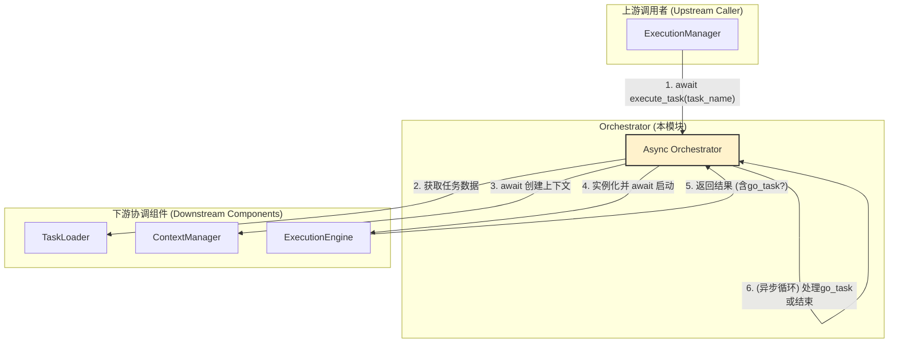

 好的，`orchestrator.py` 模块也经历了全面的异步重构，并引入了几个关键的新功能，如显式返回值处理和任务级失败处理器。这标志着其在功能和健壮性上的重大演进。

以下是根据您提供的新代码编写的对应文档。

---

# **核心模块: `orchestrator.py` (异步 & 重构版)**

## **1. 概述 (Overview)**

`orchestrator.py` 定义了 `Orchestrator` 类，它是 Aura 框架中**方案级 (Plan-level) 的异步任务编排器**。如果说 `ExecutionManager` 是负责所有施工项目的“总指挥”，那么每个 `Orchestrator` 实例就是负责一个具体楼盘项目（一个方案/插件）的“项目经理”。

它的核心职责是作为一个**协调者 (Coordinator)** 和一个**外观 (Facade)**，为单个方案内的所有操作提供一个统一的、异步的、上下文安全的入口。它负责将任务执行所需的所有资源准备妥当，并启动异步执行流程。

## **2. 在框架中的角色 (Role in the Framework)**

`Orchestrator` 是**宏观调度**（由 `Scheduler` 和 `ExecutionManager` 负责）与**微观执行**（由 `ExecutionEngine` 负责）之间的关键桥梁。系统中有多少个方案（Plan），就会有多少个 `Orchestrator` 实例。`ExecutionManager` 在决定要运行某个方案中的任务时，会找到对应的 `Orchestrator` 实例，并 `await` 其 `execute_task` 方法。

## **3. Class: `Orchestrator`**

### **3.1. 目的与职责 (Purpose & Responsibilities)**

`Orchestrator` 的设计目标是封装与单个方案相关的所有复杂性，提供一个简洁的异步接口。其核心职责包括：

1.  **异步资源协调**: 在任务执行前，调用 `TaskLoader` 加载任务定义，并 `await` `ContextManager` 创建功能完备的执行上下文。
2.  **引擎启动**: 实例化并 `await` `ExecutionEngine` 的 `run` 方法。
3.  **任务链处理**: **处理 `go_task` 跳转**。通过一个 `while` 循环来连续执行由 `go_task` 连接起来的任务链。
4.  **返回值处理**: 检查任务定义中的 `returns` 字段，并在任务成功后渲染并返回一个明确的、可预测的结果，而不仅仅是 `True` 或 `False`。
5.  **任务级失败处理**: 检查任务定义中的 `on_failure` 字段，并在任务失败时执行相应的处理逻辑。
6.  **上下文安全**: **【关键】** 使用 `ContextVar` (`current_plan_name`) 确保在 `execute_task` 的整个生命周期内，所有依赖配置的操作（如 `config()` 函数）都能正确解析到当前方案的配置，防止上下文污染。

### **3.2. 核心方法 (Core Methods)**

#### **`async execute_task(task_name_in_plan, ...)`**

这是 `Orchestrator` 最核心的异步执行入口。

*   **功能**: 异步执行一个完整的任务链，并处理其返回值和可能的失败情况。
*   **核心机制**:
    1.  **上下文设置**: 在 `try...finally` 块的开始，使用 `current_plan_name.set(self.plan_name)` 设置配置上下文，并在 `finally` 中保证其被重置。
    2.  **`go_task` 循环**: 使用一个 `while current_task_in_plan:` 循环来驱动任务链。在每次迭代中，都会创建一个**全新的、隔离的** `Context` 和 `ExecutionEngine`。
    3.  **返回值处理 (`returns`)**:
        *   当 `ExecutionEngine` 成功返回后，`Orchestrator` 会检查任务定义中是否有 `returns` 字段。
        *   如果有，它会使用任务**结束时**的上下文来渲染该模板，并将渲染结果作为任务的最终返回值。
        *   如果没有，任务成功时默认返回 `True`。
        *   这使得任务可以像函数一样，产生明确的、有意义的输出。
    4.  **失败处理 (`on_failure`)**:
        *   如果 `ExecutionEngine` 返回了错误状态，`Orchestrator` 会检查任务定义中是否有 `on_failure` 块。
        *   如果有，它会调用 `_run_failure_handler`，在一个隔离的上下文中执行 `on_failure` 中定义的步骤，并将原始错误信息注入到 `error` 变量中。

#### **`async perform_condition_check(condition_data)`**

此方法用于特殊的、脱离标准任务流的单次只读 Action 执行（主要由 `InterruptService` 使用）。

*   **功能**: 它会创建一个临时的、隔离的上下文，并直接使用 `ActionInjector` 来执行一个被标记为 `read_only` 的 Action，然后返回其布尔结果。
*   **设计**: 这种设计保持了与 `ExecutionEngine` 的低耦合，并确保了条件检查也能受益于中间件体系。

### **3.3. 外观/代理方法 (Facade/Proxy Methods)**

像 `get_persistent_context_data`, `get_file_content` 等方法都属于这一类。

*   **目的**: 它们将对底层 `ContextManager` 或文件系统的直接操作封装起来，并使其变为**异步非阻塞**。
*   **实现**: 对于同步的文件 I/O 操作，它们使用 `loop.run_in_executor(None, ...)` 将其提交到线程池中执行，从而避免阻塞主 `asyncio` 事件循环。
*   **安全**: `_validate_path` 辅助方法确保了所有文件操作都被限制在方案的目录内，防止了路径遍历攻击。

## **4. 总结 (Summary)**

重构后的 `Orchestrator` 是一个现代化的、完全异步的方案级“总管”。它不仅保留了原有的协调职责，还通过引入**上下文安全机制**、**显式返回值处理 (`returns`)** 和 **任务级失败处理器 (`on_failure`)**，极大地提升了任务执行的健壮性、可预测性和功能性。其对异步 I/O 的正确处理确保了整个框架在执行文件操作时的高性能和高响应性。它是连接宏观调度与微观执行的、功能强大且可靠的核心组件。

