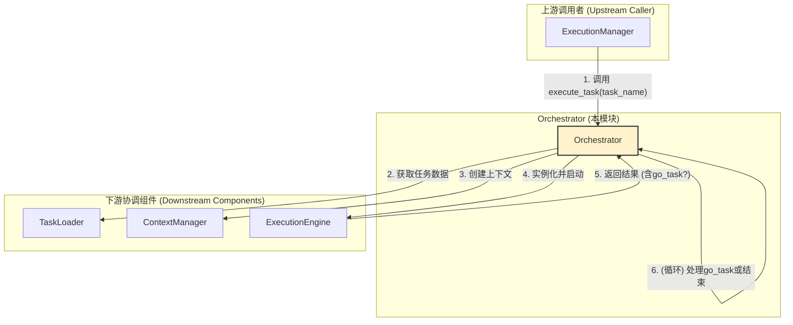

# **Core Module: `orchestrator.py`**

## **1. 概述 (Overview)**

`orchestrator.py` 定义了 `Orchestrator` 类，它是 Aura 框架中**方案级 (Plan-level) 的任务编排器**。如果说 `ExecutionManager` 是负责所有施工项目的“总监”，那么每个 `Orchestrator` 实例就是负责一个具体楼盘项目（一个方案/插件）的“项目经理”。

它的核心职责是作为一个**协调者 (Coordinator)** 和一个**外观 (Facade)**，为单个方案内的所有操作提供一个统一的、稳定的入口。它负责将任务执行所需的所有资源（任务定义、上下文、执行引擎）准备妥当，并启动执行流程。

## **2. 在框架中的角色 (Role in the Framework)**

`Orchestrator` 是**宏观调度**（由 `Scheduler` 和 `ExecutionManager` 负责）与**微观执行**（由 `ExecutionEngine` 负责）之间的关键桥梁。系统中有多少个方案（Plan），就会有多少个 `Orchestrator` 实例。`ExecutionManager` 在决定要运行某个方案中的任务时，会找到对应的 `Orchestrator` 实例，并调用其 `execute_task` 方法。

如图所示，`Orchestrator` 并不亲自执行任务步骤，而是像一个指挥家一样，按顺序调用 `TaskLoader`、`ContextManager` 和 `ExecutionEngine` 来完成一场完整的演出。

## **3. Class: `Orchestrator`**

### **3.1. 目的与职责 (Purpose & Responsibilities)**

`Orchestrator` 的设计目标是封装与单个方案相关的所有复杂性，提供一个简洁的接口。其核心职责包括：

1.  **资源协调**: 在任务执行前，调用 `TaskLoader` 加载任务定义，调用 `ContextManager` 创建功能完备的执行上下文。
2.  **引擎启动**: 实例化并启动 `ExecutionEngine`，将准备好的任务数据和上下文交给它去执行。
3.  **任务链处理**: **处理 `go_task` 跳转**。这是它的核心执行逻辑之一，通过一个 `while` 循环来连续执行由 `go_task` 连接起来的任务链。
4.  **特殊执行**: 提供 `perform_condition_check` 和 `inspect_step` 等方法，用于执行非标准的、一次性的、只读的 Action，例如在中断检查或 UI 调试时。
5.  **外观接口**: 代理对方案内其他资源（如持久化上下文、文件系统）的访问，为外部提供一个统一的、受控的 API。

### **3.2. 核心方法 (Core Methods)**

#### **`execute_task(task_name_in_plan, ...)`**

这是 `Orchestrator` 最核心的执行入口。

*   **功能**: 执行一个完整的任务链，从指定的入口任务开始，直到没有 `go_task` 跳转为止。
*   **核心机制 (go_task 循环)**:
    1.  使用一个 `while current_task_in_plan:` 循环来驱动任务链。
    2.  **在循环的每一次迭代中**，它都会创建一个**全新的、隔离的** `Context` 和 `ExecutionEngine` 实例。这是至关重要的**任务隔离**设计，确保前一个任务的上下文不会意外地污染下一个任务。
    3.  它执行单个任务并检查返回结果中的 `status` 是否为 `'go_task'`。
    4.  如果是，它会解析出下一个任务的名称，并将其赋值给 `current_task_in_plan`，从而触发下一次循环。
    5.  如果不是，它会将 `current_task_in_plan` 设为 `None`，从而结束循环。
    6.  最终返回任务链中**最后一个**任务的执行结果。

#### **`perform_condition_check(condition_data)`** 和 **`inspect_step(...)`**

这两个方法用于特殊的、脱离标准任务流的单次 Action 执行。

*   **功能**:
    *   `perform_condition_check`: 用于 `InterruptService`，执行一个只读的 Action 来判断某个条件是否成立。
    *   `inspect_step`: 用于开发工具或 UI，执行单个步骤的 Action 以便调试或预览其结果。
*   **【关键设计修复】**: 这两个方法**不再依赖 `ExecutionEngine` 的私有方法**，而是使用了标准的 `ActionInjector`。
    *   **优势**: 这种设计极大地**降低了 `Orchestrator` 和 `ExecutionEngine` 之间的耦合度**。`Orchestrator` 无需了解 `Engine` 的内部实现，只需像框架的其他部分一样，通过公共的 `ActionInjector` 来执行 Action。这也意味着这些特殊执行同样可以受益于**中间件 (Middleware)** 体系。
    *   **流程**: 创建临时上下文 -> 创建引擎 -> 创建注入器 -> 调用 `injector.execute()`。

### **3.3. 外观/代理方法 (Facade/Proxy Methods)**

像 `get_persistent_context_data`, `save_file_content` 等方法都属于这一类。

*   **目的**: 它们将对底层 `ContextManager` 或文件系统的直接操作封装起来。
*   **优势**:
    1.  **API 稳定性**: 无论底层实现如何变化，上游调用者（如 `Scheduler` 或 UI）只需与 `Orchestrator` 对话。
    2.  **封装与安全**: `Orchestrator` 可以在这里加入额外的逻辑，例如在文件操作方法中加入了路径检查，防止插件访问其目录之外的文件，增强了安全性。

## **4. 总结 (Summary)**

`Orchestrator` 是 Aura 框架中体现**分层与协调**思想的典范。它作为方案（插件）的“总管”，将数据加载、上下文管理、任务执行等多个复杂子系统无缝地捏合在一起，并通过**外观模式 (Facade Pattern)** 为上层提供了一个简洁、稳定且安全的交互接口。其对 `go_task` 的循环处理能力构成了复杂任务流的基础，而将特殊执行逻辑重构为使用 `ActionInjector` 则标志着其架构的成熟和高度解耦。

