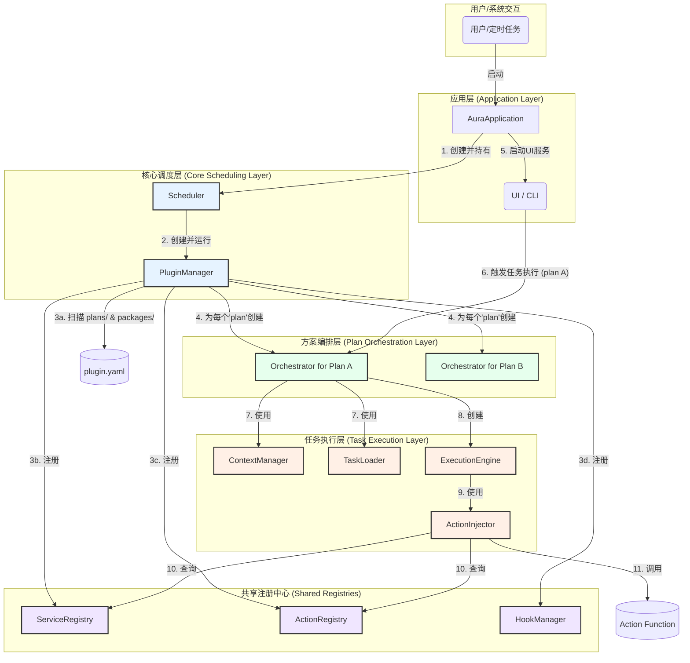

# Aura 内核文档 - 第一部分

## 1. 宏观架构与设计哲学 (The Grand Architecture)

本章旨在为框架开发者和高级贡献者提供一个高层视野，阐述 Aura 的核心设计思想以及关键组件之间的交互关系。在深入任何具体实现之前，理解这幅“架构蓝图”至关重要。

### 1.1. 架构总览图 (Architecture Diagram)

下图展示了 Aura 框架从启动到执行任务所涉及的核心组件及其交互流程。

**图例说明**:
*   **箭头**: 表示控制流、数据流或创建关系。
*   **核心调度层 (蓝色)**: 框架的启动和插件管理中心。
*   **方案编排层 (绿色)**: 负责管理和执行特定方案（Plan）内的任务。
*   **任务执行层 (橙色)**: 负责单个任务的具体执行逻辑。
*   **共享注册中心 (紫色)**: 全局可用的、存储服务和行为定义的地方。

### 1.2. 核心设计哲学 (Core Design Philosophy)

Aura 的架构并非随意堆砌，而是建立在一系列深思熟虑的设计原则之上。这些原则共同确保了框架的**模块化、可扩展性、健壮性和可维护性**。

#### 1.2.1. 插件优先的生态系统 (Plugin-First Ecosystem)

Aura 的一切皆为插件。无论是框架自身的核心功能 (`packages/`) 还是用户编写的自动化方案 (`plans/`)，都被视为平等的“插件”。

*   **实现**: `PluginManager` 统一扫描 `packages/` 和 `plans/` 目录，通过 `plugin.yaml` 清单文件来识别和解析每一个插件。
*   **优势**:
    *   **高可扩展性**: 添加新功能就像添加一个新的插件一样简单，无需修改框架内核。
    *   **解耦**: 功能被封装在独立的插件中，降低了模块间的耦合度。
    *   **易于分发**: 插件可以作为独立的单元进行分享和复用。

#### 1.2.2. 健壮的依赖管理 (Robust Dependency Management)

插件之间可能存在复杂的依赖关系。Aura 没有采用简单的、基于文件名顺序的加载方式，而是引入了专业的依赖解析库。

*   **实现**: `PluginManager` 使用 `resolvelib` 库来解析每个插件在 `plugin.yaml` 中声明的 `dependencies`，并使用 `graphlib` 对解析结果进行拓扑排序。
*   **优势**:
    *   **确定性加载**: 保证所有插件都按照其依赖关系以正确的顺序加载，从根本上杜绝了因加载顺序错误导致的 `NameError` 或 `ImportError`。
    *   **循环依赖检测**: 能够在启动阶段就检测出插件间的循环依赖，并给出清晰的错误报告，避免了在运行时陷入无限递归。
    *   **清晰的依赖声明**: 强制开发者在 `plugin.yaml` 中显式声明依赖，使得插件间的关系一目了然。

#### 1.2.3. 分层的职责与作用域 (Layered Responsibilities & Scoping)

Aura 通过多层抽象，严格限定了每个核心组件的职责和作用域，避免了“上帝对象”的出现。

*   **实现**:
    *   **`Scheduler`**: 全局唯一的、生命周期最长的调度器，是所有上层逻辑（如定时任务、UI交互）的入口。
    *   **`PluginManager`**: 专职负责框架启动时的插件加载和注册。
    *   **`Orchestrator`**: **方案级（Plan-level）单例**。每个方案（Plan）拥有一个独立的 `Orchestrator` 实例。它封装了该方案内所有资源的访问（任务加载、文件读写、上下文管理），形成了一个坚实的“沙箱”。
    *   **`ExecutionEngine`**: **任务级（Task-run-level）对象**。每次执行任务都会创建一个全新的引擎实例，保证了任务执行的无状态和隔离性。
*   **优势**:
    *   **高内聚，低耦合**: 每个组件只做一件事，并且做得很好。
    *   **安全性与隔离性**: `Orchestrator` 的方案级作用域设计，天然地防止了一个方案的任务意外地访问或修改另一个方案的文件或资源。
    *   **清晰的生命周期**: 从全局的 `Scheduler` 到临时的 `ExecutionEngine`，对象的生命周期清晰明了，便于资源管理和问题排查。

#### 1.2.4. 声明式任务与命令式逻辑分离 (Declarative vs. Imperative)

Aura 明确地将“做什么”（声明式）和“怎么做”（命令式）分离开来。

*   **实现**:
    *   **YAML (`.yml`)**: 作为声明式语言，用于定义任务的流程（`steps`）、逻辑（`if/for/while`）和数据流（`output_to`）。它清晰地描述了任务的意图。
    *   **Python (`.py`)**: 作为命令式语言，用于实现 Action 和 Service 的具体逻辑。它封装了与外部世界交互的复杂细节。
*   **优势**:
    *   **易于上手**: 非程序员用户也可以通过编写 YAML 来组合现有 Action，实现强大的自动化。
    *   **逻辑复用**: Python 实现的 Action 和 Service 可以被无数个不同的 YAML 任务复用。
    *   **可维护性**: 任务流程和底层实现分离，使得修改其中一方而无需触动另一方成为可能。

