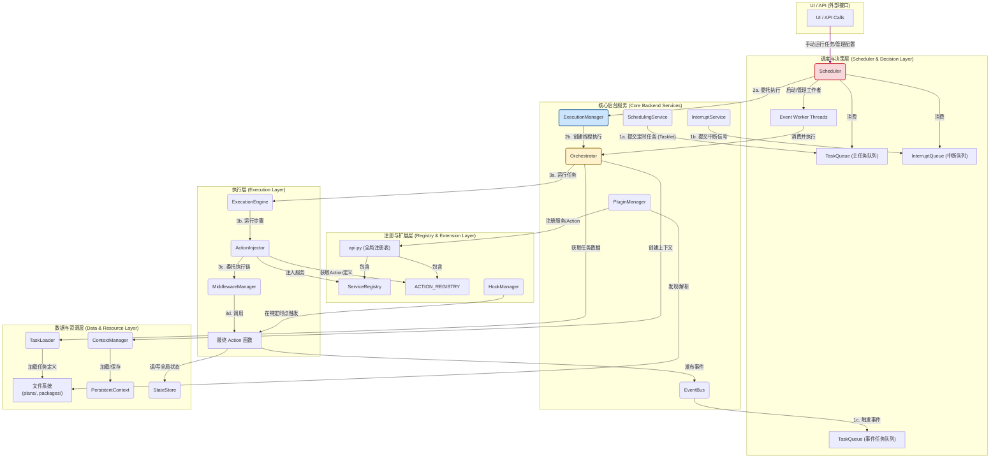

# **Aura 核心架构概览 (Aura Core Architecture Overview)**

Aura 框架的核心 (`aura_core`) 被设计成一个高度模块化、可扩展的系统。它由一系列各司其职、通过明确定义的接口和队列进行通信的服务与组件构成。理解这些组件如何协同工作，是深入掌握 Aura、进行二次开发或问题排查的关键。

## **模块化组件概览**

以下是 `aura_core` 包中所有核心模块的简要职责说明。点击链接可跳转至对应模块的详细内核文档。

*   **[scheduler.py](./scheduler.md)**: **框架总指挥**。协调所有核心服务，运行主决策循环，并为外部（如UI）提供统一的API门面。
*   **[plugin_manager.py](./plugin_manager.md)**: **插件生命周期管理器**。负责发现、解析、排序和加载所有插件，构建起框架的运行时功能。
*   **[execution_manager.py](./execution_manager.md)**: **安全执行管理器**。管理任务执行的线程，处理资源锁（设备忙碌状态），并协调中断的暂停与恢复流程。
*   **[scheduling_service.py](./scheduling_service.md)**: **时间调度服务 (闹钟)**。独立的后台服务，专职处理 `cron` 定时任务，并将到期任务放入主任务队列。
*   **[interrupt_service.py](./interrupt_service.md)**: **中断监控服务**。独立的后台服务，专职监控中断条件，并在条件满足时发出中断信号。
*   **[orchestrator.py](./orchestrator.md)**: **方案级编排器**。负责单个方案（Plan）内的任务协调，管理 `go_task` 任务链，并提供对方案内资源的访问。
*   **[engine.py](./engine.md)**: **任务执行引擎**。负责执行单个任务（Task）中的所有步骤（Steps），管理任务级的上下文和参数渲染。
*   **[action_injector.py](./action_injector.md)**: **行为注入与执行器**。框架的最底层执行单元，负责准备并调用一个具体的 Action 函数，处理服务依赖注入和中间件调用。
*   **[middleware.py](./middleware.md)**: **中间件管理器**。实现了“洋葱模型”，允许在 Action 执行前后注入可插拔的逻辑（如日志、监控）。
*   **[api.py](./api.md)**: **核心注册表**。定义了框架中所有核心的全局注册表，如 `service_registry`, `ACTION_REGISTRY` 等，是框架解耦的核心。
*   **[hook_manager.py](./hook_manager.md)**: **钩子管理器**。提供事件驱动的扩展点，允许插件在框架生命周期的特定时刻执行代码。
*   **[event_bus.py](./event_bus.md)**: **事件总线**。实现了发布-订阅（Pub/Sub）模式，用于在框架各组件之间进行异步、解耦的通信。
*   **[context_manager.py](./context_manager.md)**: **上下文管理器**。负责创建和管理任务执行时的上下文（Context），整合了持久化数据和临时数据。
*   **[persistent_context.py](./persistent_context.md)**: **持久化上下文**。提供了与 `persistent_context.json` 文件绑定的、基于 JSON 的数据持久化机制。
*   **[state_store.py](./state_store.md)**: **全局状态存储**。一个线程安全的、支持 TTL 的内存键值存储，用于管理跨任务的临时状态（驻留信号）。
*   **[task_loader.py](./task_loader.md)**: **任务加载器**。专职从文件系统加载、解析和缓存任务定义（YAML文件）。
*   **[task_queue.py](./task_queue.md)**: **任务队列**。定义了 `Tasklet` 数据结构和支持优先级的 `TaskQueue`，是连接任务生产者和消费者的缓冲层。
*   **[plugin_provider.py](./plugin_provider.md)**: **插件提供者 (适配器)**。为 `resolvelib` 库提供适配器，使其能够理解 Aura 的插件依赖关系。
*   **[builder.py](./builder.md)**: **插件构建器**。当插件没有预构建的 `api.yaml` 时，负责从源码扫描并生成该文件。

## **架构分层与交互流程**

Aura 的核心架构可以被看作一个分层的系统。请求和数据从高层流向底层，最终由最底层的执行单元完成操作。

1.  **调度与决策层**: `Scheduler` 作为最高决策者，消费队列中的请求。它的生命周期管理着所有核心后台服务。
2.  **核心服务层**: `SchedulingService` 和 `InterruptService` 等作为“生产者”，向队列中提交请求。`PluginManager` 负责构建整个环境。`ExecutionManager` 负责安全地启动执行。
3.  **执行层**: `Orchestrator` -> `ExecutionEngine` -> `ActionInjector` 构成了一条清晰的执行链，粒度从“方案”到“任务”再到“行为”，逐级细化。
4.  **数据与资源层**: `TaskLoader`, `ContextManager`, `StateStore` 等为执行层提供所需的数据和状态。
5.  **注册与扩展层**: `ServiceRegistry`, `ACTION_REGISTRY`, `MiddlewareManager`, `HookManager` 等作为框架的“结缔组织”，将所有组件松散地耦合在一起，并提供扩展能力。

下面的图表详细描绘了这些组件之间的关系和核心数据流。

## **核心架构交互图**

