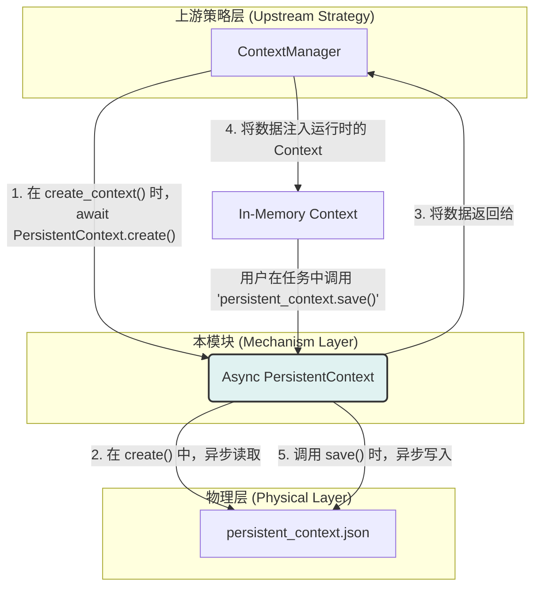

---

# **核心模块: `persistent_context.py` (异步版)**

## **1. 概述 (Overview)**

`persistent_context.py` 定义了 `PersistentContext` 类，它是 Aura 框架中实现**异步数据持久化**的基础工具。它的核心职责是提供一个简单的、与磁盘文件绑定的键值存储，允许任务在多次运行之间安全地、非阻塞地保存和恢复状态。

可以将其看作是一个智能的、自动进行 JSON 序列化和反序列化的 Python 字典，但其所有的磁盘 I/O 操作都是通过 `asyncio` 事件循环和线程池来异步执行的。

## **2. 在框架中的角色 (Role in the Framework)**

`PersistentContext` 是**底层的数据存取工具**，它作为 `ContextManager` 的底层实现。`ContextManager` 负责**何时**以及**如何**将持久化数据与运行时的 `Context` 相结合的**策略**，而 `Persistent-Context` 则负责**具体**的、与文件系统进行异步、安全交互的**机制**。

## **3. Class: `PersistentContext`**

### **3.1. 目的与职责 (Purpose & Responsibilities)**

`PersistentContext` 的设计目标是提供一个简单、原子化且非阻塞的接口来处理持久化数据。其核心职责包括：

1.  **异步加载**: 通过 `async load()` 方法，将磁盘 I/O 操作委托给线程池执行，从而在不阻塞 `asyncio` 事件循环的情况下加载 JSON 数据。
2.  **内存操作**: 提供标准的 `get` 和 `set` 方法，用于在内存中对数据进行快速读写。
3.  **异步保存**: 提供一个 `async save()` 方法，同样通过线程池将内存数据异步写回磁盘文件。
4.  **并发安全**: **【新增】** 使用 `asyncio.Lock` 来保护所有的文件读写操作。这可以防止多个协程同时尝试读取或写入同一个持久化上下文文件，从而避免数据损坏或竞争条件。

### **3.2. 核心方法与设计决策 (Core Methods)**

#### **`async create(cls, filepath)` (异步工厂)**

*   **【新增】** 这是一个**类方法 (classmethod)**，也是**推荐的实例化方式**。
*   **设计模式**: 它遵循了**异步工厂模式**。由于 `__init__` 不能是 `async` 的，而我们希望在对象创建后立即加载数据（一个 I/O 操作），因此将实例化和异步初始化这两个步骤封装在 `create` 方法中。
*   **流程**: `instance = cls(filepath)` -> `await instance.load()` -> `return instance`。

#### **`async load()`** 和 **`async save()`**

*   **异步 I/O**: 这两个方法的核心是 `loop.run_in_executor(None, ...)`。它们将同步的、可能阻塞的文件读写逻辑（`_sync_load_internal`, `_sync_save_internal`）提交到默认的线程池中执行。这使得调用 `load()` 或 `save()` 的协程可以 `await` 结果，而事件循环可以继续处理其他任务。
*   **并发控制**: 每个方法都使用 `async with self._lock:` 来确保在任何时刻只有一个读或写操作在进行中，保证了操作的原子性。
*   **健壮性**: `load` 方法中的 `try...except` 块确保了即使文件不存在或损坏，`self._data` 也会被安全地初始化为空字典。`save` 方法会确保目标目录存在。

#### **`set(key, value)`** 和 **`get(key, default)`**

标准的字典式操作接口，直接作用于内存中的 `self._data` 字典，这些操作是同步且快速的。

#### **`get_all_data()`**

提供一个方法来获取整个数据字典的**副本 (`.copy()`)**。返回副本而不是直接引用，是一种防御性编程实践，可以防止外部代码意外地修改 `PersistentContext` 的内部状态。

## **4. 总结 (Summary)**

异步重构后的 `PersistentContext` 是 Aura 框架中一个现代化、健壮的基石。它通过一个清晰的异步接口，优雅地封装了与 JSON 文件进行数据持久化交互的所有底层细节。其“异步工厂”的实例化方式、基于线程池的非阻塞 I/O，以及通过 `asyncio.Lock` 实现的并发安全机制，共同构成了一个高性能、高可靠性的数据持久化工具，完美地融入了 Aura 的异步架构中。

