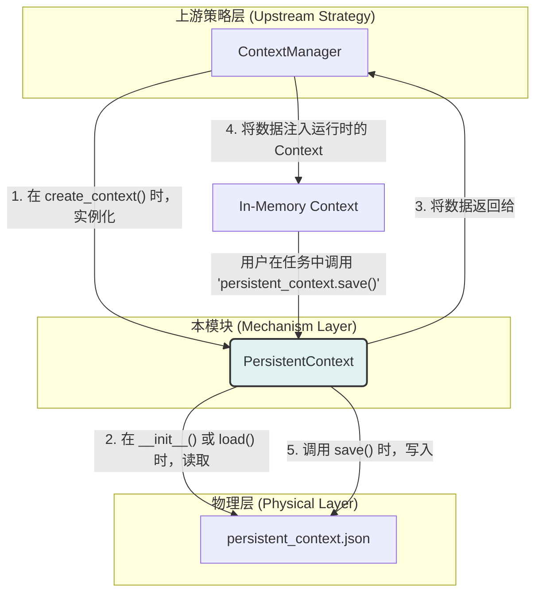

# **Core Module: `persistent_context.py`**

## **1. 概述 (Overview)**

`persistent_context.py` 定义了 `PersistentContext` 类，它是 Aura 框架中实现**数据持久化**的基础工具。它的核心职责是提供一个简单的、与磁盘文件绑定的键值存储，允许任务在多次运行之间保存和恢复状态。

可以将其看作是一个智能的、自动进行 JSON 序列化和反序列化的 Python 字典。它将复杂的“读文件 -> 解析JSON -> 操作数据 -> 序列化JSON -> 写文件”流程封装在一个简洁的面向对象接口背后。

## **2. 在框架中的角色 (Role in the Framework)**

`PersistentContext` 是**底层的数据存取工具**，它通常不被终端用户或高层逻辑直接使用，而是作为 `ContextManager` 的底层实现。`ContextManager` 负责**何时**以及**如何**将持久化数据与运行时的 `Context` 相结合的**策略**，而 `PersistentContext` 则负责**具体**的、与文件系统交互的**机制**。

## **3. Class: `PersistentContext`**

### **3.1. 目的与职责 (Purpose & Responsibilities)**

`PersistentContext` 的设计目标是提供一个简单、原子化的接口来处理持久化数据。其核心职责包括：

1.  **自动加载**: 在实例化时，自动尝试从指定的 `filepath` 加载 JSON 数据到内存中的 `_data` 字典。如果文件不存在或解析失败，则优雅地处理，初始化为一个空字典。
2.  **内存操作**: 提供标准的 `get` 和 `set` 方法，用于在内存中对数据进行读写。这些操作是快速的，不涉及即时的磁盘 I/O。
3.  **按需保存**: 提供一个显式的 `save()` 方法，用于将内存中 `_data` 的当前状态序列化为 JSON 并写回磁盘文件。
4.  **封装复杂性**: 将文件存在性检查、编码处理 (`utf-8`)、JSON 序列化/反序列化以及相关的异常处理全部封装在内部。

### **3.2. 核心方法 (Core Methods)**

#### **`__init__(self, filepath)` 和 `load()`**

*   **`__init__`**: 构造函数接收一个文件路径，并立即调用 `load()` 方法。这确保了对象一旦创建，其内存状态就与磁盘状态（或一个空状态）同步。
*   **`load()`**:
    *   **健壮性**: 使用 `try...except` 块来捕获所有可能的错误（如文件不存在、权限问题、JSON 格式错误）。在任何错误情况下，它都会保证 `self._data` 是一个有效的空字典，防止后续操作失败。
    *   **懒加载/自动加载**: 这种在初始化时自动加载的设计，简化了使用者的代码。使用者无需手动调用 `load()`。

#### **`save()`**

*   **显式调用**: 这是一个**需要显式调用**的方法。数据在内存中的改变（通过 `set()`）**不会**自动同步到磁盘。这种设计是故意的，原因如下：
    1.  **性能**: 避免了每次 `set()` 都进行一次昂贵的磁盘 I/O 操作。
    2.  **原子性/事务性**: 允许用户进行一系列的 `set()` 操作，然后在所有操作都完成后，调用一次 `save()` 来原子地保存最终状态。
*   **序列化**: 使用 `json.dump`，并指定了 `indent=4` 和 `ensure_ascii=False`。
    *   `indent=4`: 使得生成的 JSON 文件具有良好的可读性，方便人工查看和调试。
    *   `ensure_ascii=False`: 允许直接在 JSON 文件中存储中文字符或其他非 ASCII 字符，而不是将它们转义成 `\uXXXX` 的形式。

#### **`set(key, value)` 和 `get(key, default)`**

标准的字典式操作接口，直接作用于内存中的 `self._data` 字典。

#### **`get_all_data()`**

提供一个方法来获取整个数据字典的引用，这主要被 `ContextManager` 用来将所有持久化数据一次性地复制到运行时的 `Context` 中。

## **4. 与其他模块的交互 (Interaction with Other Modules)**

*   **`ContextManager`**: **主要使用者**。`ContextManager` 实例化 `PersistentContext`，调用 `get_all_data()` 来读取数据，并将 `PersistentContext` 实例本身注入到运行时 `Context` 中（键为 `persistent_context`）。
*   **用户 (通过 YAML)**: 终端用户可以在任务的 YAML 文件中通过 `{{ persistent_context.save() }}` 来调用 `save()` 方法，或者通过 `{{ persistent_context.set('my_var', 'my_value') }}` (虽然不推荐，因为不会自动保存) 来间接使用它。更常见的是，用户直接修改由 `ContextManager` 注入到顶层的变量，然后在任务结束时由框架（或在特定步骤中）统一保存。

## **5. 总结 (Summary)**

`PersistentContext` 是 Aura 框架中一个简单而坚固的基石。它通过一个清晰的面向对象接口，优雅地封装了与 JSON 文件进行数据持久化交互的所有底层细节。其“内存操作 + 显式保存”的设计模式，在保证高性能的同时，也为上层逻辑提供了实现原子性更新的能力。它是实现任务间状态记忆功能不可或缺的一环。

