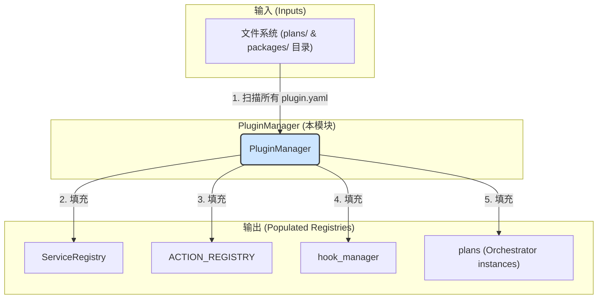

# **Core Module: `plugin_manager.py`**

## **1. 概述 (Overview)**

`plugin_manager.py` 定义了 `PluginManager` 类，它是 Aura 框架的**启动引导程序 (Bootstrap Loader)** 和**插件生命周期管理器**。它的核心职责是发现、解析、排序、加载和管理系统中所有的插件（包括核心功能包和用户方案包），确保它们以正确的顺序被初始化，并且所有的服务、行为和钩子都被正确地注册到相应的注册表中。

可以将其想象成一个操作系统的**内核加载器**。在 Aura 启动时，`PluginManager` 是第一个被调用的核心服务，它负责构建起整个框架的运行时环境，为后续的 `Scheduler` 和 `ExecutionManager` 等服务提供一个功能完备的平台。

## **2. 在框架中的角色 (Role in the Framework)**

`PluginManager` 是 Aura 启动流程的**第一阶段**和**核心协调者**。它作用于所有插件的元数据 (`plugin.yaml`) 和代码，并将它们的功能注入到框架的各个全局注册表中。

## **3. Class: `PluginManager`**

### **3.1. 目的与职责 (Purpose & Responsibilities)**

`PluginManager` 的设计目标是将所有与插件发现、依赖解析和加载相关的复杂逻辑集中到一个地方，实现高度的内聚。其核心职责包括：

1.  **清理 (Cleanup)**: 在加载开始前，清理所有旧的插件注册信息，确保每次启动都是一个全新的、干净的状态。
2.  **发现与解析 (Discovery & Parsing)**: 递归扫描 `plans/` 和 `packages/` 目录，找到所有的 `plugin.yaml` 文件，并将其解析成结构化的 `PluginDefinition` 对象。
3.  **依赖解析与排序 (Dependency Resolution & Sorting)**: 分析所有插件之间的依赖关系 (`dependencies` 字段)，并计算出一个无环的、拓扑有序的加载顺序。这是保证服务能够被正确注入的关键。
4.  **加载与注册 (Loading & Registration)**: 按照计算出的顺序，依次加载每个插件，将其提供的服务、行为和钩子注册到全局的注册表中。
5.  **构建协调 (Build Coordination)**: 如果插件没有预构建的 `api.yaml` 文件，它会调用 `builder` 模块来从源码动态构建。
6.  **Orchestrator 实例化**: 对于类型为 `plan` 的插件，它会为其创建一个对应的 `Orchestrator` 实例，以便后续的任务执行。

### **3.2. 核心方法与加载流程 (Core Methods & Loading Flow)**

`load_all_plugins()` 是该类的唯一公共入口，它按顺序执行了以下几个关键的私有方法，构成了一个清晰的**三阶段加载流程**。

#### **阶段 1: `_discover_and_parse_plugins()`**

*   **目标**: 只读取元数据，不加载任何 Python 代码。
*   **动作**:
    1.  遍历文件系统，找到所有 `plugin.yaml`。
    2.  使用 `yaml.safe_load` 解析文件内容。
    3.  将解析出的数据和元数据（如路径、类型）封装成 `PluginDefinition` 对象。
    4.  将所有 `PluginDefinition` 对象存储在 `self.plugin_registry` 字典中，以 `canonical_id` (如 `Aura-Project/base`) 为键。
*   **产出**: 一个包含系统中所有插件元数据信息的完整清单。

#### **阶段 2: `_resolve_dependencies_and_sort()`**

*   **目标**: 解决“先有鸡还是先有蛋”的问题，确定一个安全的加载顺序。
*   **动作**:
    1.  **依赖解析 (`resolvelib`)**: 使用 `resolvelib` 库（pip 的核心依赖解析器）来检查是否存在无法满足的依赖。`PluginProvider` 类作为适配器，为 `resolvelib` 提供了查找插件定义的能力。这一步确保了所有声明的依赖都是存在的。
    2.  **拓扑排序 (`graphlib`)**: 基于 `dependencies` 字段构建一个有向图，然后使用 `graphlib.TopologicalSorter` 进行拓扑排序。这一步确保了如果插件 A 依赖于插件 B，那么 B 一定会在 A 之前被加载。它还能检测出循环依赖（如 A -> B -> A）。
*   **产出**: 一个字符串列表，代表了插件加载的正确顺序。

#### **阶段 3: `_load_plugins_in_order()`**

*   **目标**: 按照排序结果，实际加载每个插件的 Python 代码并注册其功能。
*   **动作**:
    1.  遍历排序后的插件 ID 列表。
    2.  对于每个插件，检查是否存在 `api.yaml` 文件（快速加载路径）。
        *   **快速路径 (`_load_package_from_api_file`)**: 如果 `api.yaml` 存在，则直接读取其中的服务和行为定义，并通过 `_lazy_load_module` **按需、精确地**加载对应的类和函数，然后注册它们。这非常快，因为它避免了扫描整个插件目录。
        *   **构建路径 (`build_package_from_source`)**: 如果 `api.yaml` 不存在，则调用 `builder` 模块，该模块会扫描插件的所有 Python 文件，分析装饰器，并生成 `api.yaml` 文件。这个过程较慢，但只需要在插件代码变更后执行一次。
    3.  加载钩子 (`_load_hooks_for_package`): 独立地检查并加载 `hooks.py` 文件中的钩子函数。
    4.  实例化 Orchestrator: 如果插件是 `plan` 类型，则为其创建一个 `Orchestrator` 实例。

### **3.3. 关键机制: `_lazy_load_module()`**

这是一个底层的工具函数，但非常重要。

*   **功能**: 它使用 `importlib` 库来根据文件路径动态地加载一个 Python 模块，而无需该模块位于标准的 Python Path 中。
*   **优势**:
    1.  **隔离性**: 插件的代码可以保留在其自己的目录结构中，`PluginManager` 可以直接加载它们，而无需污染全局的 `sys.path`。
    2.  **缓存**: 它会检查 `sys.modules`，避免重复加载同一个模块。

## **4. 总结 (Summary)**

`PluginManager` 是 Aura 3.0 架构的基石和心脏。它通过一个清晰、健壮的三阶段加载流程，系统地解决了插件化架构中最核心的挑战：发现、依赖管理和有序加载。通过引入 `resolvelib` 和 `graphlib`，它将依赖解析和排序的逻辑建立在工业级的、经过验证的库之上。其“快速加载/按需构建”的策略，兼顾了开发时的便利性和生产环境的启动性能。理解 `PluginManager`，就等于理解了 Aura 框架是如何从一堆分散的文件，动态地组装成一个功能强大、协同工作的整体的。

