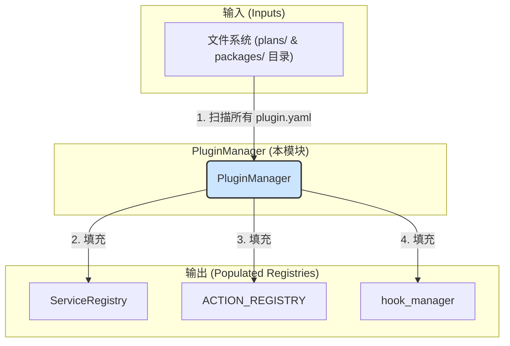

---

# **Core Module: `plugin_manager.py` (重构版)**

## **1. 概述 (Overview)**

`plugin_manager.py` 定义了 `PluginManager` 类，它是 Aura 框架的**启动引导程序 (Bootstrap Loader)** 和**插件生命周期管理器**。它的核心职责是发现、解析、排序、加载和管理系统中所有的插件（包括核心功能包和用户方案包），确保它们以正确的顺序被初始化，并且所有的服务、行为和钩子都被正确地注册到相应的全局注册表中。

可以将其想象成一个操作系统的**内核加载器**。在 Aura 启动时，`PluginManager` 是第一个被调用的核心服务，它负责构建起整个框架的运行时功能集，为后续的 `Scheduler` 等服务提供一个功能完备的平台。

## **2. 在框架中的角色 (Role in the Framework)**

`PluginManager` 是 Aura 启动流程的**第一阶段**和**核心协调者**。它作用于所有插件的元数据 (`plugin.yaml`) 和代码，并将它们的功能注入到框架的各个全局注册表中。与旧版不同，它现在**只负责注册功能定义**，而不负责实例化特定于方案的运行时对象（如 `Orchestrator`）。

## **3. Class: `PluginManager`**

### **3.1. 目的与职责 (Purpose & Responsibilities)**

`PluginManager` 的设计目标是将所有与插件发现、依赖解析和加载相关的复杂逻辑集中到一个地方，实现高度的内聚。其核心职责包括：

1.  **清理 (Cleanup)**: 在加载开始前，清理所有旧的插件注册信息，确保每次启动都是一个全新的、干净的状态。
2.  **发现与解析 (Discovery & Parsing)**: 递归扫描 `plans/` 和 `packages/` 目录，找到所有的 `plugin.yaml` 文件，并将其解析成结构化的 `PluginDefinition` 对象。
3.  **依赖解析与排序 (Dependency Resolution & Sorting)**: 分析所有插件之间的依赖关系，并计算出一个无环的、拓扑有序的加载顺序。
4.  **加载与注册 (Loading & Registration)**: 按照计算出的顺序，依次加载每个插件，将其提供的服务、行为和钩子注册到全局的注册表中。
5.  **构建协调 (Build Coordination)**: 如果插件没有预构建的 `api.yaml` 文件，它会调用 `builder` 模块来从源码动态构建。

### **3.2. 核心方法与加载流程 (Core Methods & Loading Flow)**

`load_all_plugins()` 是该类的唯一公共入口，它按顺序执行了以下几个关键的私有方法，构成了一个清晰的**三阶段加载流程**。

#### **阶段 1: `_discover_and_parse_plugins()`**

*   **目标**: 只读取元数据，不加载任何 Python 代码。
*   **动作**:
    1.  遍历文件系统，找到所有 `plugin.yaml`。
    2.  解析文件内容，并将其和元数据（如路径、类型）封装成 `PluginDefinition` 对象。
    3.  将所有 `PluginDefinition` 对象存储在 `self.plugin_registry` 字典中。
*   **产出**: 一个包含系统中所有插件元数据信息的完整清单。

#### **阶段 2: `_resolve_dependencies_and_sort()`**

*   **目标**: 解决“先有鸡还是先有蛋”的问题，确定一个安全的加载顺序。
*   **动作**:
    1.  **依赖验证 (`resolvelib`)**: 使用 `resolvelib` 库来检查是否存在无法满足的依赖。
    2.  **拓扑排序 (`graphlib`)**: 基于 `dependencies` 字段构建一个有向图，然后使用 `graphlib.TopologicalSorter` 进行拓扑排序，确保依赖项总是先被加载。它还能检测出循环依赖。
*   **产出**: 一个字符串列表，代表了插件加载的正确顺序。

#### **阶段 3: `_load_plugins_in_order()`**

*   **目标**: 按照排序结果，实际加载每个插件的 Python 代码并注册其功能。
*   **动作**:
    1.  遍历排序后的插件 ID 列表。
    2.  对于每个插件，检查是否存在 `api.yaml` 文件。如果不存在，则调用 `builder` 模块动态构建它。
    3.  **`_load_package_from_api_file`**: 读取 `api.yaml`，并通过 `_lazy_load_module` **按需、精确地**加载对应的服务类和行为函数，然后将它们注册到 `service_registry` 和 `ACTION_REGISTRY`。
    4.  **`_load_hooks_for_package`**: 独立地检查并加载 `hooks.py` 文件中的钩子函数，并注册到 `hook_manager`。

### **3.3. 关键机制: `_lazy_load_module()`**

这是一个底层的工具函数，但非常重要。

*   **功能**: 它使用 `importlib` 库来根据文件路径动态地加载一个 Python 模块，而无需该模块位于标准的 Python Path 中。
*   **【核心修正】**: 它现在会首先检查 `sys.modules`。如果模块已经被加载过，它会直接返回缓存的模块，而不是尝试重新加载。这避免了在复杂依赖场景下可能出现的 `ImportError`，并提高了性能。
*   **优势**:
    1.  **隔离性**: 插件的代码可以保留在其自己的目录结构中，`PluginManager` 可以直接加载它们，而无需污染全局的 `sys.path`。
    2.  **效率**: 按需加载和模块缓存机制确保了只有真正需要的功能才会被加载到内存中，且只加载一次。

## **4. 总结 (Summary)**

`PluginManager` 是 Aura 架构的基石和心脏。它通过一个清晰、健壮的三阶段加载流程，系统地解决了插件化架构中最核心的挑战：发现、依赖管理和有序加载。通过将职责**聚焦于功能注册**，而将 `Orchestrator` 的实例化分离出去，其设计变得更加符合单一职责原则，使得整个启动流程更加清晰和可维护。其“快速加载/按需构建”的策略，以及对模块加载的优化，共同保证了框架启动的性能和稳定性。

