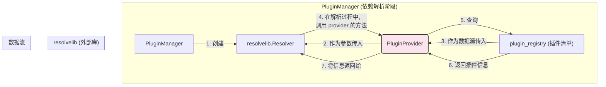

---

# **核心模块: `plugin_provider.py`**

## **1. 概述 (Overview)**

`plugin_provider.py` 定义了 `PluginProvider` 类，它是一个专门为第三方库 `resolvelib` 设计的**适配器 (Adapter)**。它的唯一职责是充当 Aura 的插件系统与 `resolvelib` 的依赖解析算法之间的“翻译官”。

`resolvelib` 是一个通用的依赖解析库（被 `pip` 使用），它不知道什么是“Aura 插件”。`PluginProvider` 通过实现 `resolvelib` 要求的 `AbstractProvider` 接口，告诉 `resolvelib` 如何理解 Aura 的插件世界：如何识别一个插件、如何找到它的依赖项，以及如何判断一个插件是否满足某个依赖需求。

## **2. 在框架中的角色 (Role in the Framework)**

`PluginProvider` 是 `PluginManager` 在执行**依赖解析阶段**时所使用的内部工具。它本身不包含任何复杂的逻辑，而是将 `resolvelib` 的抽象查询转发到 `PluginManager` 维护的 `plugin_registry` 上。

如图所示，`PluginProvider` 是一个薄薄的中间层，它使得 `PluginManager` 可以利用 `resolvelib` 强大的解析能力，而无需将 Aura 的内部数据结构暴露给 `resolvelib`，也无需修改 `resolvelib` 的代码。

## **3. Class: `PluginProvider`**

`PluginProvider` 继承自 `resolvelib.providers.AbstractProvider`，并实现了其要求的几个核心方法。

### **3.1. 目的与职责 (Purpose & Responsibilities)**

*   **适配**: 实现 `AbstractProvider` 接口，将 Aura 的插件模型适配到 `resolvelib` 的通用模型。
*   **查询代理**: 将 `resolvelib` 的所有查询请求（如“插件 'X' 的依赖是什么？”）代理到 `plugin_registry` 进行实际的数据查找。
*   **简化模型**: Aura 的插件依赖模型相对简单（没有版本号，只有存在性依赖），因此 `PluginProvider` 的实现也相应地非常直接和简化。

### **3.2. 核心方法实现 (Core Method Implementations)**

#### **`__init__(self, plugin_registry)`**

*   构造函数接收一个 `plugin_registry` 的引用。这是 `PluginProvider` 的**唯一数据源**。它不拥有数据，只是查询数据。

#### **`identify(self, requirement_or_candidate)`**

*   **`resolvelib` 问**: “这个东西（可能是一个需求，也可能是一个候选插件）的唯一名字是什么？”
*   **`PluginProvider` 答**: “在 Aura 的世界里，需求和插件的名字就是它们的规范 ID（如 `Aura-Project/base`）。所以直接返回它本身就行。”
*   **作用**: 为 `resolvelib` 提供一个统一的标识符。

#### **`find_matches(self, identifier, ...)`**

*   **`resolvelib` 问**: “对于这个名字（`identifier`），你能找到哪些匹配的‘包’？”
*   **`PluginProvider` 答**: “我查一下 `plugin_registry`。如果这个名字在我的注册表里，那我就找到了一个匹配项，就是这个名字本身。如果不在，就一个也找不到。”
*   **作用**: 告诉 `resolvelib` 哪些插件是真实存在的。因为 Aura 没有版本概念，所以一个名字只会匹配到一个“候选者”。

#### **`is_satisfied_by(self, requirement, candidate)`**

*   **`resolvelib` 问**: “这个‘候选包’ (`candidate`) 能满足这个‘需求’ (`requirement`) 吗？”
*   **`PluginProvider` 答**: “在 Aura 里，需求就是插件的名字。如果候选插件的名字和需求的名字一样，那它就满足了。”
*   **作用**: 定义了满足依赖的条件。

#### **`get_dependencies(self, candidate)`**

*   **`resolvelib` 问**: “这个‘候选包’ (`candidate`) 依赖于哪些其他的‘包’？”
*   **`PluginProvider` 答**: “我从 `plugin_registry` 里找到这个候选插件的定义，然后返回它 `dependencies` 字段里列出的所有依赖的名字。”
*   **作用**: **这是最核心的方法**。它为 `resolvelib` 提供了构建依赖图所需的所有“边”。

#### **`get_preference(...)`**

*   **`resolvelib` 问**: “如果有多个选择可以满足一个需求，我应该优先选哪个？”
*   **`PluginProvider` 答**: “在 Aura 里，一个名字只对应一个插件，不存在多个版本选择的问题，所以这个方法不重要。随便返回一个值就行。”
*   **作用**: 在更复杂的场景（如版本选择）下用于指导解析器。在 Aura 中，它的实现被简化了。

## **4. 总结 (Summary)**

`PluginProvider` 是一个典型的**适配器模式 (Adapter Pattern)** 应用。它是一个简单、专一的“胶水”类，其存在的唯一目的就是让两个原本不兼容的组件——Aura 的 `PluginManager` 和通用的 `resolvelib` 库——能够协同工作。通过这个小小的适配器，`PluginManager` 得以利用 `resolvelib` 经过工业级验证的、健壮的依赖解析能力，来确保 Aura 插件系统的稳定性和正确性，而无需自己重新发明一个复杂的依赖解析算法。

