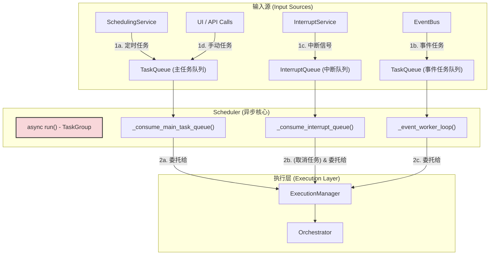

---

# **核心模块: `scheduler.py` (异步核心版)**

## **1. 概述 (Overview)**

`scheduler.py` 定义了 `Scheduler` 类，它是 Aura 框架的**异步核心**和**最高级别的服务门面 (Facade)**。在最终的架构中，`Scheduler` 自身不再执行具体的调度或执行逻辑，而是作为一个**顶级的异步协调者 (Top-Level Asynchronous Coordinator)**。

它的核心职责是：
1.  **引导启动 (Bootstrap)**: 在启动时，按顺序初始化并编排所有核心服务 (`PlanManager`, `SchedulingService`, `InterruptService`, `ExecutionManager` 等)。
2.  **并发消费 (Concurrent Consumption)**: 运行一个基于 `asyncio.TaskGroup` 的主循环，该循环会启动多个并行的“消费者”协程，分别处理来自不同队列（主任务、事件任务、中断）的请求。
3.  **状态聚合 (State Aggregation)**: 持有对框架所有核心状态的引用，并提供线程安全的接口来访问和修改它们。
4.  **高级 API 门面 (High-Level API Facade)**: 为外部系统（如 UI、CLI、Web API）提供一个统一、稳定且高级的接口，用于查询框架状态、控制任务和管理配置。

## **2. 在框架中的角色 (Role in the Framework)**

`Scheduler` 位于整个 Aura 异步架构的最顶层。它“拥有”并指挥所有其他核心服务。其他服务各司其职，并将它们的产出（如待执行的任务、触发的中断）异步地放入 `Scheduler` 的队列中，由 `Scheduler` 的并发消费者进行处理和分派。

如图所示，`Scheduler` 的 `async run()` 方法是所有并发控制流的起点。它启动多个独立的消费者，这些消费者从队列中获取工作，并统一委托给 `ExecutionManager` 执行。

## **3. Class: `Scheduler`**

### **3.1. 职责分离后的架构 (Post-Refactoring Architecture)**

`Scheduler` 的最终设计体现了清晰的职责分离：

*   **`PlanManager`**: 负责**“有什么”**。管理所有方案（Plan）的加载、资源和 `Orchestrator` 实例。
*   **`SchedulingService`**: 负责**“何时做（基于时间）”**。纯粹的定时器。
*   **`InterruptService`**: 负责**“何时做（基于状态）”**。纯粹的状态监视器。
*   **`ExecutionManager`**: 负责**“如何安全地并发执行”**。管理资源限制和执行生命周期。
*   **`Scheduler`**: 负责**“协调与分派”**。它消费所有请求，并将它们分派给 `ExecutionManager`。

### **3.2. 核心流程 (Core Flows)**

#### **启动流程 (`start_scheduler` -> `_run_scheduler_in_thread` -> `async run`)**

1.  **`start_scheduler`**: 这是从外部（如 UI 线程）调用的入口。它创建一个新的**守护线程 (`threading.Thread`)** 来托管 `asyncio` 事件循环。
2.  **`_run_scheduler_in_thread`**: 在新线程中，它调用 `asyncio.run(self.run())`，这会创建并启动一个全新的事件循环。
3.  **`async run`**: 这是**异步世界的入口**。
    *   它首先调用 `_initialize_async_components` 来创建所有 `asyncio` 原生对象（事件、队列）。
    *   然后，它使用 `asyncio.TaskGroup` 来并发地启动所有核心后台服务：`_log_consumer_loop`, `_consume_interrupt_queue`, `_consume_main_task_queue`, `_event_worker_loop`, `scheduling_service.run`, `interrupt_service.run`。
    *   `TaskGroup` 确保了任何一个核心服务崩溃，都会导致所有其他服务被优雅地取消和关闭，极大地增强了系统的健壮性。

#### **并发消费者模型**

旧的 `_commander_loop` 被分解为多个专职的、并行的消费者协程：

*   **`_consume_main_task_queue`**: 不断地从 `task_queue` 中 `await` 主任务，并立即 `asyncio.create_task()` 将其提交给 `ExecutionManager`。这种“即取即抛”的模式确保了消费者本身永远不会被阻塞。
*   **`_consume_interrupt_queue`**: `await` 中断信号。一旦收到，它会**取消**所有当前正在运行的非中断任务，然后将中断处理器任务提交给 `ExecutionManager`。
*   **`_event_worker_loop`**: 启动多个（`num_event_workers`）这样的消费者，并行地处理来自 `event_task_queue` 的任务。这为处理高并发的事件触发任务提供了吞吐能力。

### **3.3. 作为 API 门面 (As an API Facade)**

`Scheduler` 提供了大量 `get_*`, `save_*`, `run_*` 等方法，作为外部世界与 Aura 核心交互的唯一入口。

*   **封装性**: UI 或 API 客户端无需关心内部复杂的组件划分，只需与 `Scheduler` 这一个统一的接口对话。
*   **线程安全**:
    *   所有可能从外部线程调用的、修改共享状态的 API 方法都使用了 `threading.RLock` 来保证原子性。
    *   当需要将工作从外部线程提交到 `asyncio` 事件循环时（如 `run_ad_hoc_task`），它会使用 `asyncio.run_coroutine_threadsafe()`，这是一个标准的、安全的跨线程通信模式。
*   **代理/路由**: 许多方法（如 `get_file_content`）实际上是将调用代理到由 `PlanManager` 管理的正确的 `Orchestrator` 实例上，`Scheduler` 在这里扮演了路由器的角色。

## **4. 总结 (Summary)**

`Scheduler` 在 Aura 的最终异步架构中是名副其实的“异步核心与总协调者”。它通过将具体的工作委托给专职的子服务，并将自身的决策逻辑分解为多个并行的消费者，实现了高度的模块化和并发性。这种清晰、分层的异步架构使得整个系统极具扩展性、响应性和健壮性。`async run()` 方法中的 `TaskGroup` 是保证所有核心服务同生共死的关键，而其作为 API 门面的设计则为外部集成提供了一个稳定、安全且功能强大的接口。理解 `Scheduler` 如何编排其他服务并管理并发消费者，是掌握整个 Aura 框架运行脉络的终极一步。

