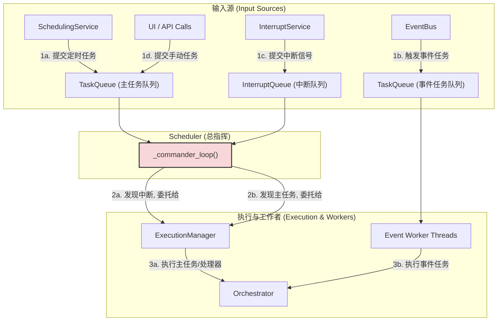

# **Core Module: `scheduler.py`**

## **1. 概述 (Overview)**

`scheduler.py` 定义了 `Scheduler` 类，它是 Aura 框架的**最终总指挥**和**核心服务门面 (Facade)**。在经过多次重构和职责分离后，`Scheduler` 的最终形态不再亲自处理具体的调度逻辑或执行管理，而是作为一个**最高级别的协调者 (Top-Level Coordinator)**。

它的核心职责是：
1.  **引导启动 (Bootstrap)**: 在启动时，按顺序初始化并编排所有核心后台服务 (`PluginManager`, `SchedulingService`, `InterruptService`, `ExecutionManager` 等)。
2.  **中央决策 (Central Decision-Making)**: 运行一个名为 `_commander_loop` 的主循环，作为所有任务请求（来自时间表、事件、手动触发）和中断信号的最终“消费者”和“决策者”。
3.  **状态聚合 (State Aggregation)**: 持有对框架所有核心状态（如任务队列、运行状态、设备锁）的引用，并管理它们之间的交互。
4.  **高级 API 门面 (High-Level API Facade)**: 为外部系统（如 UI、CLI）提供一个统一、稳定且高级的接口，用于查询框架状态、控制任务和管理配置。

## **2. 在框架中的角色 (Role in the Framework)**

`Scheduler` 位于整个 Aura 架构的最顶层。它“拥有”并指挥所有其他核心服务。其他服务各司其职，并将它们的产出（如待执行的任务、触发的中断）提交给 `Scheduler` 的队列，由 `Scheduler` 的主循环进行最终的决策和分派。

如图所示，`Scheduler` 的 `_commander_loop` 是所有控制流的汇集点。它消费队列，并根据当前系统状态（如 `is_device_busy`）将任务委托给相应的执行单元。

## **3. Class: `Scheduler`**

### **3.1. 职责分离后的架构 (Post-Refactoring Architecture)**

`Scheduler` 的最终设计体现了清晰的职责分离：

*   **`PluginManager`**: 负责**“有什么”**。管理所有插件的定义和加载。
*   **`SchedulingService`**: 负责**“何时做（基于时间）”**。它是一个纯粹的定时器，只负责在正确的时间将任务放入队列。
*   **`InterruptService`**: 负责**“何时做（基于状态）”**。它是一个纯粹的状态监视器，只负责在满足条件时发出中断信号。
*   **`ExecutionManager`**: 负责**“如何安全地做”**。它管理执行线程、资源锁和执行状态。
*   **`Scheduler`**: 负责**“最终决定做什么”**。它查看所有请求，并根据优先级和当前状态做出最终的执行决策。

### **3.2. 核心流程 (Core Flows)**

#### **启动流程 (`__init__` -> `reload_plans` -> `start_scheduler`)**

1.  **`__init__`**: 实例化所有核心服务。此时，服务之间只是建立了引用关系，但尚未开始工作。
2.  **`_register_core_services`**: 将框架自身和所有核心服务的实例注册到 `service_registry`，使其可以在 Action 中被注入。
3.  **`reload_plans`**: 这是**静态资源加载**的核心。
    *   它调用 `plugin_manager.load_all_plugins()`，后者会完成插件的发现、排序和加载，并填充 `service_registry` 和 `ACTION_REGISTRY`。
    *   **【关键解耦】**: `Scheduler` 将自身的 `pause_event` 传递给 `plugin_manager.load_all_plugins()`。`PluginManager` 在创建 `Orchestrator` 实例时，会将这个 `pause_event` 传递下去。这避免了 `Orchestrator` 需要反向引用 `Scheduler`，打破了循环依赖。
    *   加载所有方案的配置文件 (`schedule.yaml`, `interrupts.yaml` 等)。
    *   订阅事件触发器，将事件与任务关联起来。
4.  **`start_scheduler`**: 启动所有**动态服务**（后台线程）。它会分别调用 `scheduling_service.start()` 和 `interrupt_service.start()`，并启动自己的 `_commander_loop` 和事件工作者线程。

#### **主循环 (`_commander_loop`)**

这个循环被设计得极其简单和健壮，只做决策，不做耗时操作。

*   **优先级**: `with self.lock:` 块内的逻辑体现了中断的最高优先级。它总是先检查 `interrupt_queue`。
*   **消费与分派**:
    *   如果发现中断，它会调用 `_execute_handler_task`，后者再委托给 `ExecutionManager`。
    *   如果没有中断，并且设备不忙，它才从 `task_queue` 中取出一个主任务，并调用 `_execute_main_task`，后者也委托给 `ExecutionManager`。
*   **非阻塞**: 所有实际的、耗时的任务执行都在 `ExecutionManager` 或事件工作者创建的独立线程中进行，确保了 `_commander_loop` 始终保持高响应性。

#### **中断处理流程**

1.  **发现 (`InterruptService`)**: `InterruptService` 发现中断条件，将中断规则放入 `interrupt_queue`。
2.  **决策 (`Scheduler._commander_loop`)**: 主循环从队列中取出中断规则。
3.  **执行 (`Scheduler._execute_handler_task`)**:
    *   设置 `pause_event`，命令当前主任务暂停。
    *   记录被中断的任务 (`interrupted_main_task`)。
    *   委托 `ExecutionManager` 在新线程中执行处理器任务。
4.  **善后 (`ExecutionManager` -> `Scheduler._post_interrupt_handling`)**: 处理器任务执行完毕后，`ExecutionManager` 的 `finally` 块会回调 `scheduler._post_interrupt_handling`。
5.  **恢复 (`_post_interrupt_handling`)**: 根据中断规则的 `on_complete`策略，决定是恢复 (`pause_event.clear()`)、重启还是放弃被中断的任务。

### **3.3. 作为 API 门面 (As an API Facade)**

`Scheduler` 提供了大量 `get_*`, `save_*`, `run_*` 等方法。这些方法是为上层应用（如 Web UI）设计的。

*   **封装性**: UI 不需要知道有 `PluginManager`、`Orchestrator` 等多个组件。它只需要与 `Scheduler` 这一个统一的入口对话。
*   **线程安全**: 所有修改共享状态的 API 方法都使用了 `with self.lock:`，确保了从 UI 并发调用时的安全性。
*   **代理**: 许多方法（如 `get_file_content`）实际上是将调用代理到正确的 `Orchestrator` 实例上，`Scheduler` 在这里扮演了路由器的角色。

## **4. 总结 (Summary)**

`Scheduler` 在 Aura v4 架构中是名副其实的“总指挥”。它通过将具体的工作（定时、监控、执行）委托给专职的子服务，自身的职责变得高度聚焦：**协调、决策和暴露接口**。这种清晰的、分层的架构使得整个系统极具扩展性和可维护性。`_commander_loop` 作为所有控制流的最终咽喉，其简单性和对优先级的处理是保证系统稳定响应的关键。理解 `Scheduler` 如何编排其他服务并处理核心队列，是掌握整个 Aura 框架运行脉络的终极一步。

