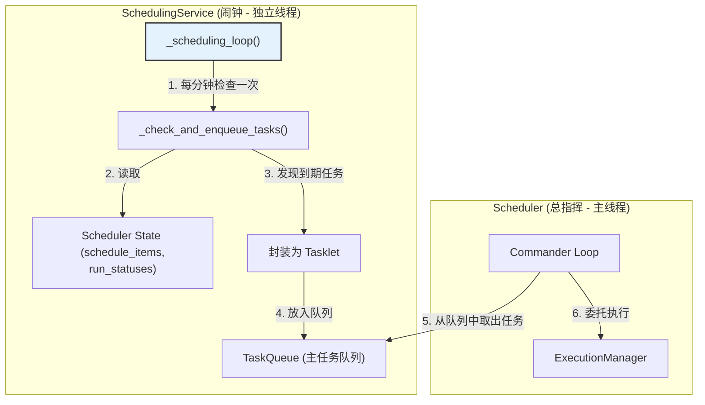

# **Core Module: `scheduling_service.py`**

## **1. 概述 (Overview)**

`scheduling_service.py` 定义了 `SchedulingService` 类，它是 Aura 框架的**时间基准调度引擎**。可以将它想象成一个高度专职的“闹钟”或“天文台”。它的唯一职责是根据预设的 `cron` 表达式，在正确的时间点“拉响铃铛”，告诉 `Scheduler` 有一个定时任务到期了。

这个服务的存在，是将**基于时间的任务触发逻辑**从 `Scheduler` 的主决策循环中完全分离出来的产物，使得 `Scheduler` 无需关心如何解析和跟踪 `cron` 时间表。

## **2. 在框架中的角色 (Role in the Framework)**

`SchedulingService` 是一个独立的后台守护服务，它扮演着**任务生产者 (Task Producer)** 的角色。它定期检查 `Scheduler` 中加载的所有 `schedule.yaml` 定义，并将到期的任务作为 `Tasklet` 对象放入 `Scheduler` 的主任务队列 (`task_queue`) 中。

`Scheduler` 的主循环 (`_commander_loop`) 则是这个队列的**消费者 (Consumer)**。

这个清晰的生产者-消费者模式，通过队列实现了 `SchedulingService` 和 `Scheduler` 之间的完美解耦。

## **3. Class: `SchedulingService`**

### **3.1. 目的与职责 (Purpose & Responsibilities)**

`SchedulingService` 的设计目标是将定时任务的检查逻辑封装成一个独立的、低频的后台服务，其核心职责包括：

1.  **后台运行**: 在一个独立的守护线程中运行，其 `_scheduling_loop` 以一分钟为周期进行检查，这对于 `cron` 表达式来说是理想的频率。
2.  **专职检查**: 只关心 `schedule.yaml` 中 `trigger` 类型为 `time_based` 的任务。
3.  **状态判断**: 综合考虑任务的 `enabled` 状态、`cooldown`（冷却时间）以及是否已在运行或排队中，来决定是否要进行时间检查。
4.  **`cron` 表达式解析**: 使用 `croniter` 库来精确判断一个任务是否根据其 `schedule` 表达式到期。
5.  **任务入队**: 当一个任务被确认为到期时，将其封装成一个标准的 `Tasklet` 对象，并放入 `Scheduler` 的主任务队列中，供 `Scheduler` 的主循环消费。

### **3.2. 核心方法与逻辑 (Core Methods & Logic)**

#### **`_scheduling_loop()`**

这是服务的“心跳”。一个 `while` 循环，每 60 秒调用一次 `_check_and_enqueue_tasks`。这个较长的休眠间隔是经过深思熟虑的：
*   **效率**: `cron` 表达式的最小精度是分钟，因此更频繁的检查是没有必要的，这可以节省 CPU 资源。
*   **隔离**: 它确保了定时任务的检查不会干扰到 `Scheduler` 主循环或 `InterruptService` 可能需要更高频率响应的逻辑。

#### **`_check_and_enqueue_tasks()`**

这是服务在每次心跳时执行的核心逻辑。它遍历所有调度项，并进行一系列过滤和检查：
1.  过滤掉未启用的、已在排队或运行中的任务。
2.  调用 `_is_ready_to_run()` 进行最终的条件判断。
3.  如果判断为真，则创建 `Tasklet` 并调用 `self.scheduler.task_queue.put(tasklet)`，完成其作为生产者的使命。
4.  更新任务状态为 `queued`。

#### **`_is_ready_to_run()`**

这是最关键的决策函数，它回答了“这个定时任务现在应该运行吗？”的问题。

*   **核心机制 (`croniter`)**: 它使用 `croniter` 库来处理 `cron` 表达式。
    *   `iterator = croniter(schedule, now)`: 基于当前时间创建一个迭代器。
    *   `prev_scheduled_run = iterator.get_prev(datetime)`: **这是关键**。它获取的是**上一个**应该运行的理论时间点。
    *   `if prev_scheduled_run > effective_last_run:`: 这个比较非常巧妙和健壮。`effective_last_run` 是任务的实际最后一次运行时间（如果是第一次运行，则为极小值）。如果理论上的上一个运行时间点比实际上的最后一次运行时间还要晚，那就意味着**自从上次运行以来，一个新的调度时间点已经过去了**，因此任务到期了。这个逻辑可以正确处理因系统关闭或休眠而错过的调度点。

## **4. 设计哲学与优势 (Design Philosophy & Advantages)**

1.  **单一职责原则 (Single Responsibility Principle)**: `SchedulingService` 的职责极其单一：将时间转化为待办任务。它将 `cron` 解析的复杂性从 `Scheduler` 中完全剥离。
2.  **解耦 (Decoupling)**: 通过生产者-消费者模式，`SchedulingService` 和 `Scheduler` 的主循环之间没有直接的方法调用，仅通过队列进行通信。这使得两个组件可以独立地进行修改和测试。
3.  **效率与资源隔离**: 通过在低频的独立线程中运行，它不会占用主决策循环的宝贵时间，也与其他可能需要高频轮询的服务（如 `InterruptService`）在资源上隔离。

## **5. 总结 (Summary)**

`SchedulingService` 是 Aura 框架成熟架构的体现。它作为一个专职的“闹钟”，将基于时间的任务触发逻辑封装成一个简单、高效、健壮的后台服务。它通过与 `Scheduler` 之间清晰的生产者-消费者关系，极大地简化了 `Scheduler` 的核心决策逻辑，并提升了整个系统的模块化程度和可维护性。其对 `croniter` 的巧妙运用，确保了定时任务的触发既精确又可靠。

