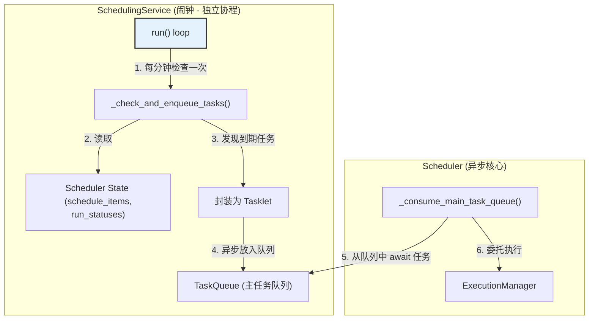

---

# **核心模块: `scheduling_service.py` (异步版)**

## **1. 概述 (Overview)**

`scheduling_service.py` 定义了 `SchedulingService` 类，它是 Aura 框架的**异步时间基准调度引擎**。可以将它想象成一个高度专职的“闹钟”或“天文台”。它的唯一职责是作为一个独立的后台协程，根据预设的 `cron` 表达式，在正确的时间点“拉响铃铛”，告诉 `Scheduler` 有一个定时任务到期了。

这个服务的存在，是将**基于时间的任务触发逻辑**从 `Scheduler` 的主协调逻辑中完全分离出来的产物。

## **2. 在框架中的角色 (Role in the Framework)**

`SchedulingService` 是一个独立的后台异步服务，它扮演着**任务生产者 (Task Producer)** 的角色。它定期检查 `Scheduler` 中加载的所有 `schedule.yaml` 定义，并将到期的任务作为 `Tasklet` 对象异步地放入 `Scheduler` 的主任务队列 (`task_queue`) 中。

`Scheduler` 的主任务消费者 (`_consume_main_task_queue`) 则是这个队列的**消费者 (Consumer)**。

这个清晰的生产者-消费者模式，通过 `asyncio.Queue` 实现了 `SchedulingService` 和 `Scheduler` 消费者之间的完美解耦。

## **3. Class: `SchedulingService`**

### **3.1. 目的与职责 (Purpose & Responsibilities)**

`SchedulingService` 的设计目标是将定时任务的检查逻辑封装成一个独立的、低频的后台服务，其核心职责包括：

1.  **异步后台运行**: 作为一个独立的 `asyncio` 任务运行，其 `run()` 循环以一分钟为周期进行检查。
2.  **上下文安全的检查**:
    *   在检查每个定时任务**之前**，它会使用 `ContextVar` (`current_plan_name`) 来**设置正确的方案上下文**。
    *   **【关键修复】**: 这确保了 `_is_ready_to_run` 方法（以及未来可能添加的、更复杂的条件检查）能够获取到任务所属方案的正确配置，这对于依赖 `config()` 函数的逻辑至关重要。
3.  **状态判断**: 综合考虑任务的 `enabled` 状态、`cooldown`（冷却时间）以及是否已在运行或排队中，来决定是否要进行时间检查。
4.  **`cron` 表达式解析**: 使用 `croniter` 库来精确判断一个任务是否根据其 `schedule` 表达式到期。
5.  **任务入队**: 当一个任务被确认为到期时，将其封装成一个标准的 `Tasklet` 对象，并 `await` `self.scheduler.task_queue.put(tasklet)`，将其异步放入主任务队列。

### **3.2. 核心方法与逻辑 (Core Methods & Logic)**

#### **`async run()`**

这是服务的“心跳”。一个 `async` 的无限循环，它会智能地计算并 `await asyncio.sleep()` 直到下一分钟的开始，以保证 `cron` 检查的准确性。

*   **效率**: `cron` 表达式的最小精度是分钟，因此更频繁的检查是没有必要的，这可以节省 CPU 资源。
*   **隔离**: 它确保了定时任务的检查不会干扰到 `Scheduler` 或 `InterruptService` 可能需要更高频率响应的逻辑。

#### **`async _check_and_enqueue_tasks()`**

这是服务在每次心跳时执行的核心逻辑。它遍历所有调度项，并进行一系列过滤和检查：

1.  **设置上下文**: 对于每个任务项，它都会在一个 `try...finally` 块中设置并保证重置 `current_plan_name` 上下文。
2.  **过滤**: 过滤掉未启用的、已在排队或运行中的任务。
3.  **决策**: 调用 `_is_ready_to_run()` 进行最终的条件判断。
4.  **入队**: 如果判断为真，则创建 `Tasklet` 并将其异步放入 `task_queue`。
5.  **更新状态**: 更新任务状态为 `queued`。

#### **`_is_ready_to_run()`**

这是最关键的决策函数，它回答了“这个定时任务现在应该运行吗？”的问题。

*   **核心机制 (`croniter`)**: 它使用 `croniter` 库来处理 `cron` 表达式。
    *   `iterator = croniter(schedule, now)`: 基于当前时间创建一个迭代器。
    *   `prev_scheduled_run = iterator.get_prev(datetime)`: **这是关键**。它获取的是**上一个**应该运行的理论时间点。
    *   `if prev_scheduled_run > effective_last_run:`: 这个比较非常巧妙和健壮。如果理论上的上一个运行时间点比实际上的最后一次运行时间还要晚，那就意味着**自从上次运行以来，一个新的调度时间点已经过去了**，因此任务到期了。这个逻辑可以正确处理因系统关闭或休眠而错过的调度点。

## **4. 设计哲学与优势 (Design Philosophy & Advantages)**

1.  **单一职责原则 (Single Responsibility Principle)**: `SchedulingService` 的职责极其单一：将时间转化为待办任务。它将 `cron` 解析的复杂性从 `Scheduler` 中完全剥离。
2.  **解耦 (Decoupling)**: 通过生产者-消费者模式，`SchedulingService` 和 `Scheduler` 的消费者之间没有直接的方法调用，仅通过异步队列进行通信。
3.  **上下文安全 (Context Safety)**: 通过 `ContextVar` 实现了**检查逻辑的上下文隔离**。这是一个至关重要的改进，确保了定时任务检查的正确性和可预测性，无论系统当时正在执行什么其他任务。

## **5. 总结 (Summary)**

`SchedulingService` 是 Aura 成熟异步架构的体现。它作为一个专职的“闹钟”，将基于时间的任务触发逻辑封装成一个简单、高效、健壮的后台异步服务。它通过与 `Scheduler` 之间清晰的生产者-消费者关系，极大地简化了 `Scheduler` 的核心协调逻辑，并通过上下文隔离机制，保证了其在复杂多方案环境下的可靠性。

