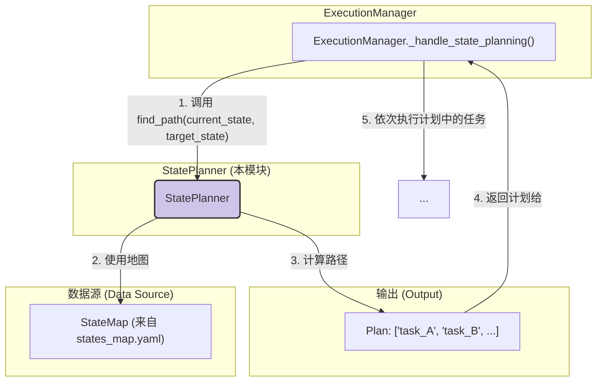

---

# **核心模块: `state_planner.py`**

## **1. 概述 (Overview)**

`state_planner.py` 定义了 `StatePlanner` 和 `StateMap` 类，它们共同构成了 Aura 框架的**自动化状态规划引擎**。您可以将其想象成一个“GPS导航系统”，用于指导应用程序从任意已知状态（“当前位置”）到达一个期望的目标状态（“目的地”）。

它的核心职责是读取一个由用户定义的“地图”（`states_map.yaml`），并使用经典的图论算法（Dijkstra's）来计算出成本最低的、由一系列任务组成的“路线”，以实现状态之间的自动转移。

## **2. 在框架中的角色 (Role in the Framework)**

`StatePlanner` 是 `ExecutionManager` 在执行任务前的**“前置条件处理器”**。当一个任务声明它需要一个特定的 `required_initial_state` 时，`ExecutionManager` 会委托 `StatePlanner` 来确保系统达到该状态。

`StatePlanner` 自身不执行任何任务，它只负责**计算计划**。`ExecutionManager` 则是这个计划的**执行者**。

## **3. Class Definitions**

### **3.1. Class: `StateMap`**

*   **目的**: 这是一个简单的数据容器类，用于结构化地持有从 `states_map.yaml` 文件中解析出的内容。它本身没有任何逻辑，仅仅是作为 `StatePlanner` 的“地图”数据源。
*   **核心属性**:
    *   `states: Dict`: 一个字典，包含了所有已定义状态的名称及其元数据（如用于验证该状态的 `check_task`）。
    *   `transitions: List`: 一个列表，包含了所有定义的状态转移路径。每一项都描述了如何从一个 `from` 状态到一个 `to` 状态，以及这个过程需要执行的 `transition_task` 和其 `cost`。

### **3.2. Class: `StatePlanner`**

*   **目的**: 这是状态规划的核心引擎。它接收一个 `StateMap`，并提供一个 `find_path` 方法来计算最优的状态转移路径。
*   **核心逻辑与方法**:

    #### **`__init__(self, state_map)` 和 `_build_graph()`**
    *   在实例化时，`StatePlanner` 会立即调用 `_build_graph()`。
    *   `_build_graph()` 是一个重要的**预处理/优化步骤**。它将 `StateMap` 中扁平的 `transitions` 列表转换成一个**邻接表 (Adjacency List)** 格式的图。这种数据结构对于图遍历算法（如 Dijkstra's）来说效率极高。
    *   图的每个节点是一个状态，每条边代表一个转移，边的权重就是 `cost`，边上携带的数据就是 `transition_task`。

    #### **`find_path(start_node, end_node)`**
    *   **算法**: 这是该类的核心，它实现的是**Dijkstra 算法**，一种用于在加权图中寻找最短路径的经典算法。
    *   **输入**: 起始状态 (`start_node`) 和目标状态 (`end_node`) 的名称。
    *   **输出**: 一个**任务ID的有序列表**，代表了从起点到终点成本最低的路径；如果找不到路径，则返回 `None`。
    *   **机制**:
        1.  它使用一个**优先队列 (`heapq`)** 来管理待探索的路径，总是优先从成本最低的路径开始探索。
        2.  它维护一个 `min_costs` 字典，记录到达每个状态的已知最低成本，以避免重复计算和无限循环。
        3.  当算法成功到达 `end_node` 时，它返回累积下来的任务路径列表。

## **4. 设计哲学与优势 (Design Philosophy & Advantages)**

1.  **声明式配置 (Declarative Configuration)**: 这是最重要的优势。用户无需编写复杂的 `if-else` 逻辑来处理状态转移。他们只需要在 `states_map.yaml` 中**声明**系统有哪些状态，以及状态之间有哪些可能的转移路径。框架会自动处理剩下的部分。这极大地降低了编写健壮工作流的复杂性。

2.  **成本驱动的优化 (Cost-Driven Optimization)**: `transition` 中的 `cost` 字段是一个强大的功能。它允许用户为不同的转移路径赋予不同的“成本”。例如，一个通过 UI 操作的转移可能 `cost` 为 10，而一个通过后台 API 的、更快的转移可能 `cost` 为 1。`StatePlanner` 会自动选择总成本最低的路径，从而实现流程的自我优化。

3.  **解耦 (Decoupling)**:
    *   **规划与执行解耦**: `StatePlanner` 只负责“思考”和“规划”，`ExecutionManager` 负责“行动”。职责非常清晰。
    *   **任务与状态解耦**: 任务本身（如 `login`）不需要知道它是一个“状态转移任务”。它只是一个普通的任务。`states_map.yaml` 将任务和状态转移的语义关联了起来。

## **5. 总结 (Summary)**

`StatePlanner` 是 Aura 框架实现高级、智能自动化的关键组件。它将复杂的路径规划问题抽象化，并通过一个简单、声明式的 YAML 文件暴露给用户。通过在底层实现经典的 Dijkstra 算法，它为框架提供了寻找最优状态转移路径的能力，使得自动化流程不仅能执行，还能在面对不同初始条件时，智能地、高效地进行“自我修复”和“环境准备”。这是从“命令式脚本”迈向“声明式自动化”的重要一步。

