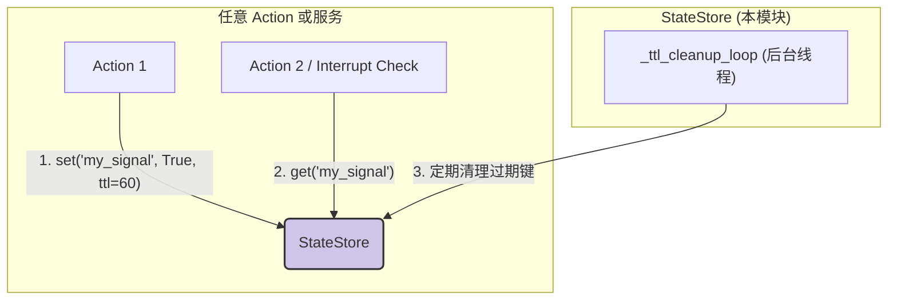

---

# **核心模块: `state_store.py`**

## **1. 概述 (Overview)**

`state_store.py` 定义了 `StateStore` 类，它是 Aura 框架中一个通用的、**线程安全的、支持 TTL (Time-To-Live) 的内存键值存储服务**。它的主要目的是为框架提供一个管理**临时性、跨任务、跨插件的全局状态**（也称为“驻留信号”）的中心位置。

与 `PersistentContext`（用于长期、基于文件的持久化）不同，`StateStore` 的数据完全存在于内存中，并在程序退出时丢失。它的核心特性是能够为任何状态设置一个“存活时间”，过期后状态会自动被清理。

## **2. 在框架中的角色 (Role in the Framework)**

`StateStore` 作为框架的一个**核心基础服务**，被注册到 `ServiceRegistry` 中，因此可以被任何 Action 或其他服务注入和使用。它解决了在复杂的自动化流程中，需要在不同执行单元之间传递临时信标或标志的问题。

**典型用例**:
*   **冷却计时器**: 一个任务执行后，设置一个带有 TTL 的状态，如 `state_store.set('spell_on_cooldown', True, ttl=30)`。其他任务或中断检查器可以通过 `state_store.get('spell_on_cooldown')` 来判断技能是否在冷却中。
*   **临时锁**: 防止某个特定逻辑（而非整个设备）被并发执行。
*   **状态信标**: 一个任务可以设置一个状态 `state_store.set('stage_one_complete', True)`，另一个不相关的任务可以根据这个状态来决定自己的行为。

## **3. Class: `StateStore`**

### **3.1. 目的与职责 (Purpose & Responsibilities)**

`StateStore` 的设计目标是提供一个简单、健壮且高性能的内存状态管理方案。其核心职责包括：

1.  **线程安全**: 所有公共方法都通过 `threading.RLock` 进行保护，确保在多线程环境（如多个事件工作者线程同时访问）下的数据一致性和操作原子性。
2.  **TTL 管理**: 为存储的键值对提供可选的 TTL 支持。
3.  **自动清理**: 运行一个独立的后台守护线程，定期自动清理已过期的状态，防止内存无限增长。
4.  **惰性删除**: 在 `get` 操作时也会检查键是否过期，实现“惰性删除”，确保用户不会获取到已经过期的陈旧数据。
5.  **生命周期管理**: 提供 `shutdown` 方法来优雅地停止后台清理线程。

### **3.2. 核心机制 (Core Mechanisms)**

#### **数据结构**
*   `_data: Dict[str, Any]`: 存储实际的键值对。
*   `_ttl: Dict[str, float]`: **这是 TTL 实现的关键**。它存储键的**过期绝对时间戳**（`time.time() + ttl_seconds`），而不是剩余时间。使用绝对时间戳比使用倒计时器更简单、更高效。
*   `_lock: threading.RLock`: 可重入锁，保证线程安全。

#### **写操作 (`set`)**
*   当调用 `set` 并提供 `ttl` 时，它会计算出未来的过期时间戳并存入 `_ttl` 字典。
*   如果 `ttl` 为 `None`，它会确保从 `_ttl` 字典中移除该键，从而实现状态的“永不过期”。

#### **读操作 (`get`)**
*   **惰性删除 (Lazy Deletion)**: 在返回值之前，它会先检查 `_ttl` 表。如果当前时间已经超过了记录的过期时间戳，它会立即删除该键（从 `_data` 和 `_ttl` 中），然后返回 `default` 值。这保证了即使后台清理线程还没来得及运行，用户也绝不会读到脏数据。

#### **后台清理 (`_ttl_cleanup_loop` & `_cleanup_expired_keys`)**
*   **主动清理 (Eager Deletion)**: `_ttl_cleanup_loop` 是一个在后台独立运行的守护线程。
*   它以 `check_interval`（默认为 60 秒）为周期醒来，然后调用 `_cleanup_expired_keys`。
*   `_cleanup_expired_keys` 会遍历整个 `_ttl` 字典，构建一个已过期键的列表，然后将它们全部删除。这种“先收集再删除”的模式，避免了在迭代字典时修改它的问题。

### **3.3. 设计哲学与优势 (Design Philosophy & Advantages)**

1.  **性能与实时性的平衡**:
    *   **写/读操作快速**: `set` 和 `get` 操作主要在内存中进行，非常快。
    *   **后台清理**: 将昂贵的、全量的清理工作放到一个低优先级的后台线程中，不会阻塞核心业务逻辑。
    *   **惰性+主动清理**: 结合两种清理策略，既保证了数据获取的实时正确性（惰性），又防止了内存的长期泄漏（主动）。

2.  **易用性**: `StateStore` 提供了与标准 Python 字典类似的 `get`/`set`/`delete` 接口，学习成本极低。TTL 功能对用户来说只是一个可选参数。

3.  **解耦**: 提供了一个集中的地方来管理全局临时状态，避免了插件或任务通过不安全的方式（如全局变量）共享状态，从而降低了模块间的耦合。

## **4. 总结 (Summary)**

`StateStore` 是 Aura 框架中一个至关重要的基础服务。它通过提供一个线程安全的、支持 TTL 的内存键值存储，完美地解决了框架内临时状态共享和管理的难题。其“惰性删除 + 后台主动清理”相结合的设计，在保证数据准确性的同时，也兼顾了性能和资源管理。作为一个通用的核心服务，它为实现更复杂的跨任务协作逻辑（如冷却、临时锁、信标）提供了坚实的基础。

