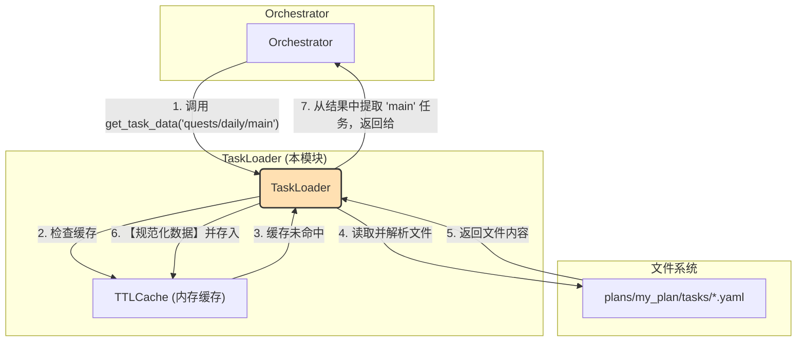

---

# **核心模块: `task_loader.py` (数据规范化版)**

## **1. 概述 (Overview)**

`task_loader.py` 定义了 `TaskLoader` 类，它是 Aura 框架中一个**专职的任务定义加载与规范化器**。每个 `Orchestrator` 实例都会拥有一个自己专属的 `TaskLoader` 实例。

它的核心职责是从指定方案包（Plan）的 `tasks/` 目录中，根据任务 ID 查找、读取、解析对应的 YAML 文件，并从中提取出具体的任务定义数据。此外，它还扮演着**数据预处理器**的角色，为加载的任务自动填充关键的默认值（如 `execution_mode`），以保证下游消费者（如 `ExecutionManager`）接收到的是结构一致、可预测的数据。

## **2. 在框架中的角色 (Role in the Framework)**

`TaskLoader` 是 `Orchestrator` 的一个**底层辅助服务**。当 `Orchestrator` 收到执行任务的指令时，它会委托其持有的 `TaskLoader` 实例去获取任务的具体步骤和配置。

## **3. Class: `TaskLoader`**

### **3.1. 目的与职责 (Purpose & Responsibilities)**

`TaskLoader` 的设计目标是将任务定义的**加载与预处理逻辑**从 `Orchestrator` 的**编排逻辑**中分离出来。其核心职责包括：

1.  **路径解析**: 将一个逻辑上的任务 ID（如 `quests/daily/main`）映射到一个物理上的文件路径。
2.  **文件读取与解析**: 安全地读取 YAML 文件内容并解析成 Python 字典。
3.  **任务提取**: 从解析出的字典中，根据任务 ID 的最后一部分提取出对应的任务定义。
4.  **数据规范化**: **【核心修改】** 在解析文件后，遍历文件中的所有任务定义，并使用 `setdefault` 为它们提供一个默认的 `execution_mode: 'sync'`。这确保了所有任务定义都明确了其执行模式，简化了 `ExecutionManager` 的处理逻辑。
5.  **性能优化**: 通过实例级别的 `TTLCache` 缓存整个文件的解析结果，显著减少后续对同一文件中任务的加载时间。

### **3.2. 核心方法与机制 (Core Methods & Mechanisms)**

#### **`__init__(self, plan_name, plan_path)`**

*   构造函数接收方案的名称和路径，并初始化一个 `TTLCache` 实例。
*   缓存 (`self.cache`) 是**实例级别**的，确保了每个方案的 `TaskLoader` 都有自己独立的缓存，互不干扰。

#### **`get_task_data(self, task_name_in_plan)`**

这是该类的主要公共接口。

*   **输入**: 方案内的任务 ID，例如 `quests/daily/main`。
*   **逻辑**:
    1.  它将任务 ID 分割成**文件路径部分** (`quests/daily`) 和**任务键部分** (`main`)。
    2.  构造出完整的物理文件路径。
    3.  调用 `_load_and_parse_file()` 来获取该文件内所有任务的字典。这个调用是经过缓存和数据规范化的。
    4.  从返回的字典中，根据 `task_key` 查找并返回具体的任务定义。

#### **`_load_and_parse_file(self, file_path)`**

这是一个私有的、被缓存的辅助方法，也是数据处理的核心。

*   **缓存逻辑**:
    *   它在方法内部**手动实现缓存逻辑**，遵循标准的“先查缓存，未命中则执行加载，然后存入缓存”的模式。
    *   **负缓存 (Negative Caching)**: 如果文件不存在，它会缓存一个空字典 `{}`，防止在缓存有效期内对一个不存在的文件进行重复检查。
*   **【核心修改】数据规范化 (Data Normalization)**:
    *   在成功解析 YAML 文件后，它会遍历文件中的每一个任务定义。
    *   对于每个任务，它会调用 `task_def.setdefault('execution_mode', 'sync')`。
    *   **作用**: 这确保了即使任务的 YAML 文件中没有显式声明 `execution_mode`，加载后的数据结构中也一定会有这个字段。这极大地增强了数据的可预测性，使得下游的 `ExecutionManager` 无需再处理 `execution_mode` 缺失的情况。

## **4. 总结 (Summary)**

`TaskLoader` 是一个职责单一、设计精良的辅助类。它通过将任务加载的 I/O 密集型操作与 `Orchestrator` 的核心编排逻辑解耦，提升了代码的清晰度和可维护性。其手动实例级缓存和负缓存策略，确保了任务加载的高效和可靠。最重要的是，它现在还扮演了**数据规范化**的关键角色，通过为任务定义注入默认值，保证了整个框架数据流的一致性和健壮性，为上游的异步执行引擎提供了坚实的数据基础。

