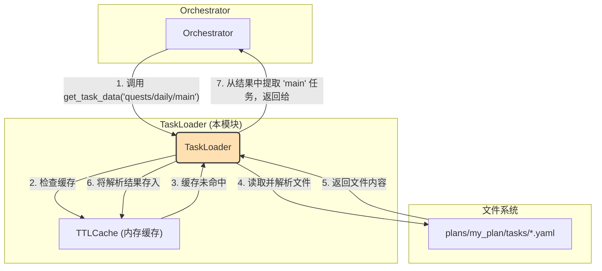

# **Core Module: `task_loader.py`**

## **1. 概述 (Overview)**

`task_loader.py` 定义了 `TaskLoader` 类，它是 Aura 框架中一个**专职的任务定义加载器**。每个 `Orchestrator` 实例都会拥有一个自己专属的 `TaskLoader` 实例。

它的核心职责是从指定方案包（Plan）的 `tasks/` 目录中，根据任务 ID 查找、读取、解析对应的 YAML 文件，并从中提取出具体的任务定义数据。为了提升性能，它还内置了一个带有 TTL（存活时间）的缓存机制，以避免对同一个文件进行重复的磁盘 I/O 和 YAML 解析操作。

## **2. 在框架中的角色 (Role in the Framework)**

`TaskLoader` 是 `Orchestrator` 的一个**底层辅助服务**。当 `Orchestrator` 收到执行任务的指令时，它会委托其持有的 `TaskLoader` 实例去获取任务的具体步骤和配置。

## **3. Class: `TaskLoader`**

### **3.1. 目的与职责 (Purpose & Responsibilities)**

`TaskLoader` 的设计目标是将任务定义的**加载逻辑**从 `Orchestrator` 的**编排逻辑**中分离出来。其核心职责包括：

1.  **路径解析**: 将一个逻辑上的任务 ID（如 `quests/daily/main`）映射到一个物理上的文件路径（如 `.../plans/my_plan/tasks/quests/daily.yaml`）。
2.  **文件读取与解析**: 安全地读取 YAML 文件内容，并使用 `PyYAML` 将其解析成 Python 字典。
3.  **任务提取**: 从解析出的字典中，根据任务 ID 的最后一部分（如 `main`）提取出对应的任务定义。
4.  **性能优化**: 通过实例级别的 `TTLCache` 缓存整个文件的解析结果，显著减少后续对同一文件中任务的加载时间。

### **3.2. 核心方法与机制 (Core Methods & Mechanisms)**

#### **`__init__(self, plan_name, plan_path)`**

*   构造函数接收方案的名称和路径，并初始化一个 `TTLCache` 实例。
*   **【关键设计】**: 缓存 (`self.cache`) 是**实例级别**的。这意味着每个方案的 `TaskLoader`都有自己独立的缓存，互不干扰。这比使用全局缓存或装饰器模式更加健壮和清晰。

#### **`get_task_data(self, task_name_in_plan)`**

这是该类的主要公共接口。

*   **输入**: 方案内的任务 ID，例如 `quests/daily/main`。
*   **逻辑**:
    1.  它将任务 ID 分割成**文件路径部分** (`quests/daily`) 和**任务键部分** (`main`)。
    2.  构造出完整的物理文件路径。
    3.  调用 `_load_and_parse_file()` 来获取该文件内所有任务的字典。这个调用是经过缓存的。
    4.  从返回的字典中，根据 `task_key` 查找并返回具体的任务定义。

#### **`_load_and_parse_file(self, file_path)`**

这是一个私有的、被缓存的辅助方法。

*   **【关键修复与设计】**:
    1.  **手动缓存**: 它不再使用 `@cached` 装饰器，而是**在方法内部手动实现缓存逻辑**。这解决了之前版本中装饰器可能导致跨实例共享缓存的潜在问题。
    2.  **缓存键**: 使用 `cachetools.keys.hashkey(file_path)` 来为缓存条目生成一个可靠的键。
    3.  **缓存命中/未命中**: 遵循标准的“先查缓存，未命中则执行加载，然后存入缓存”的模式。
    4.  **空结果缓存**: 如果文件不存在，它会缓存一个空字典 `{}`。这是一种有效的**负缓存 (Negative Caching)**，可以防止在缓存有效期内（`ttl=300` 秒）对一个不存在的文件进行重复的、无意义的检查。
    5.  **错误处理**: 如果文件解析失败，它会返回一个空字典，但**不会**将这个错误结果存入缓存，以便下次调用时可以重新尝试加载。

#### **`get_all_task_definitions()`**

*   这个方法用于一次性加载方案内的所有任务定义，主要供 `Scheduler` 在启动时收集全局任务信息使用。
*   它会遍历 `tasks/` 目录下的所有 `.yaml` 文件，并利用被缓存的 `_load_and_parse_file()` 方法高效地完成这一过程。

## **4. 总结 (Summary)**

`TaskLoader` 是一个职责单一、设计精良的辅助类。它通过将任务加载的 I/O 密集型操作与 `Orchestrator` 的核心编排逻辑解耦，提升了代码的清晰度和可维护性。其最终版本中采用的**手动实例级缓存**和**负缓存**策略，展示了对性能优化和健壮性设计的深入思考，确保了任务加载既高效又可靠。它是连接逻辑任务 ID 和物理文件定义的关键桥梁。

