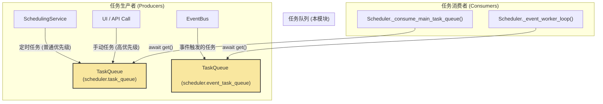

 好的，`task_queue.py` 模块也经历了全面的异步重构，并且 `Tasklet` 数据结构得到了极大的增强，以支持更复杂的异步调度策略。

以下是根据您提供的新代码编写的对应文档。

---

# **核心模块: `task_queue.py` (异步版)**

## **1. 概述 (Overview)**

`task_queue.py` 定义了 Aura 框架中用于任务传递和排队的**核心异步数据结构**。它提供了 `Tasklet`，一个标准化的、信息丰富的“工作订单”格式，以及 `TaskQueue`，一个基于 `asyncio` 的、支持优先级的、有容量限制的队列来存放这些工作订单。

可以将其理解为 Aura 框架的“待办事项列表”和“异步收件箱”。所有需要执行的任务，都必须先被封装成一个 `Tasklet`，然后异步地放入相应的 `TaskQueue` 中，等待被消费者协程处理。

## **2. 在框架中的角色 (Role in the Framework)**

`TaskQueue` 是连接**任务生产者**（如 `SchedulingService`）和**任务消费者**（如 `Scheduler` 的消费者协程）之间的**异步解耦缓冲层**。

系统中有多个 `TaskQueue` 实例，服务于不同的目的：
*   **`scheduler.task_queue`**: 主任务队列，用于处理定时任务和手动任务。
*   **`scheduler.event_task_queue`**: 事件任务队列，用于处理由事件触发的任务。

## **3. 核心数据结构 (Core Data Structures)**

### **3.1. Class: `Tasklet`**

*   **目的**: 定义一个**标准化的、信息丰富的任务单元**。它现在携带了足够多的元数据，以支持 `ExecutionManager` 进行复杂的调度决策。
*   **核心字段 (Fields)**:
    *   `task_name: str`: 要执行的任务的唯一标识符。
    *   `payload: Optional[dict]`: 与任务相关的上下文数据。
    *   `triggering_event: Optional[Event]`: 如果任务由事件触发，这里会存放事件对象。
    *   `initial_context: Optional[dict]`: 用于在任务开始前，向其上下文注入的初始数据。
*   **【新增】异步调度元数据**:
    *   `execution_mode: Literal['sync', 'async']`: **关键字段**。明确指示该任务应该在线程池中同步执行（`sync`），还是直接在事件循环中异步执行（`async`）。
    *   `resource_tags: List[str]`: 资源标签列表。`ExecutionManager` 可以使用这些标签来实现基于资源的并发控制（例如，标记为 `['gpu', 'camera']` 的任务不能同时运行）。
    *   `timeout: Optional[float]`: 任务的执行超时时间（秒）。
    *   `cpu_bound: bool`: 一个标志，提示 `ExecutionManager` 这是一个计算密集型任务，最好在单独的进程池中执行，以避免阻塞事件循环和线程池。

### **3.2. Class: `PriorityTasklet`**

*   **目的**: 这是一个**内部实现细节**，用于在 `asyncio.PriorityQueue` 中实现优先级排序。
*   **核心机制**:
    *   `@dataclass(order=True)`: 使得 Python 可以自动为该类的实例进行比较。
    *   `priority: int`: 优先级数字，**越小代表优先级越高**。
    *   `tasklet: 'Tasklet' = field(compare=False)`: **关键**。`compare=False` 告诉 Python 在比较时**只比较 `priority` 字段**。

## **4. Class: `TaskQueue`**

### **4.1. 目的与职责 (Purpose & Responsibilities)**

`TaskQueue` 是一个高级封装，它利用标准库 `asyncio.PriorityQueue` 来提供一个支持优先级的、异步的任务队列。

1.  **优先级管理**: 允许将任务以“高优先级”或“普通优先级”放入队列。
2.  **异步操作**: 提供了 `async` 的 `put` 和 `get` 方法，完美融入 `asyncio` 的编程模型。
3.  **背压 (Backpressure)**: 通过 `maxsize` 参数，队列具有容量限制。如果生产者速度过快导致队列已满，`await put()` 操作将会被阻塞，直到有消费者取走任务，从而自然地实现了流量控制。
4.  **封装实现**: 将 `PriorityTasklet` 的包装和解包逻辑封装在内部，对使用者完全透明。

### **4.2. 核心方法与机制 (Core Methods & Mechanisms)**

#### **`__init__(self, maxsize)`**
*   初始化一个 `asyncio.PriorityQueue` 实例作为其底层的存储。

#### **`async put(self, tasklet, high_priority)`**
*   **异步生产者接口**。
*   根据 `high_priority` 参数，创建一个 `PriorityTasklet` 包装器。
*   `await` 将这个包装器放入底层的 `asyncio.PriorityQueue`。如果队列已满，这个 `await` 将会暂停该协程的执行。

#### **`async get(self)`**
*   **异步消费者接口**。
*   `await` 从底层的 `asyncio.PriorityQueue` 中取出一个 `PriorityTasklet` 包装器。如果队列为空，这个 `await` 将会暂停该协程的执行。
*   它**解开包装**，只返回内部的 `Tasklet` 对象。

## **5. 总结 (Summary)**

`task_queue.py` 为 Aura 的异步架构提供了任务排队和调度的基础。`Tasklet` 经过增强，现在是一个功能强大的数据传输对象（DTO），携带了丰富的元数据以指导下游的 `ExecutionManager`。而 `TaskQueue` 则演变成了一个完全异步的、支持优先级和背压的健壮队列。这个模块是实现生产者-消费者模式、解耦系统组件以及在异步环境中实现复杂调度策略的关键所在。

