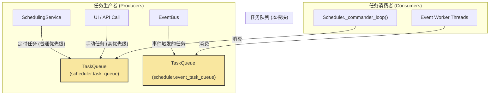

# **Core Module: `task_queue.py`**

## **1. 概述 (Overview)**

`task_queue.py` 定义了 Aura 框架中用于任务传递和排队的**核心数据结构**。它提供了 `Tasklet`，一个标准化的“工作订单”格式，以及 `TaskQueue`，一个支持优先级的、线程安全的队列来存放这些工作订单。

可以将其理解为 Aura 框架的“待办事项列表”和“收件箱”。所有需要执行的任务，无论是来自定时调度、事件触发还是手动请求，都必须先被封装成一个 `Tasklet`，然后放入相应的 `TaskQueue` 中，等待被处理。

## **2. 在框架中的角色 (Role in the Framework)**

`TaskQueue` 是连接**任务生产者**（如 `SchedulingService`、`EventBus` 的订阅回调）和**任务消费者**（如 `Scheduler` 的主循环、事件工作者线程）之间的**解耦缓冲层**。

系统中有多个 `TaskQueue` 实例，服务于不同的目的：
*   **`scheduler.task_queue`**: 主任务队列，由 `SchedulingService` 和手动 API 调用填充，由 `Scheduler` 的 `_commander_loop` 消费。
*   **`scheduler.event_task_queue`**: 事件任务队列，由 `EventBus` 的订阅回调填充，由多个 `_event_worker_loop` 线程消费。

## **3. 核心数据结构 (Core Data Structures)**

### **3.1. Class: `Tasklet`**

*   **目的**: 定义一个**标准化的、轻量级的任务单元**。它是框架内部传递“待办事项”的通用语言。
*   **字段 (Fields)**:
    *   `task_name: str`: 要执行的任务的唯一标识符（例如 `my_plan/quests/daily/main`）。
    *   `payload: Optional[dict]`: 与本次任务执行相关的上下文数据。对于一个定时任务，它通常是 `schedule.yaml` 中定义的整个任务项。
    *   `is_ad_hoc: bool`: 标志这个任务是否是临时的、一次性的调用。
    *   `triggering_event: Optional[Event]`: 如果这个任务是由一个事件触发的，这里会存放该事件的 `Event` 对象，以便任务内部可以访问触发它的事件信息。

### **3.2. Class: `PriorityTasklet`**

*   **目的**: 这是一个**内部实现细节**，用于在 `queue.PriorityQueue` 中实现优先级排序。它将一个 `Tasklet` 和一个整数 `priority` 包装在一起。
*   **核心机制**:
    *   `@dataclass(order=True)`: 这个装饰器使得 Python 可以自动为该类的实例进行比较。
    *   `priority: int`: 优先级数字，**越小代表优先级越高**。
    *   `tasklet: 'Tasklet' = field(compare=False)`: **这是关键**。`compare=False` 告诉 Python 在比较两个 `PriorityTasklet` 实例时，**只比较 `priority` 字段**，而忽略 `tasklet` 字段的内容。这确保了排序的正确性和高效性。

## **4. Class: `TaskQueue`**

### **4.1. 目的与职责 (Purpose & Responsibilities)**

`TaskQueue` 是一个高级封装，它利用标准库 `queue.PriorityQueue` 来提供一个支持优先级的、线程安全的任务队列。

1.  **优先级管理**: 允许将任务以“高优先级”或“普通优先级”放入队列。
2.  **线程安全**: 底层的 `PriorityQueue` 保证了多个生产者和消费者可以安全地并发访问队列。
3.  **封装实现**: 将 `PriorityTasklet` 的包装和解包逻辑封装在内部，对队列的使用者完全透明。使用者只需关心 `Tasklet` 对象。

### **4.2. 核心方法与机制 (Core Methods & Mechanisms)**

#### **`__init__()`**
*   初始化一个 `queue.PriorityQueue` 实例作为其底层的存储。

#### **`put(self, tasklet: Tasklet, high_priority: bool = False)`**
*   **这是实现优先级的核心**。
*   它接收一个纯粹的 `Tasklet` 对象。
*   根据 `high_priority` 参数，决定优先级数字（`0` 代表高，`1` 代表普通）。
*   创建一个 `PriorityTasklet` **包装器**，将优先级和 `Tasklet` 包在一起。
*   将这个**包装器**放入底层的 `PriorityQueue`。

#### **`get(self, ...)`**
*   **这是对 `put` 操作的逆向过程**。
*   它从底层的 `PriorityQueue` 中取出一个 `PriorityTasklet` 包装器。
*   它**解开包装**，只返回内部的 `tasklet` 属性。
*   这个“包装-解包”的过程对调用 `get` 的消费者是无感知的，它们得到的总是一个干净的 `Tasklet` 对象。

#### **其他方法 (`task_done`, `join`, `empty`, `qsize`)**
*   这些都是对底层 `queue.PriorityQueue` 相应方法的直接代理调用，提供了标准队列的完整功能。

## **5. 总结 (Summary)**

`task_queue.py` 为 Aura 框架提供了任务排队和调度的基础。`Tasklet` 定义了任务的标准化“信封”，而 `TaskQueue` 则提供了一个健壮的、支持优先级的“邮箱系统”。通过将优先级实现的细节（`PriorityTasklet`）封装在 `TaskQueue` 内部，它为框架的其他部分提供了一个简洁而强大的接口。这个模块是实现生产者-消费者模式、解耦系统组件以及确保关键任务（如手动触发的任务）能够得到优先处理的关键所在。

