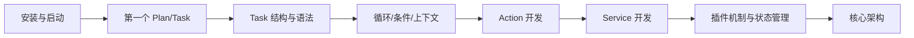

---
# Aura 框架快速入门指南（入门 -> 进阶）

本指南提供清晰的学习路径与实践步骤，并将关键能力拆分为独立章节，方便按需深入。

## 0. 推荐学习路径
入门（1-2 天）
- 运行 Aura 与创建第一个 Plan/Task
- 任务编写结构：`readme/quick_start/task_about.md`
- 任务参考：`readme/quick_start/tasks_reference.md`

基础（2-5 天）
- 循环结构：`readme/quick_start/loop_structure.md`
- 条件执行：`readme/quick_start/condition_execution.md`
- 上下文与模板渲染：`readme/quick_start/context_and_rendering.md`

进阶（1-2 周）
- 插件开发（Action/Service/Hook）：`readme/quick_start/plugin_development_guide.md`
- 状态管理与状态规划：`readme/quick_start/state_management_guide.md`
- 核心架构与执行链路：`readme/quick_start/core_architecture_overview.md`

学习路径流程图：


## 1. 环境准备
- Python 3.11+（使用了 `asyncio.TaskGroup`）
- pip
- 可选：Node.js 18+（仅 GUI 需要）

## 2. 安装依赖
```bash
git clone <your-repo-url>
cd Aura
python -m venv .venv
.venv\Scripts\activate
pip install -r requirements.txt
```

## 3. 启动 Aura
推荐先启动后端 API：
```bash
python backend/run.py
```
默认地址：`http://127.0.0.1:18098/api/v1`

交互式控制台：
```bash
python main.py
```

GUI（可选）：
```bash
cd aura_gui
npm install
npm run dev
```

## 4. 创建第一个 Plan
1) 新建 Plan 目录与 `plugin.yaml`：
```bash
mkdir plans/HelloWorld
```

```yaml
# plans/HelloWorld/plugin.yaml
identity:
  author: "YourName"
  name: "HelloWorld"
  version: "0.1.0"
description: "My first Aura plan"
homepage: ""
dependencies:
  "Aura-Project/base": ">=1.0.0"
```

2) 创建任务目录：
```bash
mkdir plans/HelloWorld/tasks
```

## 5. 编写第一个 Task
```yaml
# plans/HelloWorld/tasks/greeting.yaml
say_hello:
  meta:
    title: "Say Hello"
    entry_point: true
    inputs:
      - name: "name"
        label: "User Name"
        type: "string"
        default: "Aura"
  steps:
    greet:
      action: log
      params:
        message: "Hello, {{ inputs.name }}!"
```

更多结构说明请阅读：`readme/quick_start/task_about.md`

## 6. 运行 Task
方式 A：通用 API
```bash
curl -X POST http://127.0.0.1:18098/api/v1/tasks/run \
  -H "Content-Type: application/json" \
  -d '{"plan_name":"HelloWorld","task_name":"greeting/say_hello","inputs":{"name":"Aura"}}'
```

方式 B：Plan 级 API（注意字段名是 `params`）
```bash
curl -X POST http://127.0.0.1:18098/api/v1/plans/HelloWorld/tasks/greeting/say_hello/run \
  -H "Content-Type: application/json" \
  -d '{"params":{"name":"Aura"}}'
```

方式 C：CLI
```bash
python cli.py task run HelloWorld/greeting/say_hello
```

## 7. 编写第一个 Action
1) 新建 actions 目录与 Action 文件：
```bash
mkdir plans/HelloWorld/actions
```

```python
# plans/HelloWorld/actions/hello_actions.py
from packages.aura_core.api import register_action

@register_action(name="hello.greet", public=True)
def greet(name: str) -> str:
    return f"Hello, {name}!"
```

2) 在 Task 中调用：
```yaml
steps:
  greet:
    action: hello.greet
    params:
      name: "{{ inputs.name }}"
```

3) 如果 `api.yaml` 已存在，需重新构建：
```bash
python cli.py package build plans/HelloWorld
```
提示：构建后需重启后端/控制台，新的 Action 才会生效。

## 8. 编写第一个 Service
1) 新建 services 目录与 Service 文件：
```bash
mkdir plans/HelloWorld/services
```

```python
# plans/HelloWorld/services/greeter_service.py
from packages.aura_core.api import register_service

@register_service(alias="greeter", public=True)
class GreeterService:
    def format(self, name: str) -> str:
        return f"Hello, {name}!"
```

2) 在 Action 中注入 Service：
```python
from packages.aura_core.api import register_action, requires_services

@register_action(name="hello.greet", public=True)
@requires_services(greeter="greeter")
def greet(name: str, greeter) -> str:
    return greeter.format(name)
```

3) 重新构建插件 API：
```bash
python cli.py package build plans/HelloWorld
```
提示：构建后需重启后端/控制台，新的 Service 才会生效。

## 9. 下一步
- 任务结构：`readme/quick_start/task_about.md`
- 循环结构：`readme/quick_start/loop_structure.md`
- 条件执行：`readme/quick_start/condition_execution.md`
- 上下文与模板：`readme/quick_start/context_and_rendering.md`
- 插件开发（Action/Service）：`readme/quick_start/plugin_development_guide.md`
