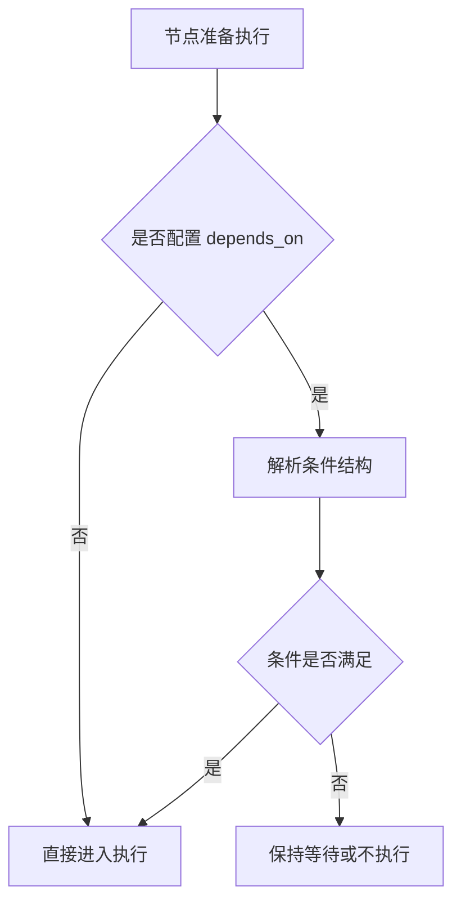

---
# 条件执行

条件执行主要通过 `depends_on` 与 `when:` 表达式完成。

## 条件执行流程图


说明：
- `depends_on` 只影响是否可进入执行队列，不改变节点定义本身。
- `when:` 会先进行模板渲染，再转换为布尔值。

## 1. 基础依赖
这个例子表示 `step_b` 必须在 `step_a` 成功后才会执行，适合线性流程的串联。
```yaml
steps:
  step_a:
    action: log
    params:
      message: "A"
  step_b:
    action: log
    params:
      message: "B"
    depends_on: step_a
```

- 字符串表示依赖节点成功

## 1.1 列表依赖（等价 AND）
列表语义为 AND，只有所有列出的依赖节点都成功时，当前节点才会进入执行。
```yaml
steps:
  step_c:
    action: log
    params:
      message: "C"
    depends_on:
      - step_a
      - step_b
```

## 2. 组合依赖
使用 `and` / `or` / `not` 可以表达更复杂的条件组合，适合多分支场景。
```yaml
steps:
  step_c:
    action: log
    params:
      message: "C"
    depends_on:
      and:
        - step_a
        - step_b
```

支持 `and` / `or` / `not`。

### 2.1 OR 示例
当 `step_a` 或 `step_b` 任意一个成功时即可执行。
```yaml
depends_on:
  or:
    - step_a
    - step_b
```

### 2.2 NOT 示例
`not` 表示依赖条件为假时才执行，常用于“未完成某步时才补偿”的场景。
```yaml
depends_on:
  not: step_a
```

## 3. 按节点状态判断
通过指定状态，可以在依赖节点失败或被跳过时触发后续逻辑。
```yaml
steps:
  step_d:
    action: log
    params:
      message: "D"
    depends_on:
      step_a: "success|skipped"
```

可选状态：`success` / `failed` / `running` / `skipped`

### 3.1 失败兜底
当 `step_a` 失败时执行 `fallback`，用于兜底日志或补偿任务。
```yaml
steps:
  fallback:
    action: log
    params:
      message: "step_a failed, running fallback"
    depends_on:
      step_a: "failed"
```

## 4. 运行时条件（when）
`when` 依赖于模板渲染结果，适合基于输入或运行时结果动态决定是否执行。
```yaml
steps:
  step_e:
    action: log
    params:
      message: "E"
    depends_on: "when: {{ inputs.mode == 'pro' }}"
```

`when` 会使用模板渲染并取布尔值，常用于基于输入或上下文条件执行。

### 4.1 基于输入参数
示例中只有当输入 `mode` 属于指定集合时才执行。
```yaml
depends_on: "when: {{ inputs.mode in ['pro', 'enterprise'] }}"
```

### 4.2 基于节点输出
示例中依赖请求状态为 200 才继续执行。
```yaml
depends_on: "when: {{ nodes.fetch.status == 200 }}"
```

## 5. 组合条件示例
把状态依赖与 `when` 结合，可以表达“成功且输出满足条件”的组合判断。
```yaml
depends_on:
  and:
    - step_a
    - "when: {{ nodes.step_a.output == 'ok' }}"
```

## 6. 常见错误与规避
- 忘记给依赖节点命名：`depends_on` 中必须是已存在的节点 ID。
- 使用了未渲染的变量：`when` 中的变量必须来自 `inputs` / `nodes` / `state` 等上下文。
- 结构混用：`depends_on` 是 list 时为 AND；需要 OR 请使用 `or:`。

## 相关章节
- 上下文与模板：`readme/quick_start/context_and_rendering.md`
- 任务参考：`readme/quick_start/tasks_reference.md`
