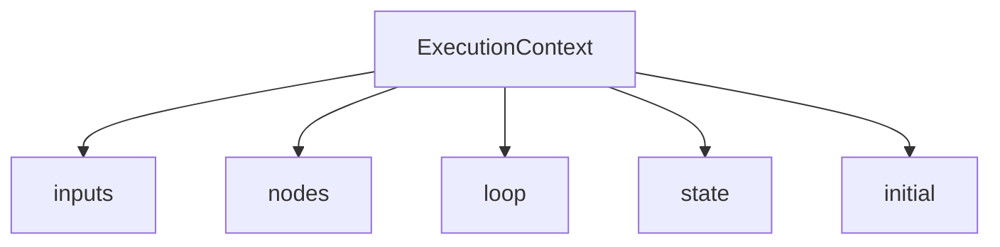

---
# 上下文与模板渲染

任务中的模板渲染由 `TemplateRenderer` 完成，作用域来自 `ExecutionContext`。

## 作用域结构图


## 1. 作用域
- `inputs`: 任务输入
- `nodes`: 节点结果
- `loop`: 循环变量
- `state`: 状态存储
- `initial`: 预留初始数据（通常为空）

## 2. 读取 `inputs`
当任务被调用时传入的参数都会进入 `inputs`，是最常用的数据来源。
```yaml
steps:
  greet:
    action: log
    params:
      message: "Hello {{ inputs.name }}"
```

## 3. 读取 `nodes`
- 未定义 `outputs` 时，节点结果在 `nodes.<id>.output`
- 定义 `outputs` 后，读取命名字段

这个示例先获取 HTTP 响应，再在后续节点中读取结构化输出字段。
```yaml
steps:
  fetch:
    action: http.get
    params:
      url: "{{ inputs.url }}"
    outputs:
      status: "{{ result.status_code }}"
      body: "{{ result.text }}"

  log_status:
    action: log
    params:
      message: "Status={{ nodes.fetch.status }}"
    depends_on: fetch
```

### 3.1 输出对比示例
`plain` 节点没有 `outputs`，因此使用 `nodes.plain.output`；`structured` 需要读取命名字段。
```yaml
steps:
  plain:
    action: calc.add
    params:
      a: 1
      b: 2
  structured:
    action: http.get
    params:
      url: "{{ inputs.url }}"
    outputs:
      status: "{{ result.status_code }}"
returns:
  sum: "{{ nodes.plain.output }}"
  status: "{{ nodes.structured.status }}"
```

## 4. `returns`
任务最终返回给调用方的 `user_data` 由 `returns` 渲染得到：
```yaml
returns:
  ok: "{{ nodes.fetch.status == 200 }}"
  body: "{{ nodes.fetch.body }}"
```

## 5. `state` 状态读取
`state` 适合跨任务共享数据，例如登录态、设备配置或用户偏好。
```yaml
steps:
  show_state:
    action: log
    params:
      message: "User={{ state.user_name }}"
```

## 6. 未定义变量
模板变量不存在时会返回 `None` 并记录警告，避免直接抛错。

### 6.1 常见排错思路
- 先确认 `inputs` 是否正确传入。
- 再确认依赖节点是否已执行成功（`nodes.<id>` 是否存在）。
- 在 `loop` 内使用 `loop.item` / `loop.index` 之前，确保该节点配置了 `loop`。
