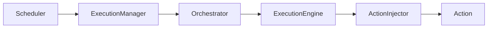
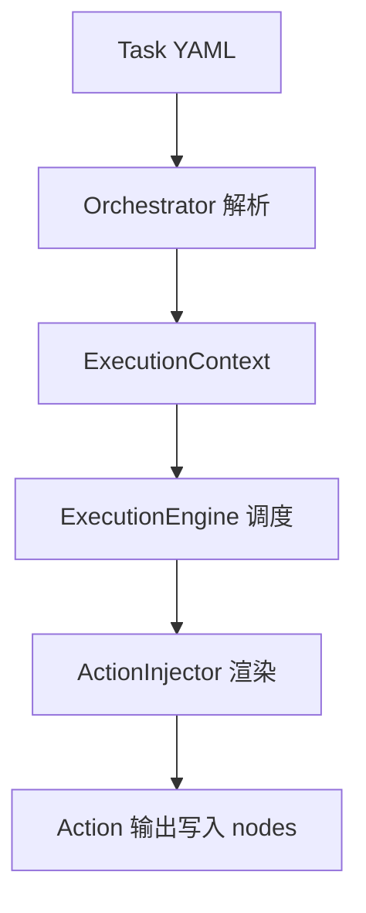

---
# 核心架构概览

Aura 的核心执行链路：
`Scheduler` -> `ExecutionManager` -> `Orchestrator` -> `ExecutionEngine` -> `ActionInjector`。

## 执行链路流程图

这条链路描述了从调度入口到 Action 执行的完整路径，是理解系统行为的关键。

## 关键职责
- Scheduler：系统入口与调度总控
- ExecutionManager：并发管理与状态规划
- Orchestrator：任务加载与执行上下文
- ExecutionEngine：DAG 调度与节点执行
- ActionInjector：参数渲染与服务注入

## 调用数据流示意

该示意强调了数据在执行过程中如何被解析、渲染并写回上下文。

## 进一步阅读
- 任务结构：`readme/quick_start/task_about.md`
- 条件执行：`readme/quick_start/condition_execution.md`
- 上下文与模板：`readme/quick_start/context_and_rendering.md`
