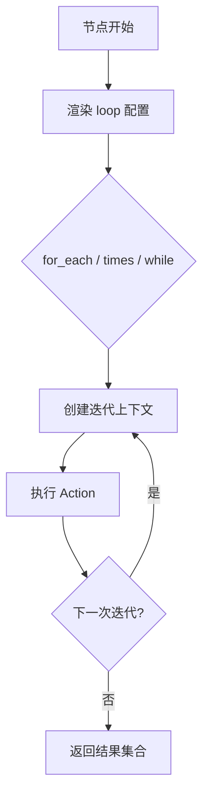

---
# 循环结构

`loop` 用于在一个节点内重复执行同一 Action。支持 `for_each`、`times`、`while`。

## 循环执行流程图


## 1. `for_each`
适合对列表/字典批量执行同一 Action，例如批量请求或批量写入日志。
```yaml
steps:
  iterate_items:
    action: log
    params:
      message: "Item={{ loop.item }}, Index={{ loop.index }}"
    loop:
      for_each: "{{ inputs.items }}"
      parallelism: 4
```

- `items` 可为 list 或 dict
- `loop.item`、`loop.index` 在每次迭代中可用
- `parallelism` 控制并发度（默认等于任务数）

### 1.1 dict 迭代示例
当 `for_each` 为 dict 时，`loop.index` 对应 key，`loop.item` 对应 value。
```yaml
steps:
  log_map:
    action: log
    params:
      message: "Key={{ loop.index }}, Value={{ loop.item }}"
    loop:
      for_each: "{{ inputs.map }}"
```

## 2. `times`
使用 `times` 固定循环次数，常用于简单重试或模拟多次执行。
```yaml
steps:
  retry_log:
    action: log
    params:
      message: "Attempt {{ loop.index }}"
    loop:
      times: 3
```

## 3. `while`
`while` 适合轮询场景，条件在每次迭代前重新渲染。
```yaml
steps:
  poll:
    action: check.status
    params:
      id: "{{ inputs.id }}"
    loop:
      while: "{{ nodes.poll.output != 'done' }}"
      max_iterations: 20
```

- `while` 每次迭代前进行模板渲染判断
- `max_iterations` 默认 1000，避免死循环

### 3.1 while 结果收集示例
当需要累计每次执行结果时，可直接使用 `while` 返回的列表。
```yaml
steps:
  poll:
    action: check.status
    params:
      id: "{{ inputs.id }}"
    loop:
      while: "{{ nodes.poll.output != 'done' }}"
      max_iterations: 10
```

## 4. 循环中的多步骤逻辑
`loop` 只能重复执行一个节点的 Action。如需在每次循环内执行多步，推荐：
- 将循环节点的 Action 设为 `aura.run_task`
- 在子任务中定义多个步骤
